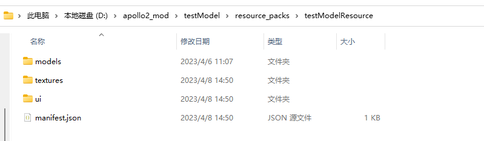
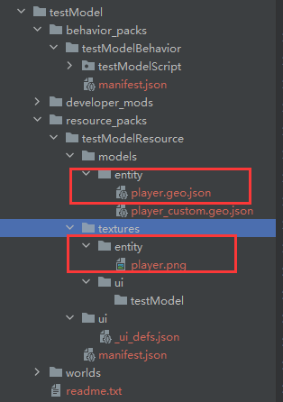
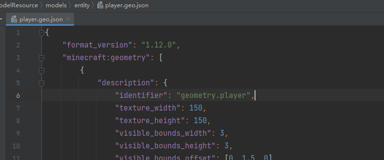
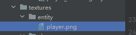
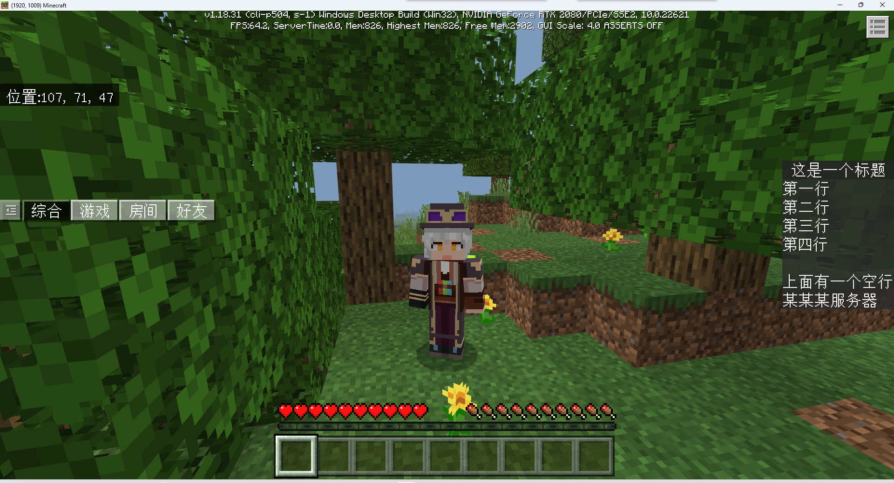
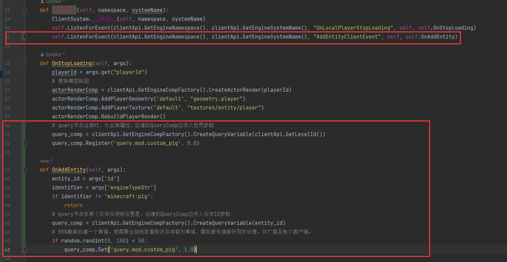
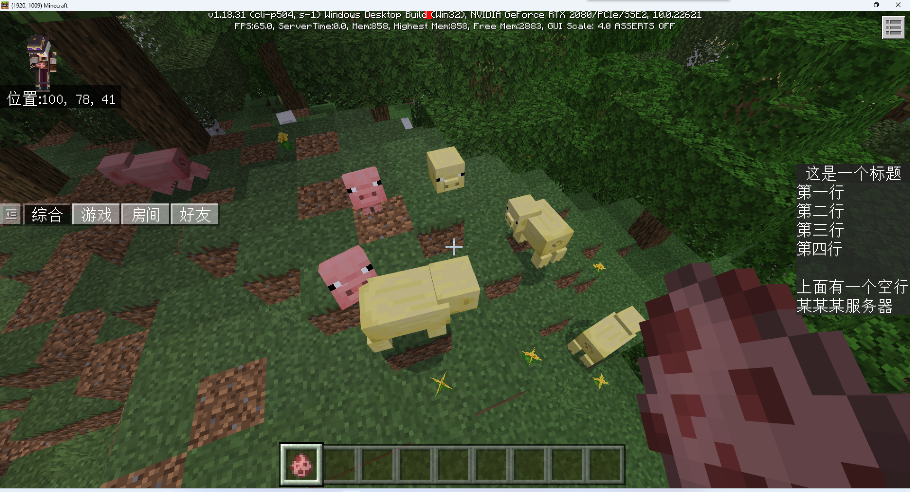

# BlockBench模型的使用

<iframe src="https://cc.163.com/act/m/daily/iframeplayer/?id=64818e09ef3bb6958baf3886" width="800" height="600" allow="fullscreen"/>

在制作游戏玩法时，经常会遇到需要修改玩家模型，或者实体模型的场景。我们可以使用Blockbench制作的模型，配合模组SDK来轻松实现修改实体模型的功能。

## 本地玩家模型的修改

在开始之前，首先前往内容库，找到`Spigot示例Demo`，下载并打开。本节课将使用官方Demo中提供的模型素材来进行演示。

接下来创建一个插件，这里命名为`testModel`，复制到Mod部署目录。

打开Demo的目录，找到`SpigotDemo\CustomHumanModelDemo\DemoClientMod\resource_packs\resource_pack_geyser_demo_mod`，为Demo中的资源包文件夹，将其中的`models`和`textures`复制到`testModel`的资源包文件夹中。



通过IDE打开这个目录，可以看到目录结构中，主要是复制了2个`.geo.json`后缀的模型文件和1个贴图。

接下来我们尝试，将玩家的模型替换为`player.geo.json`所存储的模型，贴图替换为`player.png`的贴图。



首先要替换模型，我们要知道模型的identifier，打开`player.geo.json`，可以看到identifier字段的值为`geometry.player`，这个值就是模型的识别符，需要保证它在所有资源包中是唯一的。



接下来我们还需要知道模型所对应的贴图的路径。在资源包中对应路径`textures/entity/player`



接下来我们就可以调用在[OnLocalPlayerStopLoading](https://mc.163.com/dev/mcmanual/mc-dev/mcdocs/1-ModAPI/%E4%BA%8B%E4%BB%B6/%E4%B8%96%E7%95%8C.html?key=OnLocalPlayerStopLoading&docindex=3&type=0)事件触发时，为本地玩家[重建数据渲染器](https://mc.163.com/dev/mcmanual/mc-dev/mcdocs/1-ModAPI/%E6%8E%A5%E5%8F%A3/%E7%8E%A9%E5%AE%B6/%E6%B8%B2%E6%9F%93.html?key=AddPlayerGeometry&docindex=1&type=0#rebuildplayerrender)，修改其参数。

```python
def __init__(self, namespace, systemName):
    ClientSystem.__init__(self, namespace, systemName)
    self.ListenForEvent(clientApi.GetEngineNamespace(), clientApi.GetEngineSystemName(), "OnLocalPlayerStopLoading", self, self.OnStopLoading)

def OnStopLoading(self, args):
    playerId = args.get("playerId")
    # 更换模型贴图
    actorRenderComp = clientApi.GetEngineCompFactory().CreateActorRender(playerId)
    actorRenderComp.AddPlayerGeometry('default', "geometry.player")
    actorRenderComp.AddPlayerTexture('default', "textures/entity/player")
    actorRenderComp.RebuildPlayerRender()

def Destroy(self):
    self.UnListenForEvent(clientApi.GetEngineNamespace(), clientApi.GetEngineSystemName(), "OnLocalPlayerStopLoading", self, self.OnStopLoading)
```

> 在这里所调用的接口，实际上是为单独的实体修改了它的客户端实体json，并重建。自定义模型以及json详细参数详见： [自定义生物](https://mc.163.com/dev/mcmanual/mc-dev/mcguide/20-玩法开发/15-自定义游戏内容/3-自定义生物/01-自定义基础生物.html)
>
> 因此只能客户端本地看到这个修改，如果需要让**所有玩家都看到**新模型，那么需要借助服务器**广播给所有客户端**，让其他客户端也为这个实体修改参数并重建数据渲染器。
>
> 同理，如果需要为不同玩家设置不同模型，也可以由服务端来控制，什么玩家显示什么模型。并在新玩家加入时给所有在线客户端广播，通知其他客户端修改新加入的玩家的模型。

进入游戏后，可以看到本地玩家的模型被修改。



## 本地实体模型的修改

仍继续使用官方Demo中的模型资源，复制下方资源文件到testModel插件的对应资源包目录：

- `SpigotDemo\CustomPigModelDemo\CustomPigModelClientMod\resource_packs\resource_pack_pig_model\textures\entity\pig` 贴图文件
- `SpigotDemo\CustomPigModelDemo\CustomPigModelClientMod\resource_packs\resource_pack_pig_model\render_controllers` 渲染控制器
- `SpigotDemo\CustomPigModelDemo\CustomPigModelClientMod\resource_packs\resource_pack_pig_model\entity`  客户端实体定义

修改的思路如下：

1. 修改客户端实体定义，添加贴图文件引用。修改渲染控制器

```json
"textures": {
    "default": "textures/entity/pig/pig",
    "saddled": "textures/entity/pig/pig_saddle",
    // 黄猪贴图引用
    "default_yellow": "textures/entity/pig/yellow_pig",
    // 黄猪上鞍贴图引用
    "saddled_yellow": "textures/entity/pig/yellow_pig_saddle"
},
```

```json
// 替换成自定义的猪渲染控制器，可变成黄猪
"render_controllers": [ "controller.render.pig_custom" ],
```

2. 修改渲染控制器，根据molang选择贴图的使用。

> molang的解释参考[Wiki](https://zh.minecraft.wiki/w/Molang)

```json
// 自定义猪渲染器，增加黄猪皮肤
"controller.render.pig_custom": {
    "arrays": {
        "textures": {
            "Array.skins": [ "Texture.default", "Texture.saddled" ],
            "Array.skins_custom": ["Texture.default_yellow", "Texture.saddled_yellow"]
        }
    },
    "geometry": "Geometry.default",
    "materials": [ { "*": "Material.default" } ],
    // 在Python脚本内注册query.mod.custom_pig节点，默认值为0.0。该处表达式意思为：当某只猪的实例的query自定义节点不为1时，则皮肤组切换至黄猪组。
    "textures": [ "query.mod.custom_pig == 0 ? Array.skins[query.is_saddled] : Array.skins_custom[query.is_saddled]" ]
}
```

3. Python脚本注册molang节点，通过脚本控制molang的值，来显示不同的模型或贴图。


在修改玩家模型的客户端的代码基础上做修改，框选部分为新增部分：



同样 如果需要指定某个实体ID为某个模型，则需要通过服务端存储实体ID和对应模型之间的映射关系，并广播给所有客户端对指定实体进行molang值的修改。

进入游戏生成猪，可以看到随机的猪的颜色。



