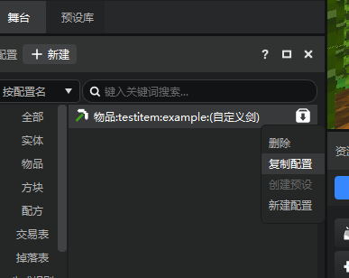
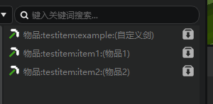
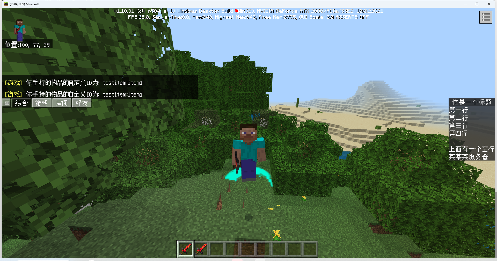
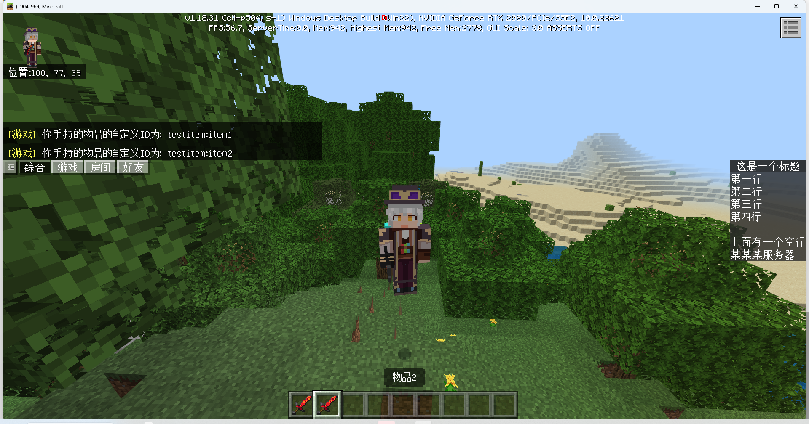

# 作业

<iframe src="https://cc.163.com/act/m/daily/iframeplayer/?id=64818ea7c31a9c0f360dc5f4" width="800" height="600" allow="fullscreen"/>

制作2个自定义物品，可以长按空白处使用，有不同的效果

- 物品1：播放一个中国版特效
- 物品2：修改玩家模型

## 客户端实现

客户端的部分将基于之前所制作的`testEffect`、`testModel`、`testItem`客户端模组来实现。制作过程见[中国版特效的配置](./0-中国版特效的配置.md)、[BlockBench模型的使用](./1-BlockBench模型的使用.md)、[自定义物品的制作](./2-自定义物品制作.md)。

其中`testEffect`模组已经实现了监听服务端的事件来播放特效的功能。

### testModel

`testModel`模组 需要让其监听服务端事件再做出修改即可。

修改的部分：

- OnLocalPlayerStopLoading 后通知服务端
- 监听服务端事件OnChangeLocalModelEvent，事件触发后再更改模型

修改后的代码:

```python
class ModelClientSystem(ClientSystem):
    """
    该mod的客户端类
    根据服务端推送下来的数据显示通用显示界面
    """

    def __init__(self, namespace, systemName):
        ClientSystem.__init__(self, namespace, systemName)
        self.ListenForEvent(clientApi.GetEngineNamespace(), clientApi.GetEngineSystemName(), "OnLocalPlayerStopLoading", self, self.OnStopLoading)
        self.ListenForEvent(ModelConst.ModName, ModelConst.ServerSystemName, "OnChangeLocalModelEvent", self, self.OnChangeLocalModel)
        self.ListenForEvent(clientApi.GetEngineNamespace(), clientApi.GetEngineSystemName(), "AddEntityClientEvent", self, self.OnAddEntity)

    def OnChangeLocalModel(self, args):
        playerId = clientApi.GetLocalPlayerId()
        # 更换模型贴图
        actorRenderComp = clientApi.GetEngineCompFactory().CreateActorRender(playerId)
        actorRenderComp.AddPlayerGeometry('default', "geometry.player")
        actorRenderComp.AddPlayerTexture('default', "textures/entity/player")
        actorRenderComp.RebuildPlayerRender()

    def OnStopLoading(self, args):
        # query节点注册时，为全局属性，创建的QueryComp应传入世界参数
        query_comp = clientApi.GetEngineCompFactory().CreateQueryVariable(clientApi.GetLevelId())
        query_comp.Register('query.mod.custom_pig', 0.0)
        self.NotifyToServer("ClientStopLoadingEvent", {})

    def OnAddEntity(self, args):
        entity_id = args['id']
        identifier = args['engineTypeStr']
        if identifier != 'minecraft:pig':
            return
        # query节点在某个实体实例被设置是，创建的QueryComp应传入实体ID参数
        query_comp = clientApi.GetEngineCompFactory().CreateQueryVariable(entity_id)
        # 50%概率创建一个黄猪。若需要全部玩家看到该实体都为黄猪，需在服务端做好同步处理，并广播至每个客户端。
        if random.randint(0, 100) < 50:
            query_comp.Set('query.mod.custom_pig', 1.0)

    def Destroy(self):
        self.UnListenForEvent(clientApi.GetEngineNamespace(), clientApi.GetEngineSystemName(), "OnLocalPlayerStopLoading", self, self.OnStopLoading)
        self.UnListenForEvent(clientApi.GetEngineNamespace(), clientApi.GetEngineSystemName(), "AddEntityClientEvent", self, self.OnAddEntity)
        self.UnListenForEvent(ModelConst.ModName, ModelConst.ServerSystemName, "OnChangeLocalModelEvent", self, self.OnChangeLocalModel)
```

### testItem

使用编辑器打开之前所编辑的附加包，继续添加新物品。方便起见，直接使用自定义剑的配置，进行复制。



复制两个新物品，识别符分别为`item1`、`item2`，物品名分别为`物品1`、`物品2`。



因为编辑器可能会覆盖字段，对**所有**的物品，打开`物品行为文件`，添加`java_identifier`，都为`wooden_sword`。

> 需要注意的是：
>
> 添加完`java_identifier`后，再次使用编辑器打开，可能会将字段覆盖。
>
> 建议编辑完成后将文件进行备份，防止字段丢失。

完成后打开文件夹，将行为包和资源包对应内容复制到testItem插件中。

## 服务端实现

新建一个项目，命名为`TutorialItemDemo`，并导入SpigotMaster作为依赖。

- 创建监听器，监听玩家长按空白处（鼠标右键点击）
- 获取物品基岩版标识符，根据不同的标识符执行不同的逻辑

```java
@EventHandler
public void onInteract(PlayerInteractEvent e) {

    Action action = e.getAction();
    if (action != Action.RIGHT_CLICK_BLOCK && action != Action.RIGHT_CLICK_AIR) {
        return;
    }
    ItemStack itemStack = e.getItem();
    String identifier = spigotMaster.getCustomItemIdentifier(itemStack);
    Player player = e.getPlayer();
    if (identifier.equalsIgnoreCase("testitem:item1")) {
        sendEffect(player);
    } else if (identifier.equalsIgnoreCase("testitem:item2")) {
        changeModel(player);
    }
}
```

### 特效播放

实现特效播放的事件信息发送。

需要注意的是，根据之前所编写的客户端模组，命名空间为`testEffects`，系统名为`testEffectsDev`，事件为`PlayEffectEvent`。

```java
private void sendEffect(Player player) {
    Map<String, Object> data = new HashMap<>();
    data.put("name", "effects/Attack_2.json");
    Location location = player.getLocation();
    data.put("pos", Arrays.asList(location.getX(), location.getY(), location.getZ()));
    spigotMaster.notifyToClient(player, "testEffects", "testEffectsDev", "PlayEffectEvent", data);
}
```

### 模型更改

发送`OnChangeLocalModelEvent`事件给客户端，命名空间为`testModel`，系统名为`testModelDev`。

```java
private void changeModel(Player player) {
    spigotMaster.notifyToClient(player, "testModel", "testModelDev", "OnChangeLocalModelEvent", new HashMap<>());
}
```

## 效果测试

进入游戏后，打开创造物品栏，拿出物品1、物品2。分别手持物品右键。

- 物品1：播放特效



- 物品2：切换模型




## 参考插件下载

Java插件下载 [点我](https://g79.gdl.netease.com/TutorialItemDemo.zip)

Python模组下载 [点我](https://g79.gdl.netease.com/TutorialItemDemo-Python.zip)
