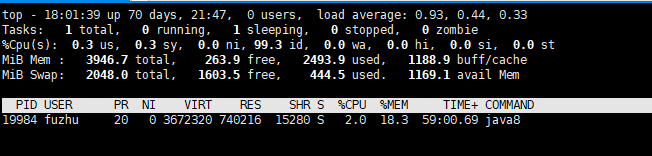

# 分布式技术

<iframe src="https://cc.163.com/act/m/daily/iframeplayer/?id=64818ee9c31a9c0f360dc5fc" width="800" height="600" allow="fullscreen"/>

由于开服工具2.0使用的是Spigot服务端。该服务端的主要游戏逻辑都放在单一线程内进行处理。

在CPU单核性能的限制下，如果单服务器承载玩家数量较多的情况下，就非常有可能会造成卡顿。

因此推荐将玩家通过代理端，分发给不同的除了游戏数据之外完全一致的服务器进行游戏。

下面将介绍几个常用的玩法服务器的架设方式，来介绍如何更合理的使用硬件资源。

## 小游戏服

- 某玩法
  - 地图A
    - 服务器1
      - 游戏1
      - 游戏2
      - 游戏3
    - 服务器2
      - 游戏4
      - 游戏5
  - 地图B
    - 服务器3
      - 游戏6
      - 游戏7
    - 服务器4
      - 游戏8
      - 游戏9

在小游戏服的架构中，可以根据某个玩法对CPU性能的消耗，估算出单一服务器进程能承载的玩家最大玩家数，再在单一服务器下，开设n个游戏房间，来提高单台机器的玩家承载能力。

## RPG服

- 主城服
  - 服务器1
  - 服务器2
- 区域A
  - 服务器3
  - 服务器4
- 区域B
  - 服务器5
- 副本1
  - 服务器6
  - 服务器7
- 副本2
  - 服务器8
  - 服务器9

在RPG类游戏玩法服务器的架构中，可以考虑将玩家在线量较大的服务器进行水平拓展，复制出n个完全相同的服务器，这些服务器共享玩家的数据，通过代理服进行负载均衡。


## 性能观察

在确定好架构之后，还需要对服务器性能进行观察，合理调整每个服务器的最大人数，降低服务器的压力。

### TPS

服务器TPS是衡量服务器流畅度的指标之一，它代表了每秒钟服务端程序运行了多少个游戏刻。服务器在最理想情况下，每秒应运行20个游戏刻，即最理想的TPS值为20。我们可以依靠TPS对服务器流畅度量化，在TPS值低于15时，玩家会有很明显的卡顿感。

在Spigot服务端中，可以以管理员身份输入`/tps`指令来查看服务器TPS。

在服务器TPS较低时，就需要依靠工具来对卡顿进行检查。在这里仅介绍spigot原生支持的timings进行检查。

### timings

timings是spigot服务端原生提供的一个性能追踪工具。使用它可以对服务端运行的耗时进行检查。

使用步骤

- 服务器卡顿情况下，输入`/timings on`
- 等待几分钟，输入`/timings paste`
- 访问`/timings paste`给出的链接，对性能进行分析。

具体参数含义，可以参考[文档](https://www.spigotmc.org/wiki/timings/)。打开timings指令提供的链接

- 如果主要占用时间较多的项目是插件逻辑。建议对插件逻辑进行检查，避免在主线程上进行I/O、网络操作，尽可能的优化插件算法，减少时间复杂度。
- 如果主要占用时间较多的项目是游戏原生逻辑，则需要对应去检查是否有玩家恶意利用游戏漏洞、使用高频红石等等。并使用插件对此类行为进行一定限度的限制。

如果在上述方面都以已经无法进行优化，那么在不魔改服务端内核的情况下，已经达到了CPU单核性能所能承载的最大人数。可以分别测试不同人数下，TPS的数值，推算出一个可以让TPS稳定在19+的人数数值。并限制单服务器最大在线人数。

对于单服多游戏的小游戏架构同理，可以估算出最大在线人数，再除以每局游戏最大人数，计算出一个服务器可以部署多少个游戏。或者可以修改匹配算法，让单服务器同时最多承载一局游戏，把单核性能发挥到极致。

> 例如起床战争玩法，一个服务器进程提供3个维度进行游戏，服务器启动时，注册3个不同维度的房间。
>
> 匹配算法，优先匹配没有任何运行中的维度的服务器，分配玩家。
>
> 这样每个玩家进入的服务器，都只有玩家所在维度的房间是有人的。
>
> 当3个维度房间全部消耗殆尽后，重启服务器并重置地图。


除此之外，我们还需要预估出让玩家流畅游玩所需要使用的机器数量，在流量高峰到来之前，提前申请机器做好准备。

首先我们需要在服务器TPS能稳定在19+、服务器到达最大在线人数的时候，进入ssh输入`ps -aux | grep java8`，找到这个服务器所对应的进程。如果有多个java8进程，可以通过插件（例如CMI插件）在服务器内查看服务器进程的PID，找到对应的PID所对应的进程。

```
fuzhu@g79xxspt-runtime27-87000:~$ ps -aux | grep java
fuzhu     8046  0.0  0.0  13408   892 pts/0    S+   10:15   0:00 grep java
fuzhu    14058  0.4  3.5 3532168 143324 pts/1  Sl+  Apr06  91:39 java8 -jar BungeeCord.jar
fuzhu    19984  2.0 18.3 3672320 739604 pts/2  Sl+  Apr17  49:43 java8 -jar -Xms1G -Xmx1G -jar spigot-1.12.2.jar
```

例如在这里，我们找到lobby端所在的进程，即PID为19984的进程。

找到进程之后，我们使用`top -p PID`，例如这里的`top -p 19984 `来查看资源占用峰值。



例如这里CPU占用峰值为2.0%，内存占用峰值为18.3%。

得出了单服满载时的硬件资源消耗后，我们可以根据这个数值，计算出一台机器的最大承载数量，并根据这个最大在线数据，计算需要提前申请多少的机器。