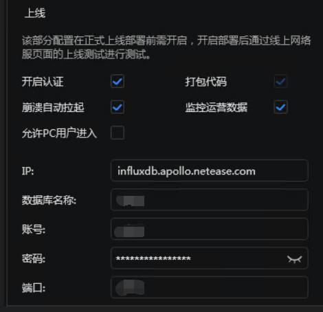
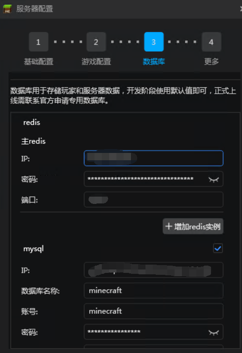

## 上线前的配置

完成了玩法的编写，搭建，就需要前往开发者平台，编写介绍，上传图片素材。

点击`编辑更新`按钮，在跳转的界面中填写服务器的基本信息，适用版本，详细信息，图片素材。

其中基本信息的`游戏IP或域名`、`测试服IP或域名`不需要填写，在部署后会自动生成。

然后部署审核服并提审，联系审核员进行玩法初步跑测。玩法初步跑测通过，则会发放正式服务器。

在收到机器之后，需要将审核阶段服务器，再次复制一份，复制到上线阶段中。

操作细节可以参考[官方文档](https://mc.163.com/dev/mcmanual/mc-dev/mcguide/27-%E7%BD%91%E7%BB%9C%E6%B8%B8%E6%88%8F/%E8%AF%BE%E7%A8%8B9%EF%BC%9A%E6%9C%8D%E5%8A%A1%E5%99%A8%E4%B8%8A%E7%BA%BF/%E7%AC%AC1%E8%8A%82%EF%BC%9A%E5%B9%B3%E5%8F%B0%E5%8F%91%E5%B8%83.html?catalog=1)。

并在服务器配置的`更多`中，按照下图进行配置。

其中influxdb的连接信息会在发放正式服务器的时候一同发放。

除此之外，还需要前往数据库配置，按照正式机发放时的数据库信息填写。

并将Java服的插件的配置文件同步进行修改，使用官方提供的数据库SaaS。

部署完成后，可以联系官方工作人员进行上架前审核，验证玩法是否和审核时一致，是否达到上架玩法需求，美术资源是否齐全等。

审核通过即可上架，正式开始运营。
