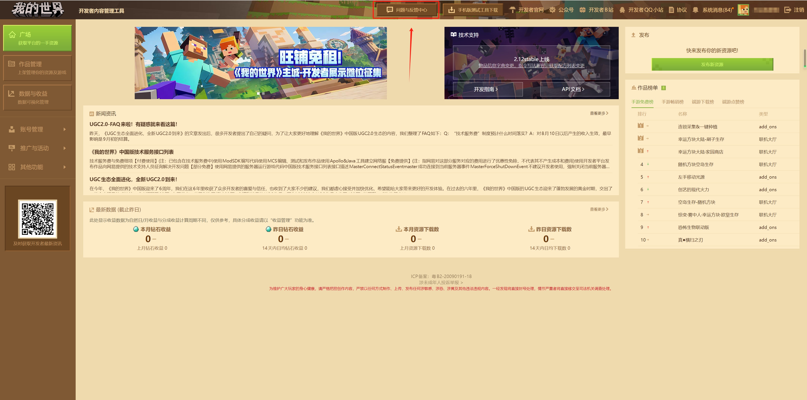
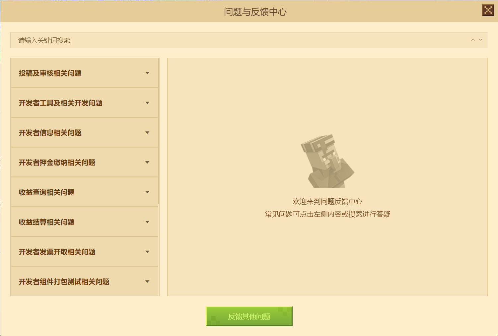
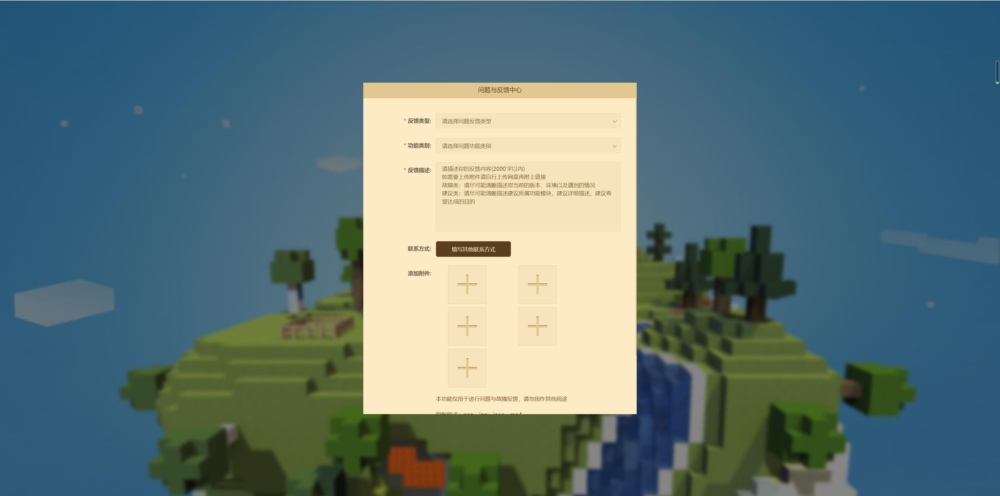
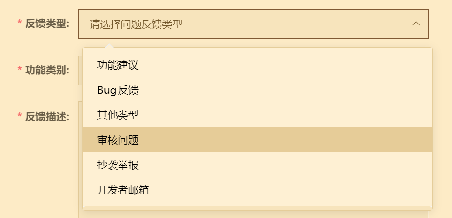
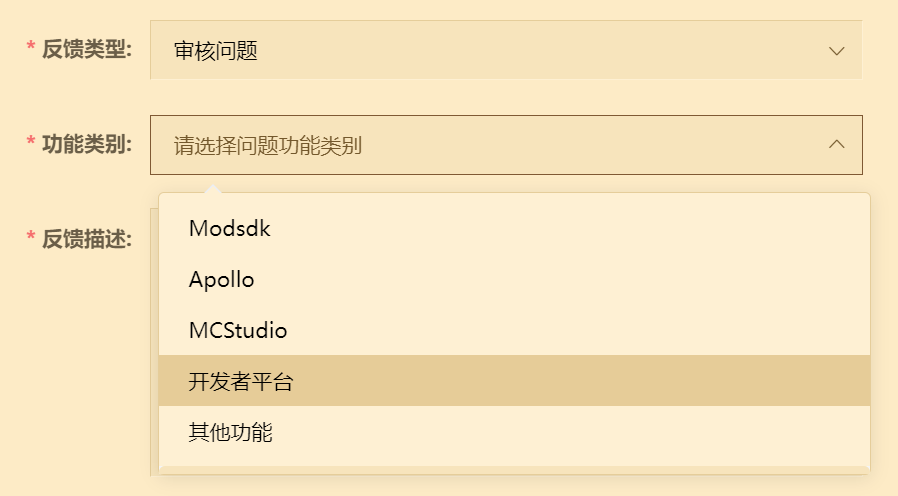
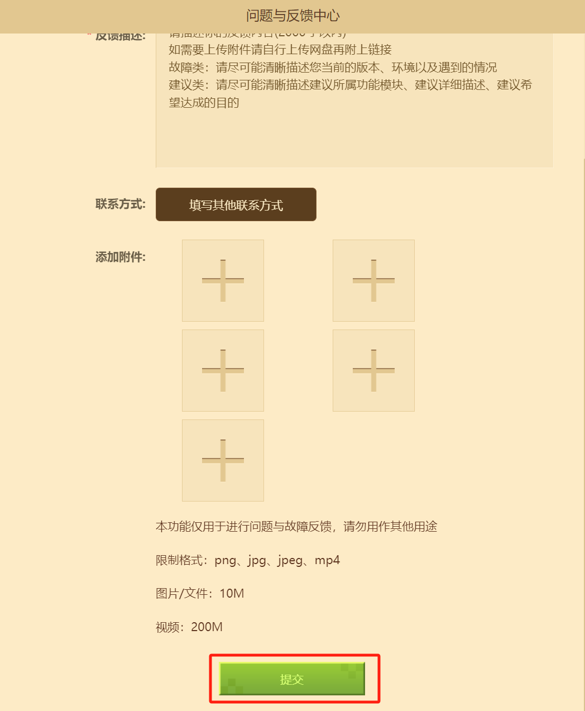

# 开发者账号的审核

在你提交开发者账号审核之后，你的注册信息便会进入送审流程。审核是为了确认你的信息无误且有资格成为一名《我的世界》开发者。

## 审核时间

审核时间一般是 **7个工作日** ，请在审核期间耐心等待。

## 问题反馈

如果你在审核中遇到问题需要联系官方人员，你可以在[开发者平台](https://mcdev.webapp.163.com/)中进行问题反馈。打开顶部的“ **问题与反馈中心** ”：

在弹出的对话框中选择底部的“ **反馈其他问题** ”：

之后会弹出一个新的页面：

在“ **反馈类型** ”中选择“审核问题”：

在“ **功能类型** ”中选择“开发者平台”：

在填写完成你的反馈信息之后，点击最下方的“提交”按钮即可：

之后，请耐心等待几个工作日，我们的工作人员会向你发送反馈的回馈。