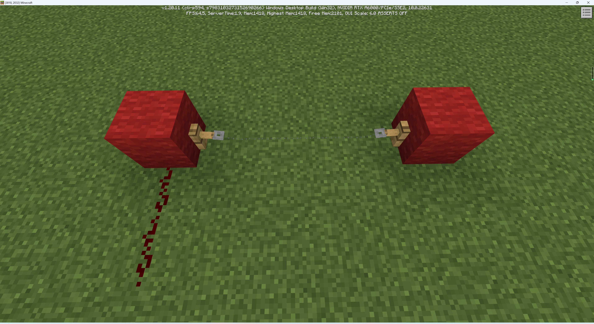
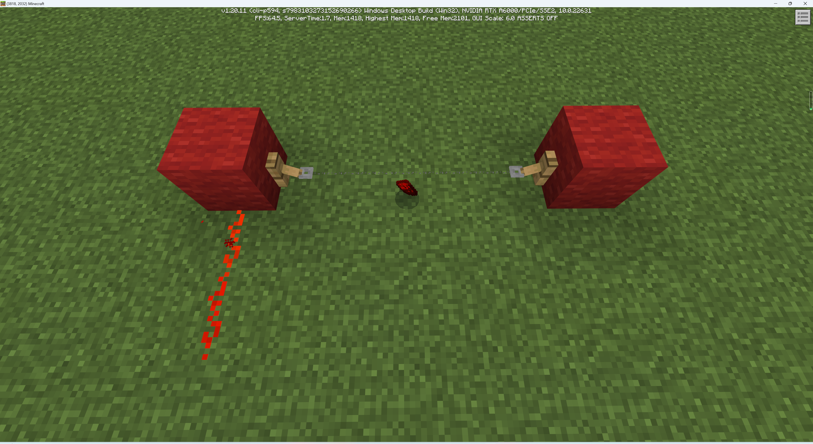
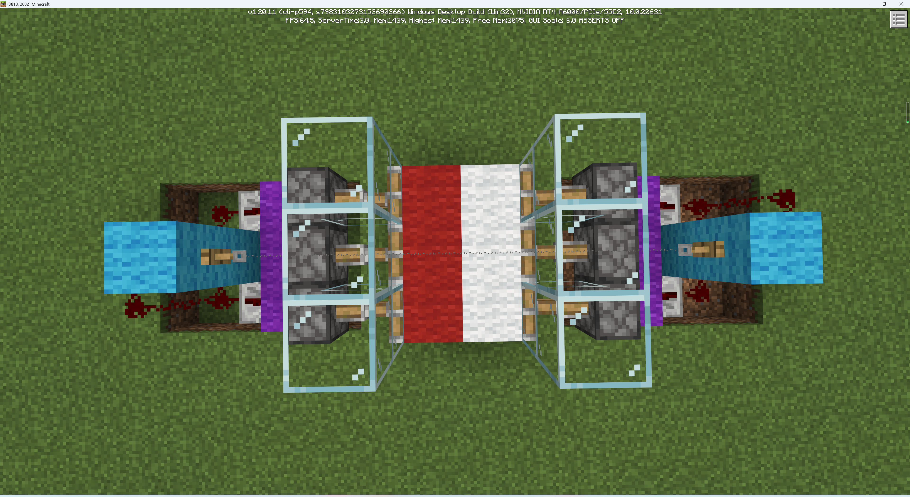
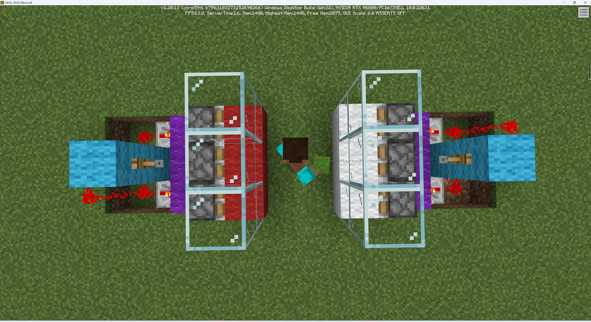
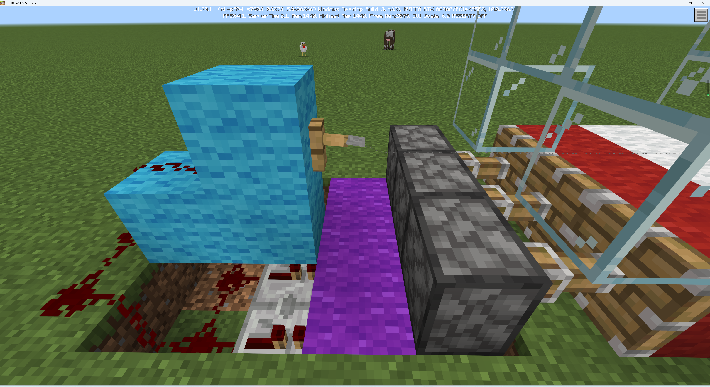

# 掉落陷阱

在我们的遗迹中，一种最常见的陷阱就是掉落陷阱。顾名思义，掉落陷阱就是一种在你经过时可能会掉落到下方的陷阱，而陷阱的下方往往是致命的，例如滴水石椎，或者满满的熔岩。

下面，我们一起来学习如何制作一个掉落陷阱。

## 绊线钩

在整个遗迹中，几乎所有陷阱都使用绊线钩作为红石电路的产能器，这是因为绊线钩可以做到很好的藏匿。

绊线钩需要成对相对放置，且其只能附着在一个方块的侧表面。对着成对的绊线钩中间使用线，即可在世界中放置绊线。当特定的实体位于绊线上时，绊线钩便会激活毗邻的元件，并给予附着15级的强充能。掉落物和玩家都可以激活绊线。

## 构建掉落陷阱

我们现在超平坦世界中试做一个掉落陷阱。掉落陷阱要求玩家靠近该陷阱时脚下的方块移开，从而落到下方准备的陷阱装置中。还记得上一章中我们制作的开关门吗，这其实是相同的原理。

我们从侧面分析一下陷阱。图中的玻璃方块用于模拟遗迹中实际的墙壁。注意的是，下方的截图中在每个活塞的正下方都有一个附着于紫色羊毛上的红石火把。

如果你之前的章节理解的够好，或许你已经看出来整体的原理了。是的，在默认状态下红石火把激活活塞，使活塞伸出。当绊线触发后，绊线钩后方的方块被强充能。进一步激活红石线。红石线激活下方的中继器。中继器充能紫色羊毛，从而熄灭火把，使活塞收回。绊线钩的未知之所以这么靠内，除了隐匿自身以外，还要放置绊线钩本身激活红石线或者活塞。下方之所以用红石中继器，是因为红石线并不会主动连接受能方块，也就是图中的紫色羊毛。必须用中继器强行将紫色羊毛这个受能方块加入红石电路中。

躲避这个陷阱的方法也很简单，只需要跳跃越过绊线，不触发机关即可。但绊线本身并不显眼，所以稍不留神就可能身陷囹圄。下面是这个机关布置在遗迹中的最终效果。