# 基于原版生物的自定义生物设计

在本节中，我们一起来学习如何使用《我的世界》开发工作台中的编辑器自定义生物。自定义生物最简单的方式便是从仿照原版生物开始。在《我的世界》开发工作台中，我们便有一键仿照原版生物创建新生物的功能。

## 创建生物

在《我的世界》开发工作台中找到你的作品，点击编辑按钮进入编辑器。

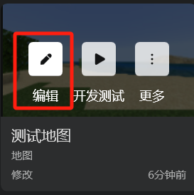

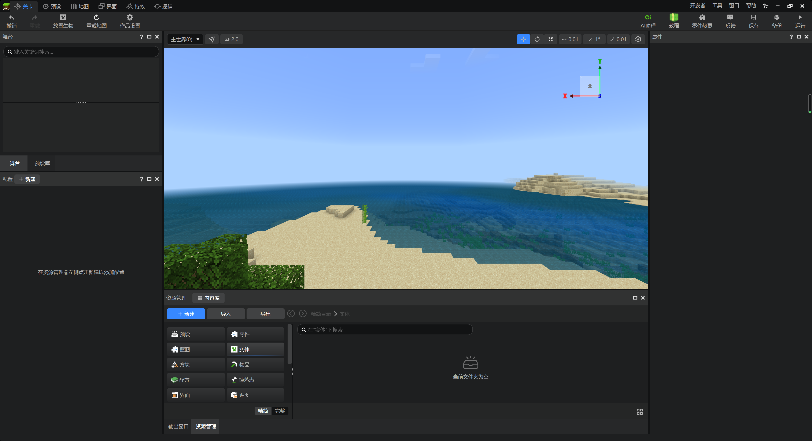

我们找到下方的“资源管理”窗格，点击“+新建”按钮。并点击“配置”选项卡。

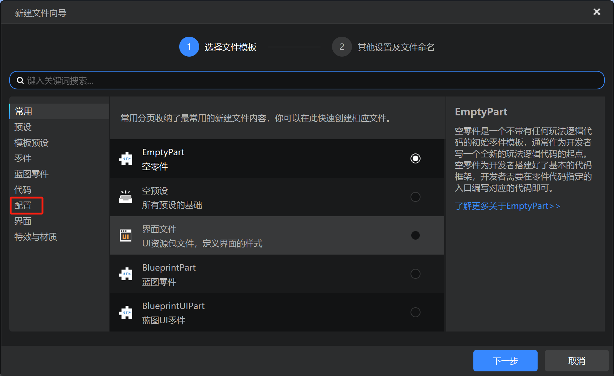

选择“实体”并点击“下一步”。

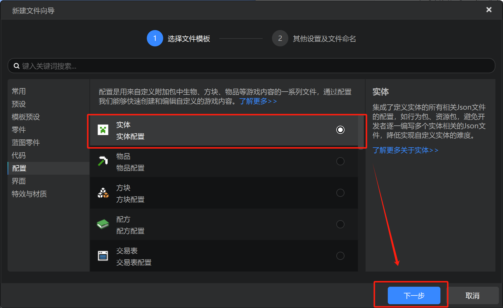

在这里，我们可以选择各类原版实体作为模板来开始创作。同时，我们可以为我们的实体命名。

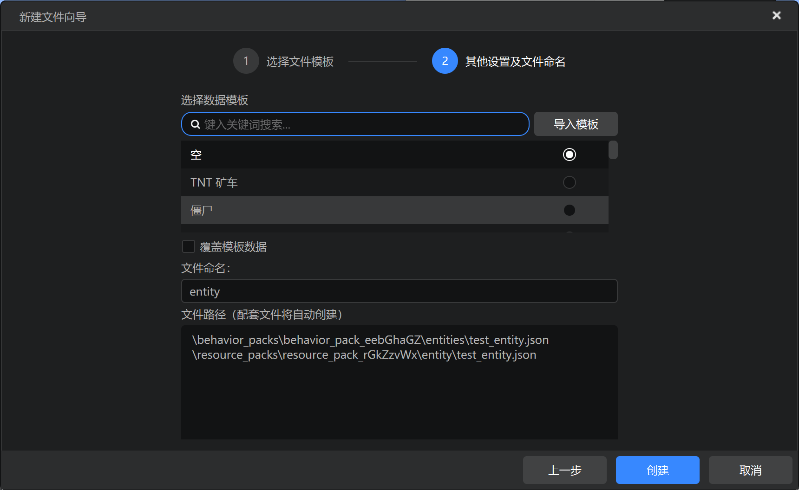

作为示例，我们可以选择僵尸，并命名为`guard`。由于我们此时的作品设置中设定的命名空间为`test`，因此我们的实体的标识符便是`test:guard`。

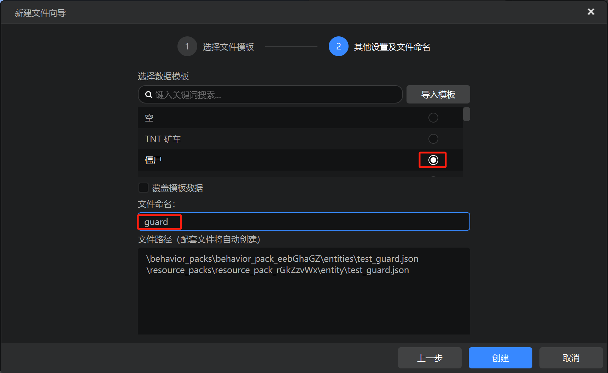

我们点击“创建”，便可以看到我们的实体已经出现在左侧的“配置”窗格内了。同时，右侧出现了该实体的属性信息。这样，我们便创建了一个新的名为`test:guard`的实体。

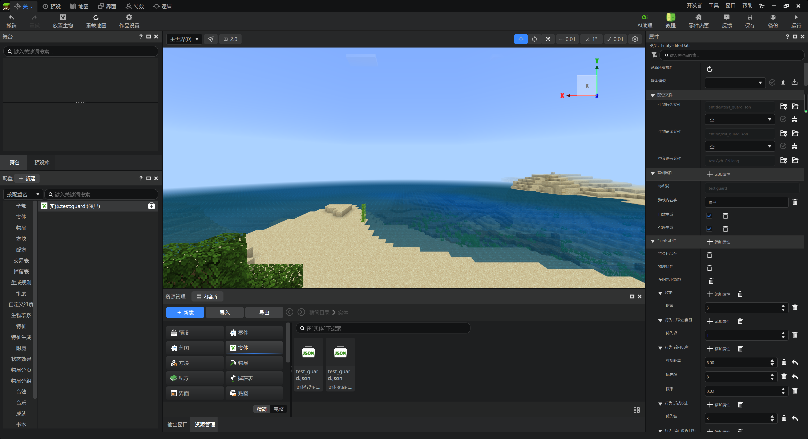

## 编辑实体

在右侧的窗格中，我们可以编辑实体。例如，我们可以在“游戏内名字”一栏编辑游戏内的名字。我们将其改为“守卫”。

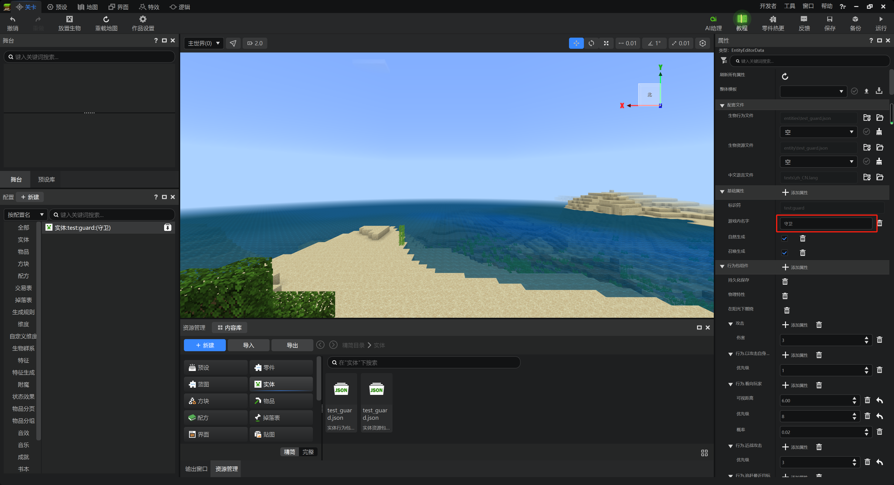

然后，我们也可以修改一些纹理。比如把这个以僵尸为底的守卫的皮肤换成紫的。首先点击下方“资源管理”内的“完整”按钮。

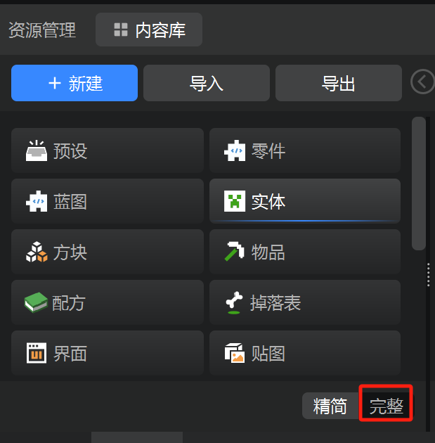

然后点击资源包。

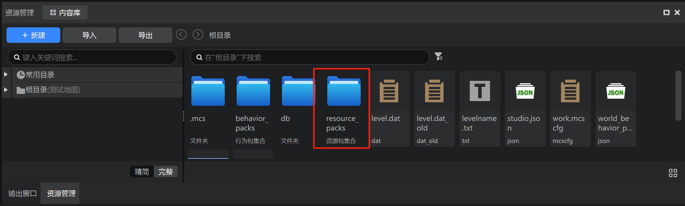

找到`textures`文件夹。

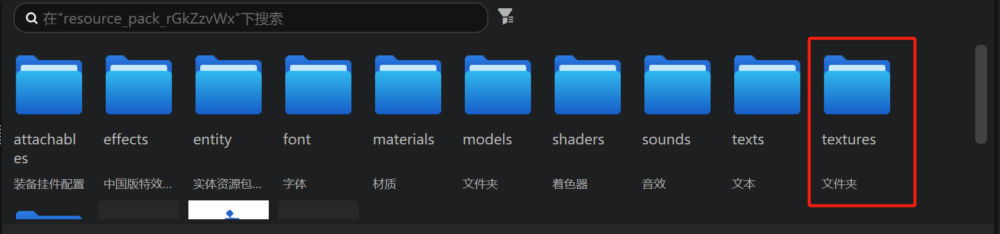

进入`entity`文件夹。

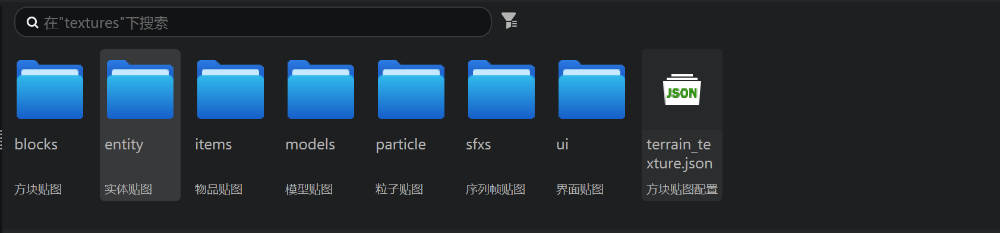

在这里放入我们希望更改的紫皮僵尸的纹理文件。

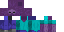

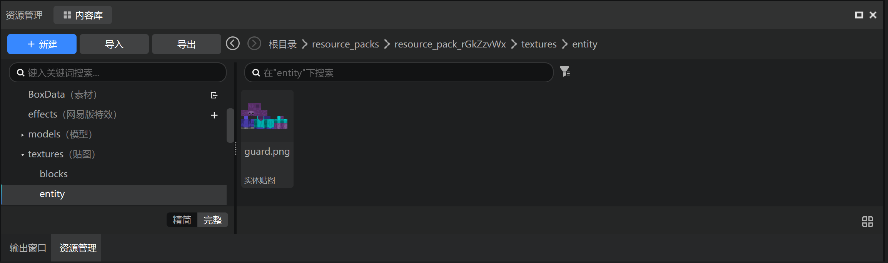

记住该文件的路径是`textures/entity/guard.png`。然后我们回到精简视图。找到“实体”。并找到实体资源包定义文件。

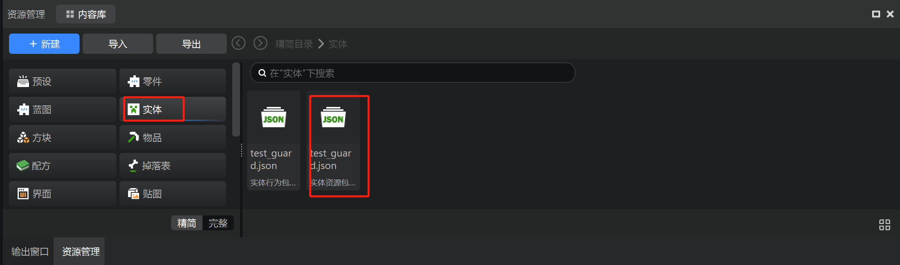

打开该文件，找到如图所示位置，将其更改为`textures/entity/guard`，也就是实际文件去掉`.png`扩展名之后的路径。并保存。

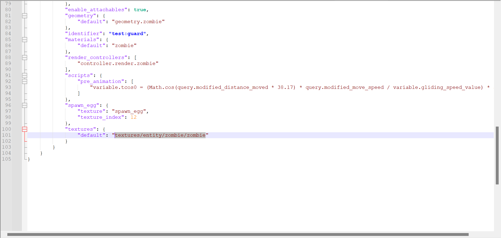

现在，我们就已经修改好纹理了！进入游戏看看，效果如何？

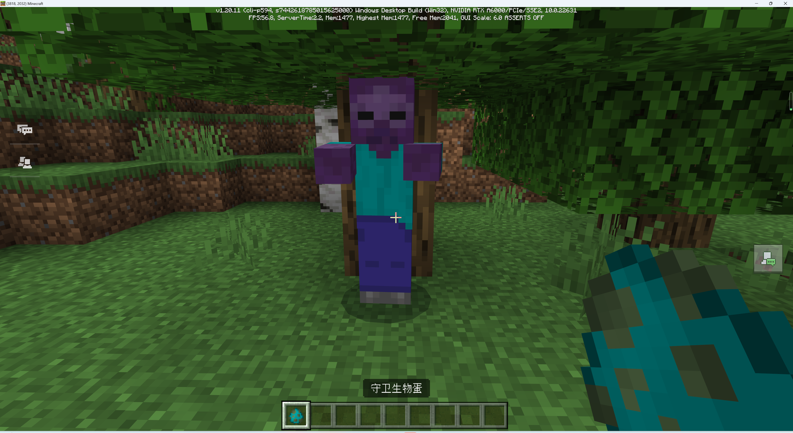