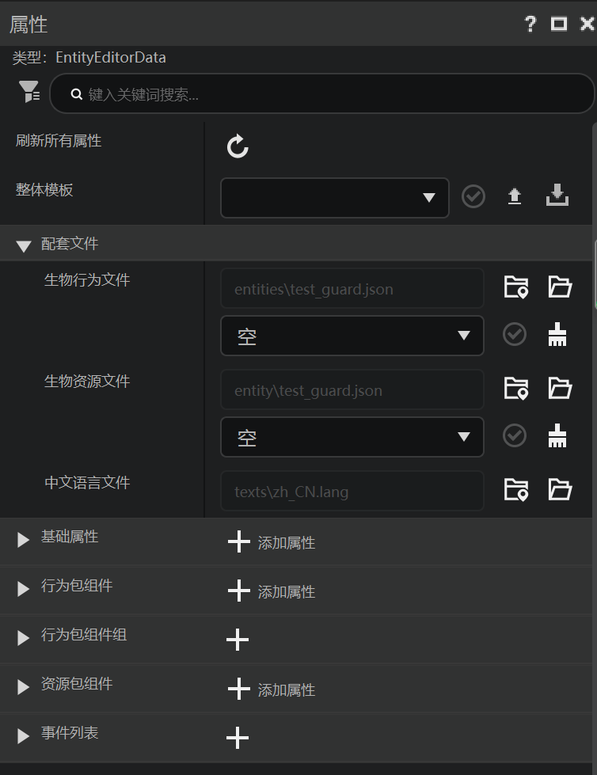
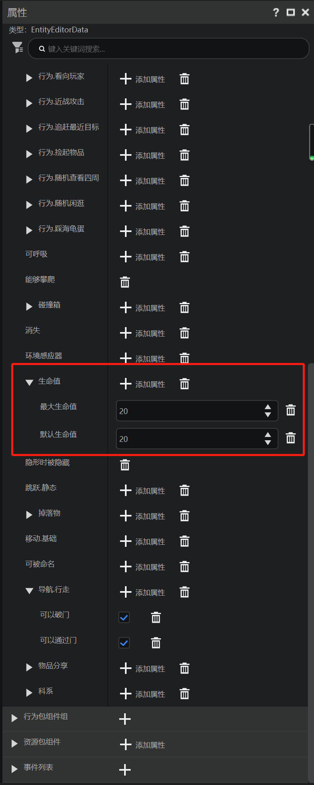
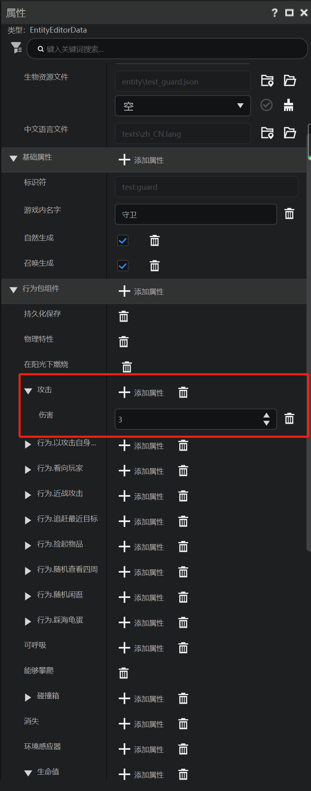
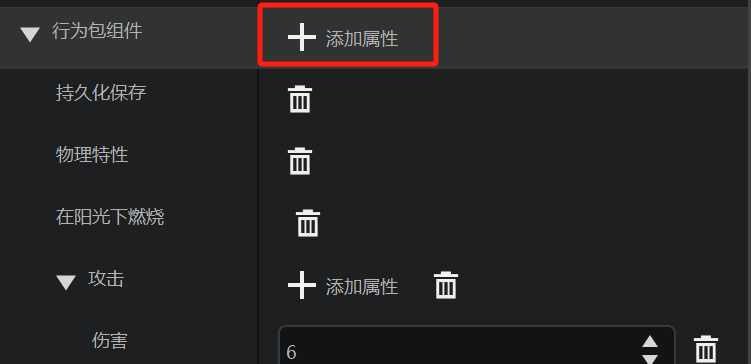
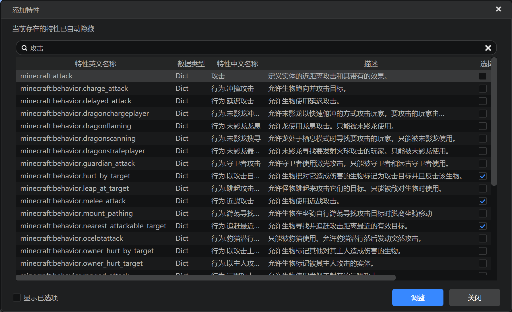
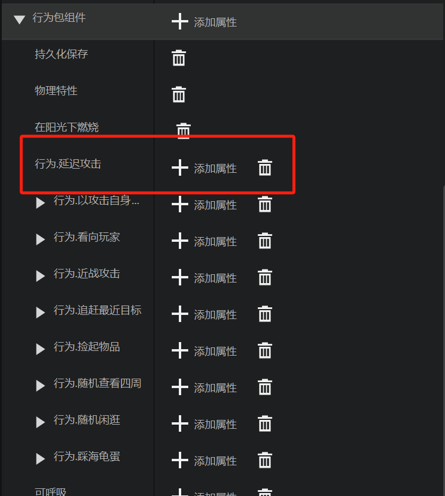
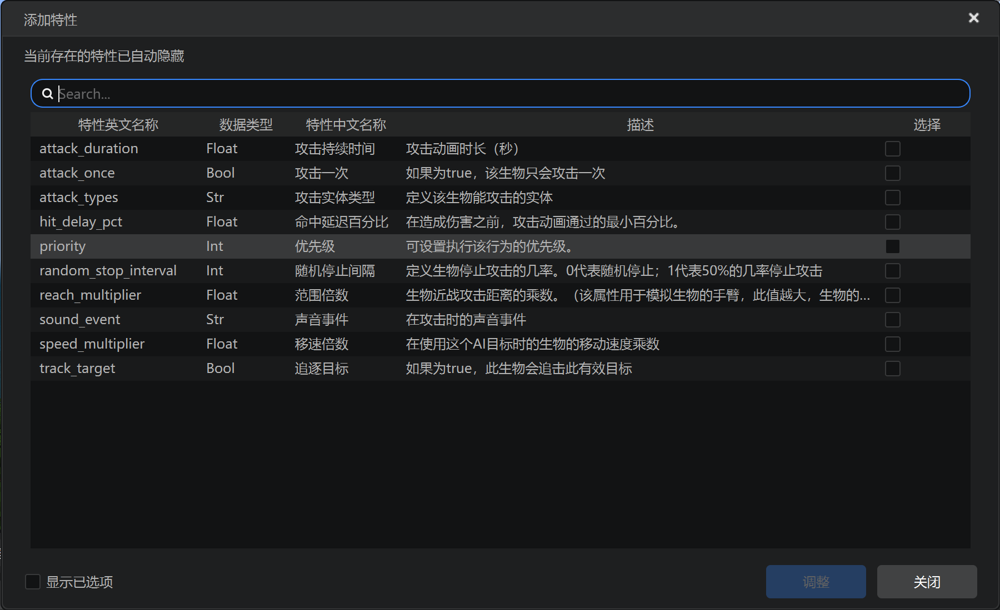
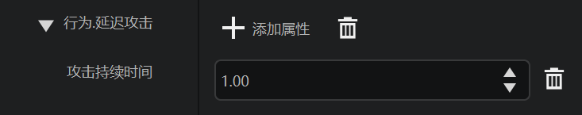

# 配置生物行为和属性

在上一节中，我们在编辑器中创建了第一个守卫生物。现在，我们一起来研究如何修改这个生物的行为和属性。

## 属性类型

在属性栏内，将所有展开的属性收起，我们可以看到属性分为多个种类。

- 基础属性是这个生物最基础的属性，包括名字和是否可以自然生成、召唤生成等。
- 行为包组件是这个生物的行为。
- 行为包组件组诗这个生物一些成组的特定行为。
- 资源包组件是这个生物的客户端渲染和音效相关的属性。
- 事件列表是这个生物所有可触发的事件。

## 配置生命值

作为遗迹的守卫，必然需要更高的生命值。在属性栏中找到“生命值”。

最大生命值是该实体可以通过回复血量的途径回复达到的最大生命值。默认生命值是该实体生成时具有的生命值。我们可以将两个属性改为40。

## 攻击力

作为守卫，攻击力也需要对应稍加提高，以增加应对的代价，从而更好地满足击败守卫的成就感。找到“攻击”。

我们可以将攻击的伤害改为6。让我们的守卫生物打人更疼一些。

## 更改攻击方式

作为一个守卫生物，他可以拥有更多的攻击方式。我们可以为守卫生物添加其他的攻击方式或更改他的攻击方式。点击“行为包组件”右侧的“添加属性”。

我们可以看到打开了一个对话框。对话框中是所有可以添加的属性，以及当前添加的情况。已添加的属性在右侧“选择”列中表现为选中状态。我们可以在顶部的搜索栏中搜索“攻击”。我们将得到所有与攻击相关的属性。

比如，我们可以添加一个“延迟攻击”的属性。延迟攻击可以做到并非在接触时直接给予近战攻击伤害，而是延迟特定时间之后再攻击，多样的攻击方式可以丰富我们的生物的行为。选择打钩“延迟攻击”，并点击调整，延迟攻击的行为便进入了属性栏中。

再次点击延迟攻击下的添加属性，可以添加更多相关的配置。

比如，我们可以添加攻击持续时间并进行修改。

除了攻击之外，你可以自定义或自主添加更多其他的行为。《我的世界》中有丰富的实体接口，以供我们自定义逻辑复杂的生物模式。