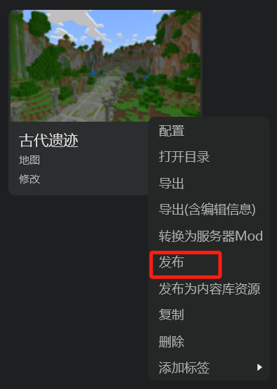
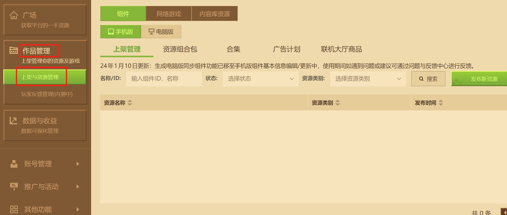

# 发布地图

在一切准备就绪之后，我们便可以发布地图了。

## 提审作品

在编辑器中找到作品资源，点击“更多”按钮或者右键。点击“发布”按钮，我们即可来到发布资源的浏览器页面。

按照你作品的属性填写好每一项基本信息，在详情信息输入框内填写一些地图描述，并上传一些截图之后，点击右上角的“提交审核”，便可以提审了。如果你不想这么快提交审核，也可以点击“保存”将作品信息暂存在开发者内容管理工具系统中。

如果你之前已经发布过作品，你需要更新原有的作品，而不是新发布一个新作品。

## 上架作品

在审核通过后，在开发者内容管理工具中便可以点击上架，上架我们的作品啦！

