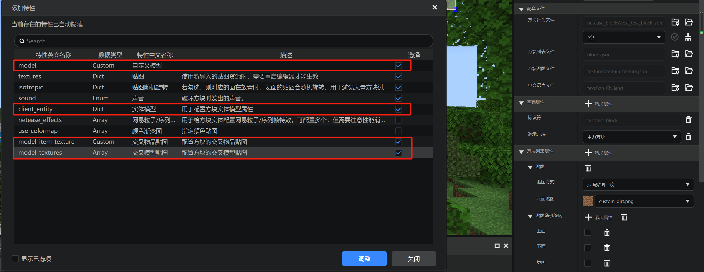
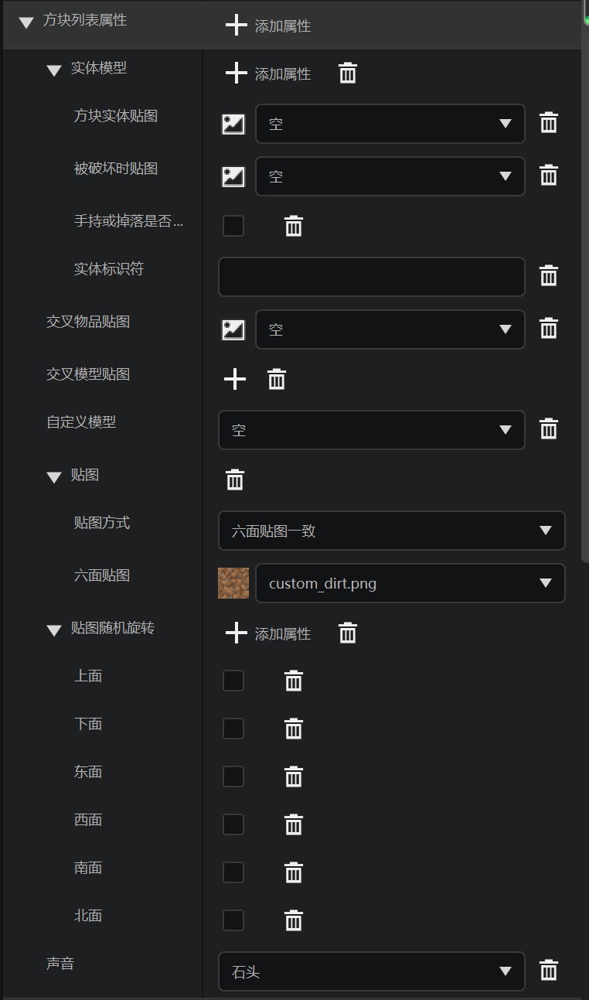
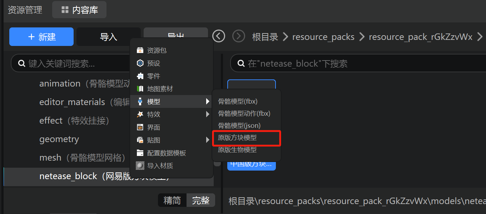

# 外观

最后，我们回顾学习如何修改方块的外观。

## 在编辑器中添加



我们回到`test:test_block`方块，在“方块列表属性”中像这样选中并添加一些属性。



在属性栏中，我们产生了如图所示的属性列表。要注意的是，我们此处是为了演示对应关系而将他们全部添加进来了，事实上，在实际操作中，我们未必需要这些全部同时存在。你马上就会知道这些属性之间的含义有哪些异同。

## 实际文件

我么打开资源包的`blocks.json`文件：

```json
{
    "format_version": [
        1,
        1,
        0
    ],
    "test:loot": {
        "textures": "test:barrel_side"
    },
    "test:test_block": {
        "client_entity": {
            "hand_model_use_client_entity": false,
            "identifier": ""
        },
        "isotropic": {
            "down": false,
            "east": false,
            "north": false,
            "south": false,
            "up": false,
            "west": false
        },
        "model_item_texture": "",
        "model_textures": [

        ],
        "netease_model": "",
        "sound": "stone",
        "textures": "test:custom_dirt"
    }
}
```

首先，我们关注`netease_model`字段，这用于控制方块是否使用自定义模型。使用自定义模型的方块如同实体一样，可以拥有更细致的外观。使用这种方法定义的自定义模型必须是网易特有的JSON格式，关于如何制作这种JSON格式，你可以详细参考官方文档的[自定义方块模型](https://mc.163.com/dev/mcmanual/mc-dev/mcguide/20-%E7%8E%A9%E6%B3%95%E5%BC%80%E5%8F%91/15-%E8%87%AA%E5%AE%9A%E4%B9%89%E6%B8%B8%E6%88%8F%E5%86%85%E5%AE%B9/2-%E8%87%AA%E5%AE%9A%E4%B9%89%E6%96%B9%E5%9D%97/5-%E8%87%AA%E5%AE%9A%E4%B9%89%E6%96%B9%E5%9D%97%E6%A8%A1%E5%9E%8B.html?catalog=1)页面。特别地，我们这里展示如何在编辑器中通过导入`.bbmodel`文件来产生网易自定义的方块模型格式：



在导入完成后，我们可以在资源包的`models`文件夹下的`netease_block`文件夹中找到对应模型的JSON文件。一个示例的JSON文件形如此：

```json
{
    "format_version": "1.13.0",
    "netease:block_geometry": {
        "bones": [
            {
                "cubes": [
                    {
                      "origin": [-16, 0, 8],
                      "size": [16, 16, 0],
                      "pivot": [-8, 0, 8],
                      "rotation": [0, -45, 0],
                        "uv": {
                            "north": {
                                "texture": 0,
                                "uv": [
                                    0,
                                    0
                                ],
                                "uv_size": [
                                    16,
                                    16
                                ]
                            }
                        }
                    },
                    {
                      "origin": [-16, 0, 8],
                      "size": [16, 16, 0],
                      "pivot": [-8, 0, 8],
                      "rotation": [0, 45, 0],
                        "uv": {
                            "north": {
                                "texture": 0,
                                "uv": [
                                    0,
                                    0
                                ],
                                "uv_size": [
                                    16,
                                    16
                                ]
                            }
                        }
                    }
                ],
                "name": "unknown_bone",
                "pivot": [
                    0,
                    0,
                    0
                ]
            }
        ],
        "description": {
            "identifier": "customblocks:web_preset",
            "use_ao": true
        }
    }
}
```

该模型文件是网易内置的一个特殊模型文件，标识符可以在文件内容中轻松找到，为`customblocks:web_preset`。由于是内置的，这也意味着我们不能再采用这个标识符作为模型名。

如果我们将`netease_model`字段设置为这个`customblocks:web_preset`模型，那么我们将允许直接在`blocks.json`文件中配置使用交叉贴图模型的方块。`model_textures`和`model_item_texture`字段将在此时有效。如果`netease_model`字段设置为其他值，这两个字段将无效。关于交叉贴图方块相关字段如何设置可以查看官方文档[自定义交叉贴图方块](https://mc.163.com/dev/mcmanual/mc-dev/mcguide/20-%E7%8E%A9%E6%B3%95%E5%BC%80%E5%8F%91/15-%E8%87%AA%E5%AE%9A%E4%B9%89%E6%B8%B8%E6%88%8F%E5%86%85%E5%AE%B9/2-%E8%87%AA%E5%AE%9A%E4%B9%89%E6%96%B9%E5%9D%97/3-%E7%89%B9%E6%AE%8A%E6%96%B9%E5%9D%97/8-%E8%87%AA%E5%AE%9A%E4%B9%89%E4%BA%A4%E5%8F%89%E8%B4%B4%E5%9B%BE%E6%96%B9%E5%9D%97.html?catalog=1)页面。

最后我们来看`client_entity`字段。该字段是用于配置客户端方块实体的。方块实体允许方块在客户端使用自定义模型的同时使用与实体一样的模型动画。在这里，我们接受的模型不再是方块模型，而是直接接受一个实体客户端定义文件的标识符，也就是直接引用一个实体客户端定义。可想而知，实体的所有渲染表现形式都可以轻松在这里的方块实体中实现。具体方块实体相关字段的配置可以参考官方文档[自定义方块实体外观](https://mc.163.com/dev/mcmanual/mc-dev/mcguide/20-%E7%8E%A9%E6%B3%95%E5%BC%80%E5%8F%91/15-%E8%87%AA%E5%AE%9A%E4%B9%89%E6%B8%B8%E6%88%8F%E5%86%85%E5%AE%B9/2-%E8%87%AA%E5%AE%9A%E4%B9%89%E6%96%B9%E5%9D%97/4.1-%E8%87%AA%E5%AE%9A%E4%B9%89%E6%96%B9%E5%9D%97%E5%AE%9E%E4%BD%93%E5%A4%96%E8%A7%82.html?catalog=1)页面。