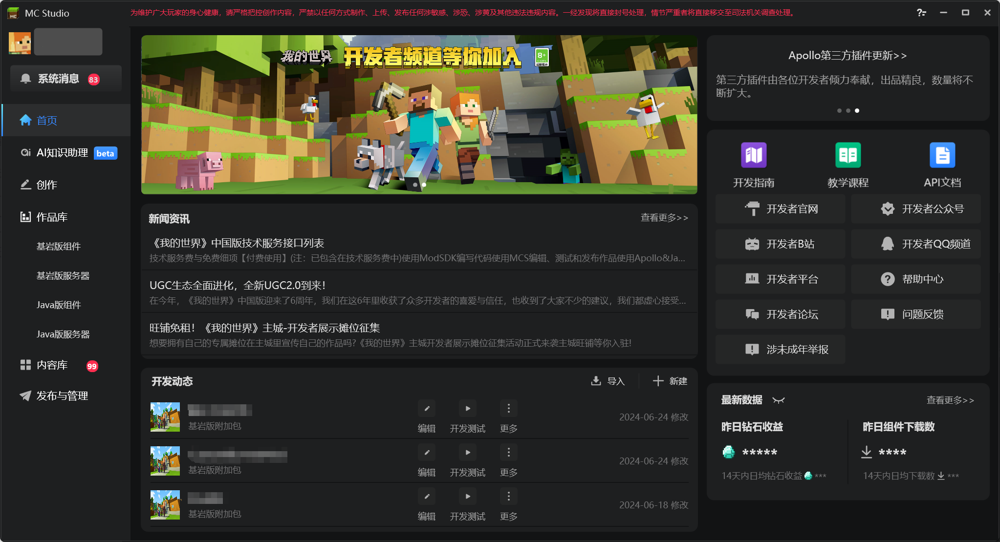
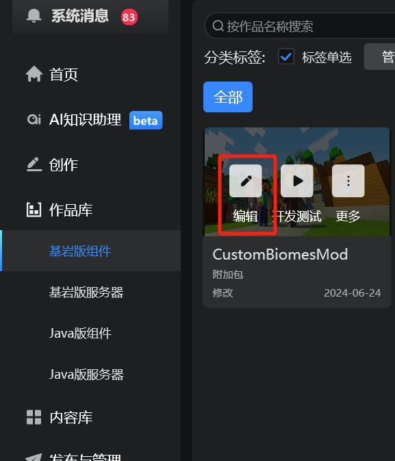
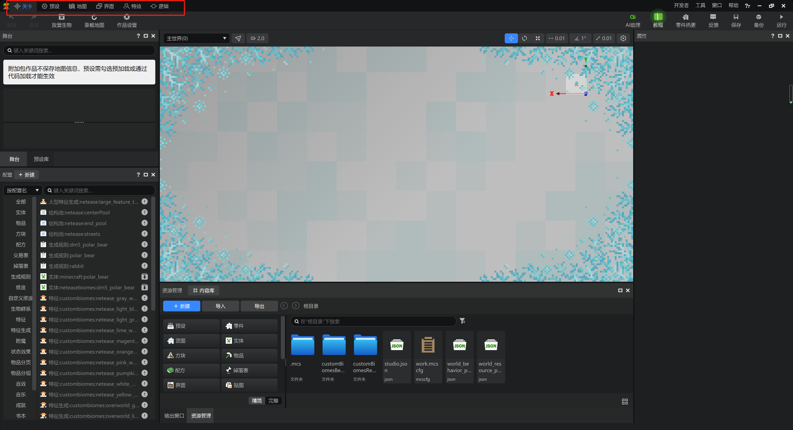
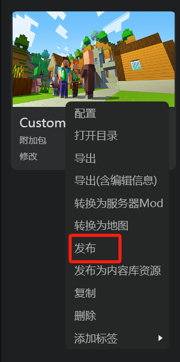
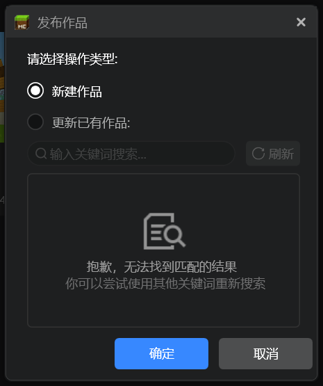
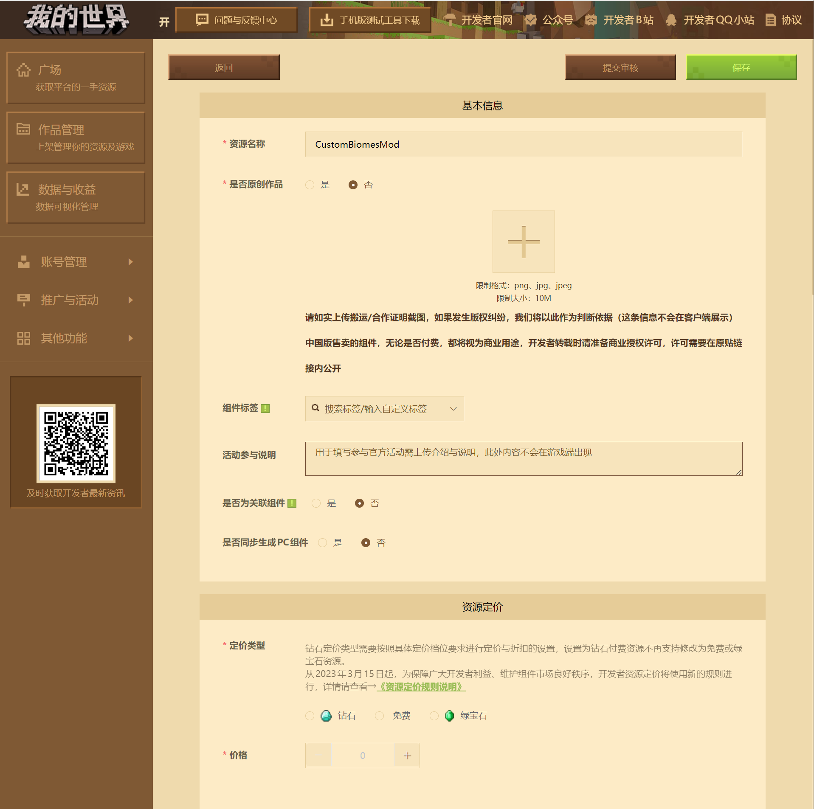
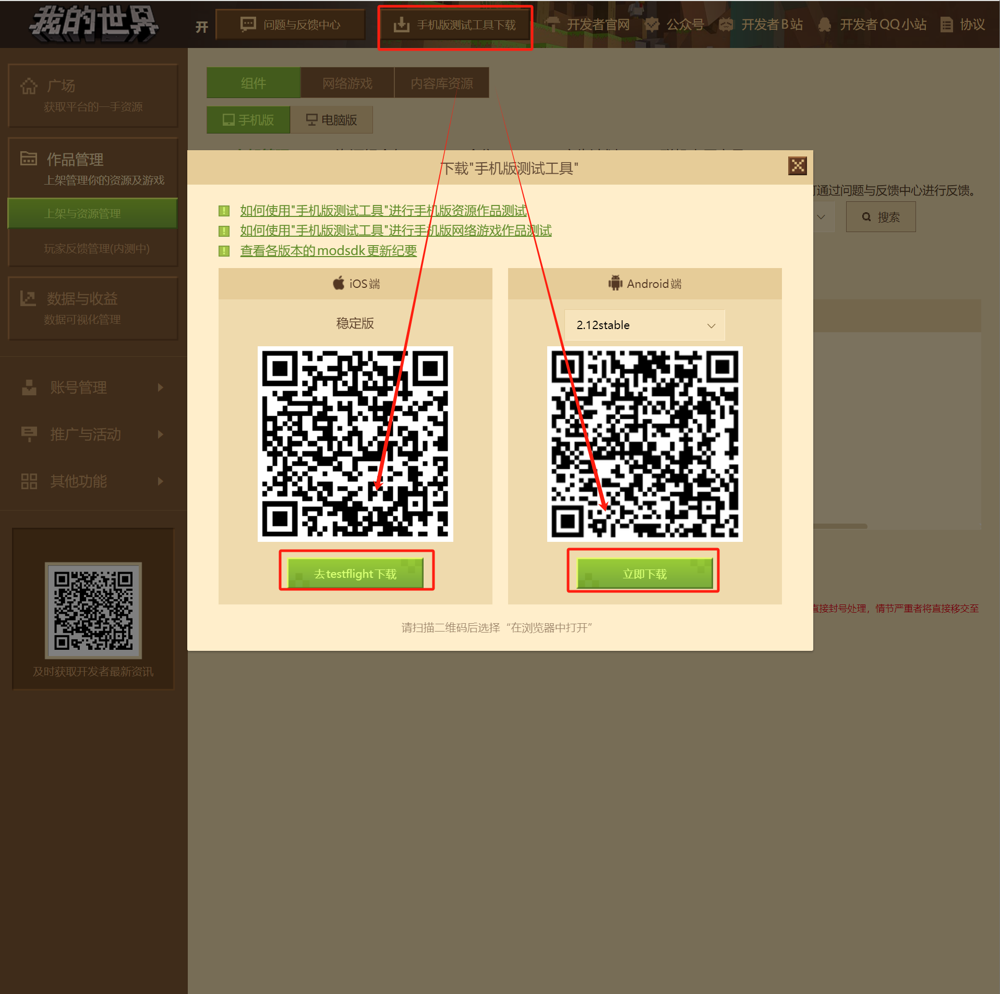

# 《我的世界》开发工作台功能简介

我们一起来浏览《我的世界》开发工作台的基本功能。点击桌面上的“ **我的世界开发者启动器** ”按钮，打开《我的世界》开发工作台。在弹出的弹窗中输入你的开发者账号和密码，便可以登录进入开发工作台的主页面。

## 主页功能

- 首页：开发者的新闻资讯，开发资料，你的收益和近期编辑的项目动态。
- AI知识助理：官方训练的《我的世界》开发对话式辅助AI，可以帮助你查询知识和试写简单的开发内容。
- 创作：新建作品，新建服务器，导入作品，调用各类创作工具。
- 作品库：你当前在开发工作台内创建、导入和编辑过的所有作品的列表，你可以在这里进入作品的编辑页面、调试作品和快速调用相关工具。
- 内容库：在线的开发资源库，来自各个热心开发者投递的可以改编和复用的创作模板。
- 发布与管理：点击这个按钮，将跳转到浏览器内的开发者平台进行作品的提审、管理和发布。

## 编辑

在新建作品之后，或者在作品库中找到你的作品之后，你可以进入“编辑”功能。编辑器功能会打开一个编辑器供你使用。

编辑器的顶部可以切换编辑器的各项子编辑器。我们一起来了解一下各子编辑器的功能：

- 关卡编辑器：你可以在这里添加附加包的各项数据驱动和脚本功能，并在舞台中管理游戏内的实体、方块、预设，定位和打开你的配置文件资源。
- 预设编辑器：你可以在这里精细地编辑、操作你添加在游戏内的各个预设。
- 地图编辑器：你可以在这里使用丰富的工具修改地形，也可以在这里制作并保存结构。
- 界面编辑器：你可以在这里可视化地编辑JSON UI。
- 特效编辑器：你可以在这里制作微软原版和中国版两种版本的粒子特效。
- 逻辑编辑器：你可以在这里使用节点式可视化编程来编写蓝图模组。这对于非编程专业出身的小白开发者编写复杂逻辑极其友好。

## 调试

在“编辑”按钮的右侧有“ **开发测试** ”按钮，按下该按钮后游戏将调用Mod PC开发包并进入调试。这是一个可以模拟生产环境，但具备一定程度的开发功能的《我的世界》实例，你可以在这里测试你模组上线后的效果。当然，最终效果仍要以上线之后的实际测试为准。不过在此之前，我们可以通过上线前的手机端自测来更为接近地测试实际效果。这边引出了模组发布相关功能。

## 发布

右击你的模组，你可以看到“ **发布** ”按钮。按下该按钮后模组将进入发布流程。你将看到浏览器弹出并引导你进入发布页面。按照你的实际情况填写模组内容并发布即可。发布后模组会进入审核状态。审核结束之后你便可以选择上线模组。

在模组审核期间，你可以在开发者平台上下载手机自测端来进行自测。手机自测较为接近模组最终上线后的品质，你可以通过自测发现、修改问题，或确认自己的模组功能无误。

至此，你已经学会了《我的世界》开发工作台的基本功能。对于更深入的功能，你需要自己结合开发者官方的资料自行探索。相信你一定可以利用开发工作台的丰富功能，在模组开发上大展拳脚！

参考资料：

- [MC Studio使用说明](https://mc.163.com/dev/mcmanual/mc-dev/mcguide/12-%E5%85%A5%E9%97%A8%E6%95%99%E7%A8%8B/20-MC%20Studio%E4%BD%BF%E7%94%A8%E8%AF%B4%E6%98%8E.html?catalog=1)
- [认识开发者平台](https://mc.163.com/dev/mcmanual/mc-dev/mcguide/12-%E5%85%A5%E9%97%A8%E6%95%99%E7%A8%8B/11-%E8%AE%A4%E8%AF%86%E5%BC%80%E5%8F%91%E8%80%85%E5%B9%B3%E5%8F%B0.html?catalog=1)
- [充分利用关卡编辑器](https://mc.163.com/dev/mcmanual/mc-dev/mcguide/20-%E7%8E%A9%E6%B3%95%E5%BC%80%E5%8F%91/11-%E7%BB%84%E8%A3%85%E7%AE%80%E5%8D%95%E7%8E%A9%E6%B3%95/0-%E5%85%B3%E5%8D%A1%E7%BC%96%E8%BE%91%E5%99%A8.html)
- [预设编辑器](https://mc.163.com/dev/mcmanual/mc-dev/mcguide/20-%E7%8E%A9%E6%B3%95%E5%BC%80%E5%8F%91/14-%E9%A2%84%E8%AE%BE%E7%8E%A9%E6%B3%95%E7%BC%96%E7%A8%8B/0-%E7%90%86%E8%A7%A3%E9%A2%84%E8%AE%BE%E7%B3%BB%E7%BB%9F/7-%E9%A2%84%E8%AE%BE%E7%BC%96%E8%BE%91%E5%99%A8%E4%BD%BF%E7%94%A8%E8%AF%B4%E6%98%8E.html)
- [地图编辑器使用说明](https://mc.163.com/dev/mcmanual/mc-dev/mcguide/14-%E5%9C%B0%E5%9B%BE%E5%88%B6%E4%BD%9C/2-%E5%9C%B0%E5%9B%BE%E7%BC%96%E8%BE%91%E5%99%A8%E4%BD%BF%E7%94%A8%E8%AF%B4%E6%98%8E.html)
- [特效编辑器简介](https://mc.163.com/dev/mcmanual/mc-dev/mcguide/16-%E7%BE%8E%E6%9C%AF/9-%E7%89%B9%E6%95%88/00-%E7%89%B9%E6%95%88%E7%BC%96%E8%BE%91%E5%99%A8%E7%AE%80%E4%BB%8B.html)
- [界面编辑器入门](https://mc.163.com/dev/mcmanual/mc-dev/mcguide/18-%E7%95%8C%E9%9D%A2%E4%B8%8E%E4%BA%A4%E4%BA%92/1-%E7%95%8C%E9%9D%A2%E7%BC%96%E8%BE%91%E5%99%A8%E4%BD%BF%E7%94%A8%E8%AF%B4%E6%98%8E.html)
- [什么是逻辑编辑器](https://mc.163.com/dev/mcmanual/mc-dev/mcguide/20-%E7%8E%A9%E6%B3%95%E5%BC%80%E5%8F%91/12-%E5%8F%AF%E8%A7%86%E5%8C%96%E7%BC%96%E7%A8%8B/10-%E6%96%B0%E7%89%88%E9%80%BB%E8%BE%91%E7%BC%96%E8%BE%91%E5%99%A8%E4%BD%BF%E7%94%A8%E8%AF%B4%E6%98%8E/01-%E4%BB%80%E4%B9%88%E6%98%AF%E9%80%BB%E8%BE%91%E7%BC%96%E8%BE%91%E5%99%A8.html)