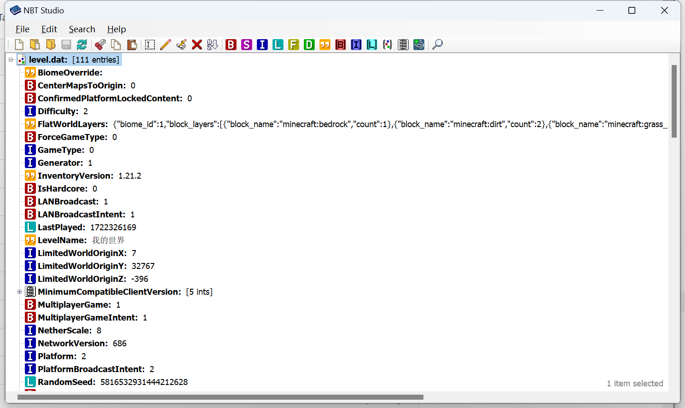

# 编辑存档NBT

 **NBT** （ **N** amed **B** inary  **T** ags）译为二进制命名标签，是《我的世界》独有的一种存储（序列化）格式，可以非常方便地存储《我的世界》的存档和网络交换信息。因此，为了编辑《我的世界》存档，我们必须知道如何编辑NBT。

## NBT Studio

NBT Studio是一款Java版和基岩版通用的NBT编辑软件，支持编辑Java版NBT文件、Java版区域文件（`.mca`、`.mcr`）、基岩版NBT文件、SNBT文件等。

### 下载

打开NBT Studio的GitHub发布页，我们可以下载到最新版NBT Studio：https://github.com/tryashtar/nbt-studio/releases 。下载最新版本的“ **Assets（资产）** ”一栏下方的`NbtStudio.exe`文件即可。

### 使用

用NBT Studio打开一个NBT文件即可使用。基岩版一个存档的根目录下的`level.dat`文件便是一个典型的基岩版NBT文件。我们打开一个`level.dat`，以此为例来了解NBT Studio的功能。

上图是一个完整的`level.dat`文件在NBT Studio中打开后所显示的界面。NBT是一个树状结构，结构中的每个字段都会有一个类型，例如上图的根节点`level.dat`是一个复合标签类型，复合标签下可以挂接多个其他字段。其下的`BiomeOverride`是字符串类型，`CenterMapsToOrigin`是字节类型，等。具体的NBT格式你可以参考中文Minecraft Wiki的[NBT格式](https://zh.minecraft.wiki/w/NBT%E6%A0%BC%E5%BC%8F)页面。如果你学有余力，可以额外参考[这个页面（英文）](https://wiki.vg/NBT)。

双击一个字段以编辑它的键名和值。选中一个复合标签，例如上图我们选中了`level.dat`字段，之后点击工具栏上的“B”、“S”等类型按钮，便可以在该复合标签下添加一个新的选中类型的字段。具体类型可以将鼠标移动到按钮上方，以查看该按钮的工具提示信息。

NBT Studio还有编辑SBNT等其他高级功能，但对于初学者而言，了解至此便已足够。如果你感兴趣，你可以自行探索这款软件。

## LevelDB

基岩版的存档有一个`level.dat`和一个LevelDB结构合在一起而组成。`level.dat`文件用于存储该世界的基本配置信息。LevelDB用于存储该世界内的区块格式信息和必要的硬编码数据信息。《我的世界》使用一种改造的LevelDB格式来结合NBT存储区块等信息，因此你需要一款能够编辑《我的世界》这种特殊LevelDB的工具来修改存档。

如果你对底层的直接修改感兴趣，我们推荐[McpeTool](https://github.com/midnightfreddie/McpeTool)这款工具。但由于这款工具使用命令行或网页API，门槛过高，我们不做介绍。在之后的课程中，我们会介绍更多友善且实用的存档编辑软件，可以部分访问且修改到LevelDB内的信息。请继续向后阅读！