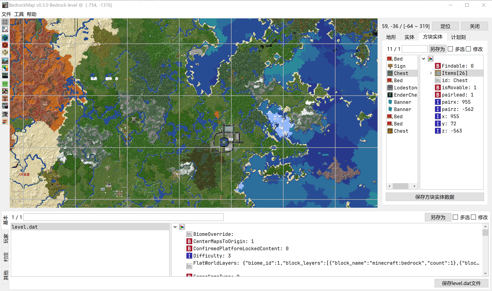
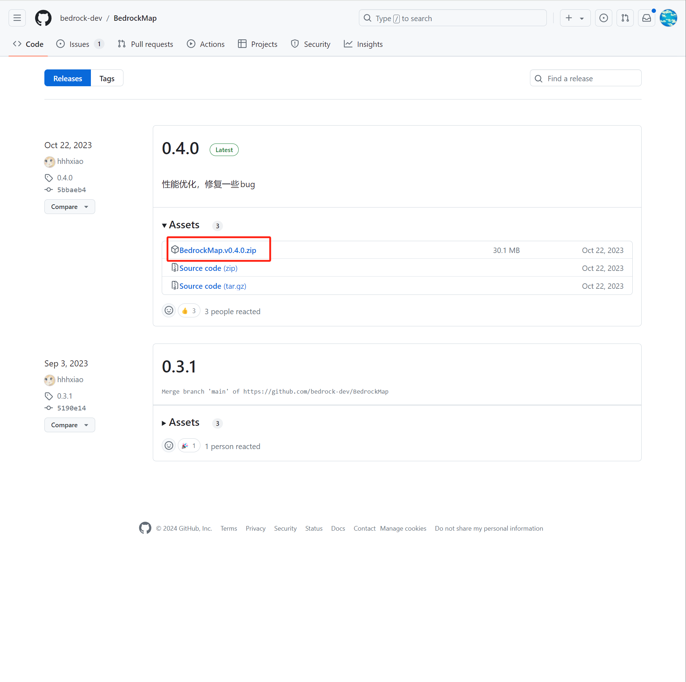

# 安装BedrockMap

BedrockMap是一款能够修改基岩版存档的免费工具。提供了`level.dat`修改，部分的LevelDB修改，可视化地形地图等多种功能。下面，我们一起来下载和安装BedrockMap。

## 下载

BedrockMap发布在GitHub，我们需要访问GitHub的发布页来获取最新版本的BedrockMap：https://github.com/bedrock-dev/BedrockMap/releases 。下载最新版本的`BedrockMap.vx.x.x.zip`即可。

该软件是免安装软件，因此你只需要将包体内的文件解压到你指定的一个空文件夹中，便可以完成安装。

双击`BedrockMap.exe`打开该软件。
