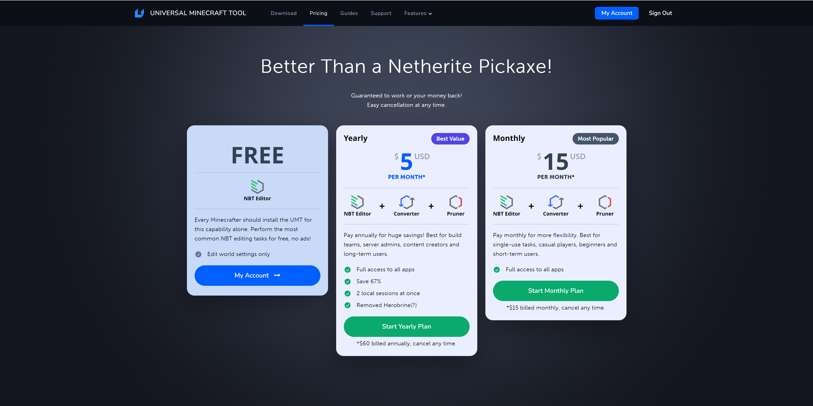
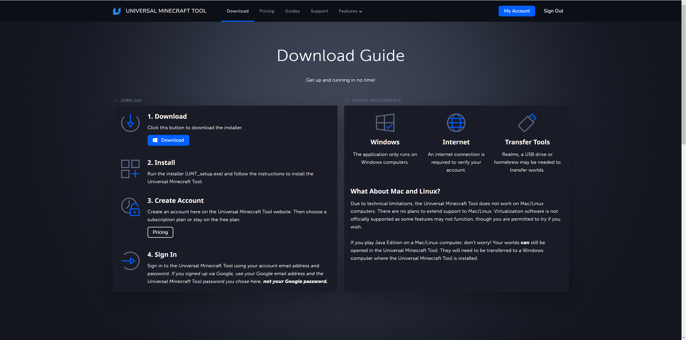
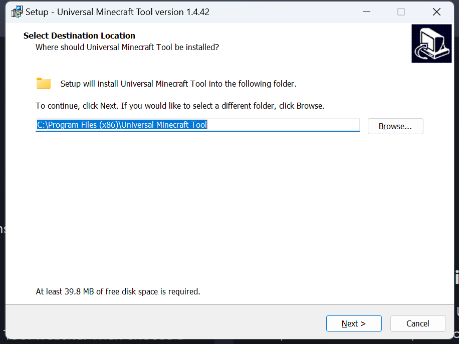
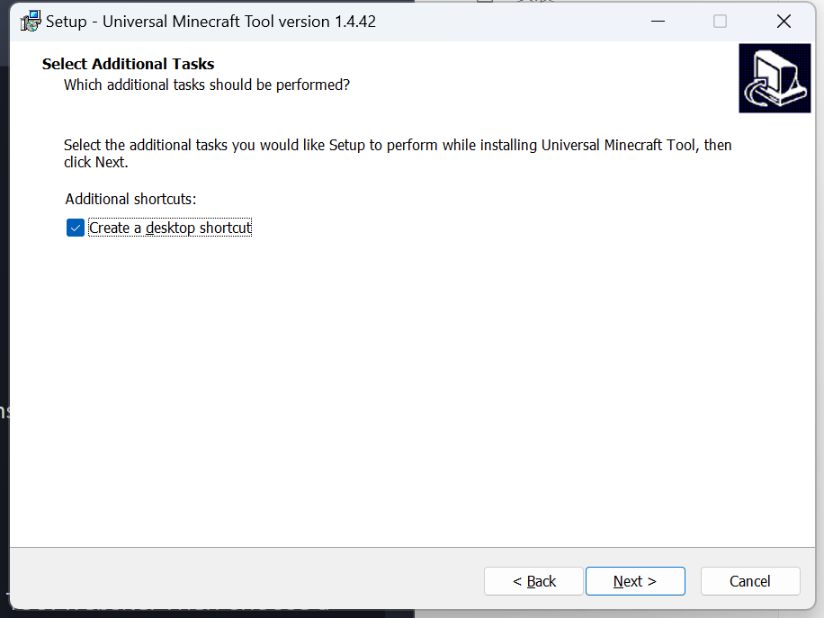
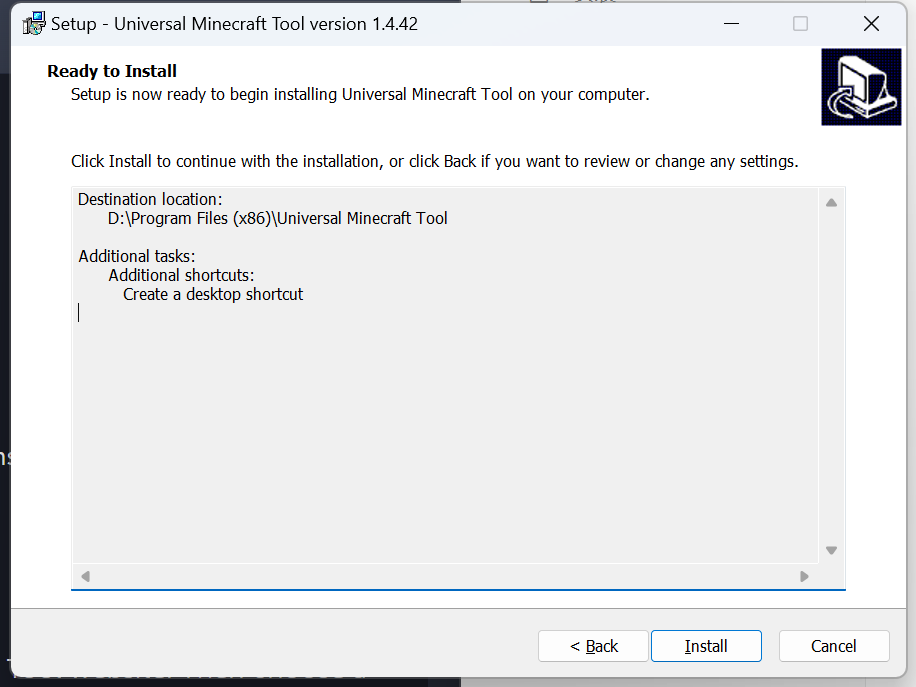

# 安装Universal Minecraft Tool

Universal Minecraft Tool（简称UMT）是一款收费的《我的世界》地图编辑软件，它具有更多更强大的《我的世界》地图编辑功能，除此之外，他还有近乎完美的、不限制大小的JE、BE地图转换功能和地图修剪功能。并且，他正常支持中国版创建的存档的地形地图。

## 订阅

为了使用UMT，你需要向UMT的开发团队付费。打开UMT的官方网站：https://www.universalminecrafttool.com/ 。

点击顶部栏的“ **Pricing（定价）** ”按钮，你可以看到各档位的定价。

你依旧可以选择免费继续，但这样你将只能编辑`level.dat`，而不能享受其他所有功能。

## 下载

假设我们已经为我们的账户进行了付费，我们接下来一起来下载UMT软件。

点击官网上方的“ **Download（下载）** ”按钮，我们来到UMT的下载页：

这款工具支持在Windows上运行，在此点击蓝色的“ **Download（下载）** ”按钮下载安装包。

## 安装

下载完成后，双击安装包以开始安装：

你可以根据自己的喜好更改安装路径。

在点击“ **Next（下一步）** ”后，可以选择是否创建桌面快捷方式，默认为创建。然后再次点击“ **Next（下一步）** ”，我们来到准备安装界面：

点击“ **Install（安装）** ”，等待安装完成即可。

这样我们便安装了UMT软件！安装完成UMT后，如果你选择了创建桌面快捷方式，我们会在桌面上找到名为“Universal Minecraft Tool”的快捷方式，双击即可打开UMT。