# PyCharm简介

和VSCode类似，我们找到并打开PyCharm。我们一起来了解PyCharm的功能。

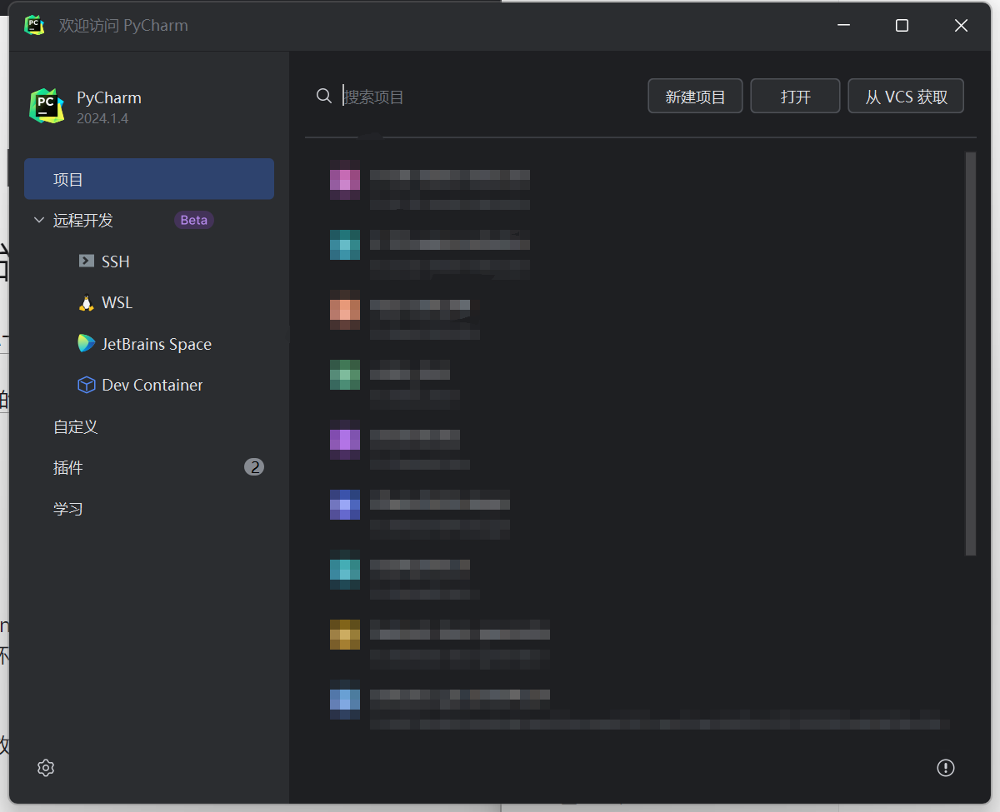

## 汉化

和VSCode一样，你可能会发现，你的PyCharm的初始界面也是英文的。专业是没有下载中文语言插件的结果。我们点击“插件”（Plugins）按钮：

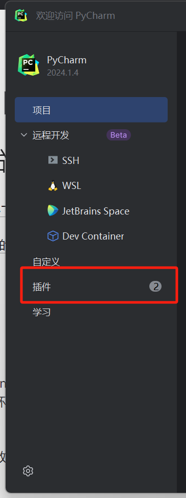

在“Marketplace（市场）”中找到中文语言插件并安装：

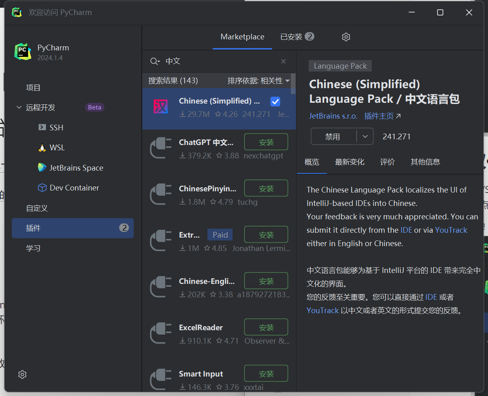

在重启你的PyCharm之后你的界面语言便已更新为中文了！

## 基本功能

和VSCode类似，你可以打开你的附加包工作目录：

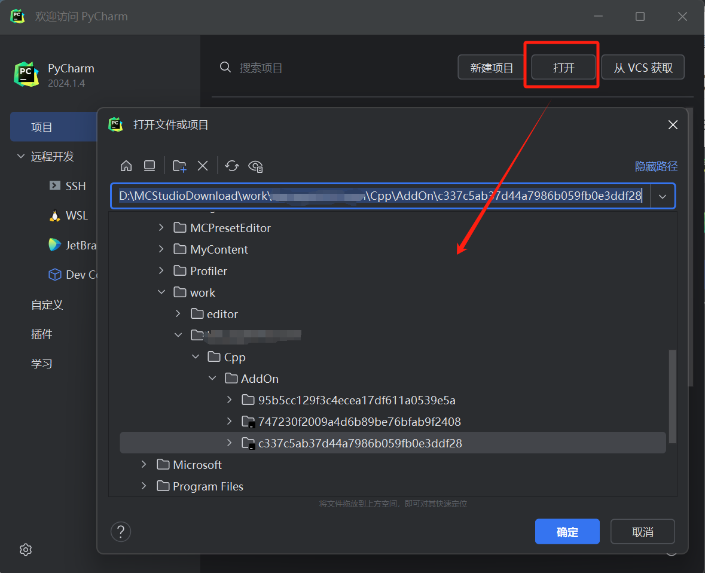

你将见到和VSCode类似的文件结构，左侧是你的工作目录的树状结构，右侧是你的文本编辑窗口：

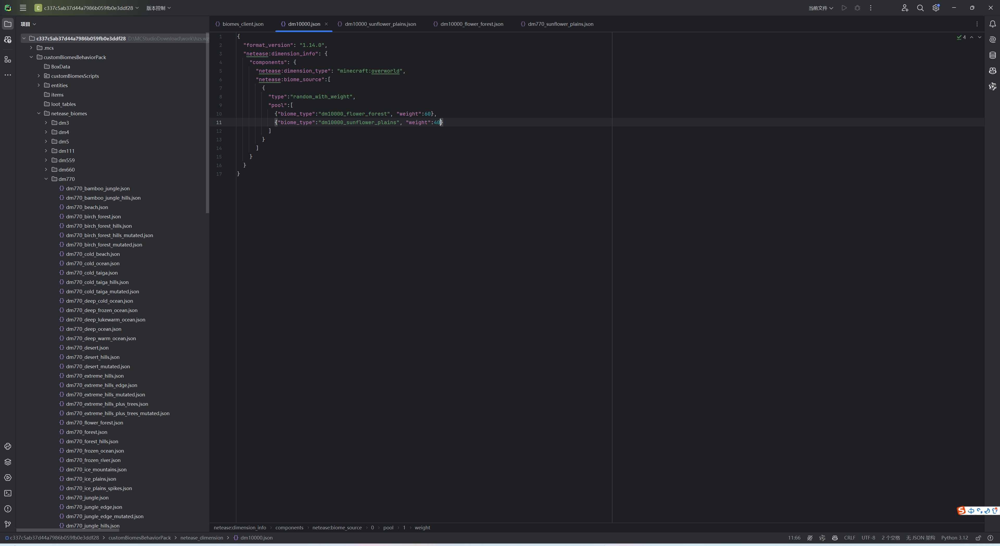

对于Python脚本文件，你依旧要注意解析器的选取：

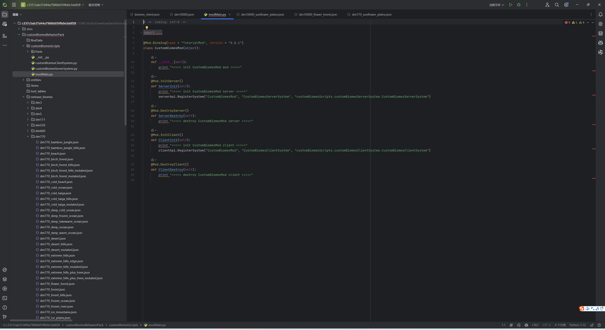

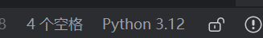

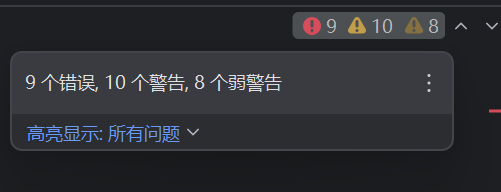

请选取为 **Python2.7** 以保证代码错误提示正确。

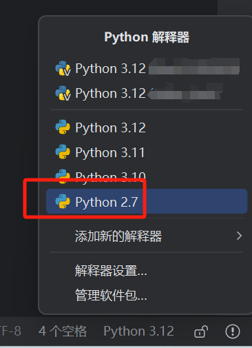

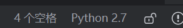

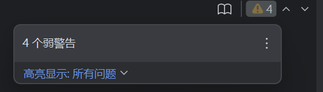

如果你希望了解更多关于PyCharm编辑器的知识，你可以阅读JetBrains的[PyCharm产品文档（英文）](https://www.jetbrains.com.cn/en-us/help/pycharm/getting-started.html)或在互联网上搜索更详细的相关教程。我们鼓励你多多动手，自行探索出来的使用技巧将记忆地最为牢固！