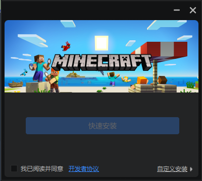
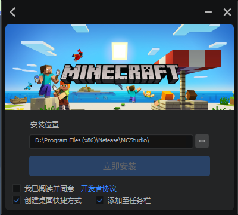

# 安装《我的世界》开发工作台

《我的世界》开发工作台，又名MC Studio，是我们官方提供的《我的世界》模组开发和发布工具，是你开发模组必备的助手！

下面，我们一起下载和安装《我的世界》开发工作台。

# 下载

打开《我的世界》中国版开发者官网：https://mc.163.com/dev/ 。在首页中找到“ **下载开发工作台** ”按钮。按下该按钮，浏览器将会开始下载《我的世界》开发工作台的安装包。

## 安装

打开下载到的安装包可执行文件。你将看到如图所示的界面。请先阅读并同意《 **开发者协议** 》。

-  **快速安装** ：在勾选开发者协议之后，你便可以点击快速安装按钮。快速安装将会将《我的世界》开发工作台安装在默认位置，并默认在桌面创建一个快捷方式图标。

-  **自定义安装** ：如果你想修改安装位置等相关选项，请点击右下角的“自定义安装”。

  

  在这里你可以修改安装位置，例如如图所示我们将安装位置的盘符更改到了D盘。并且你可以选择是否在桌面和任务栏添加《我的世界》开发工作台的快捷方式。之后，点击“ **立即安装** ”按钮将开始安装。之后，《我的世界》开发工作台将安装在你的计算机上。

至此，我们成功安装了《我的世界》开发工作台。开发工作台内都有什么内容和功能，打开《我的世界》开发工作台一探究竟吧！

