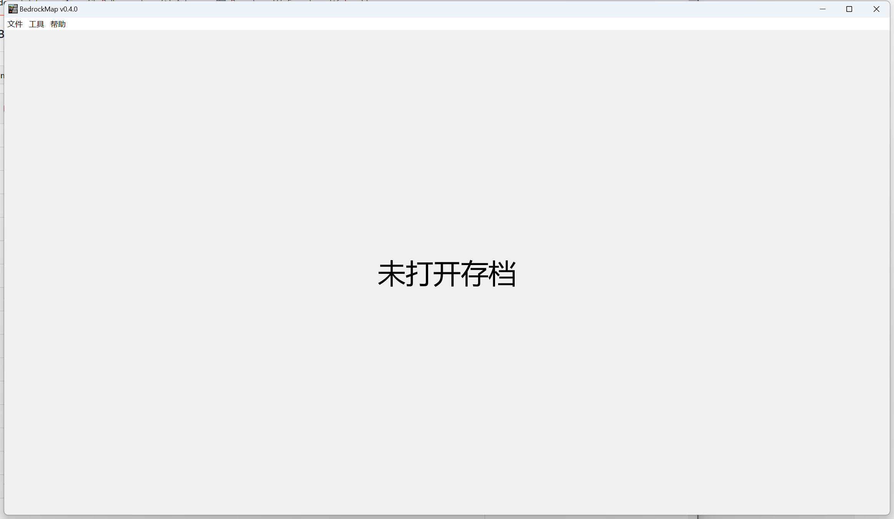
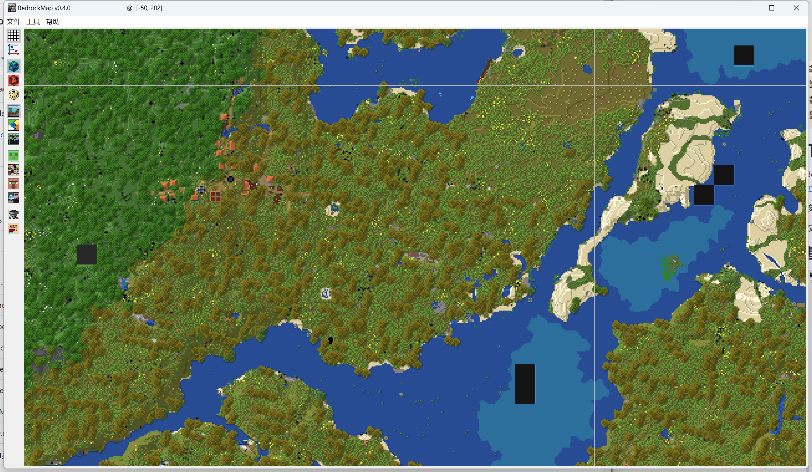
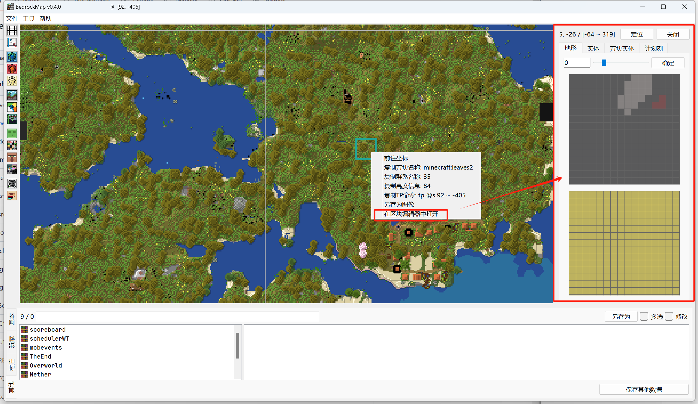
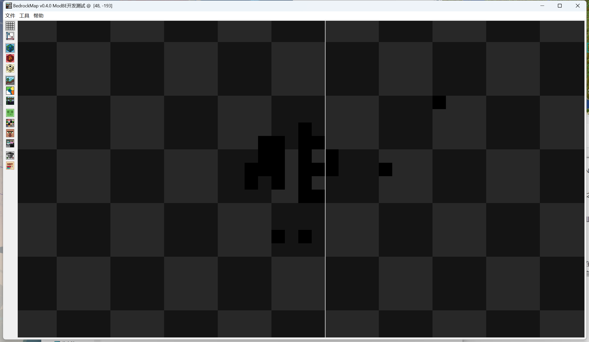
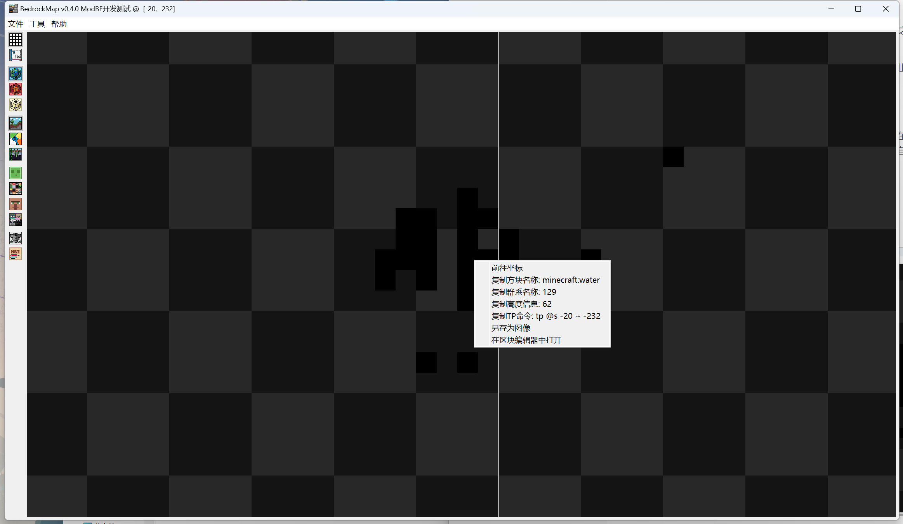
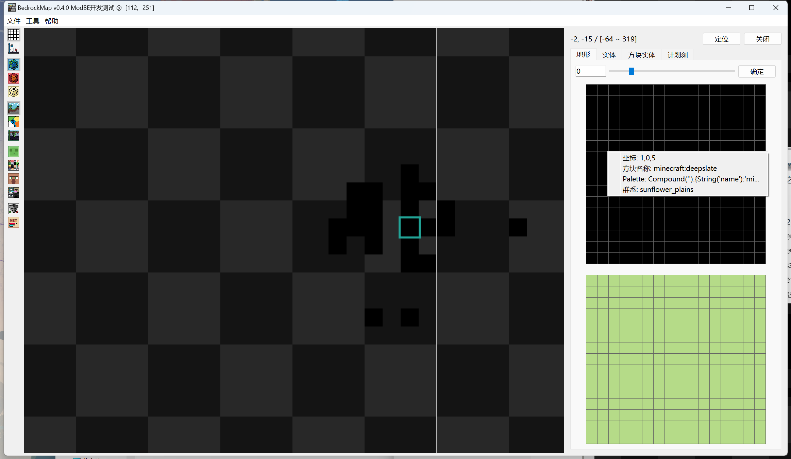
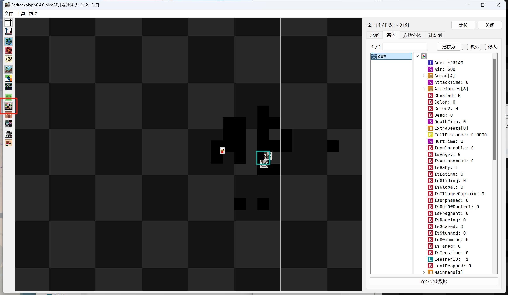
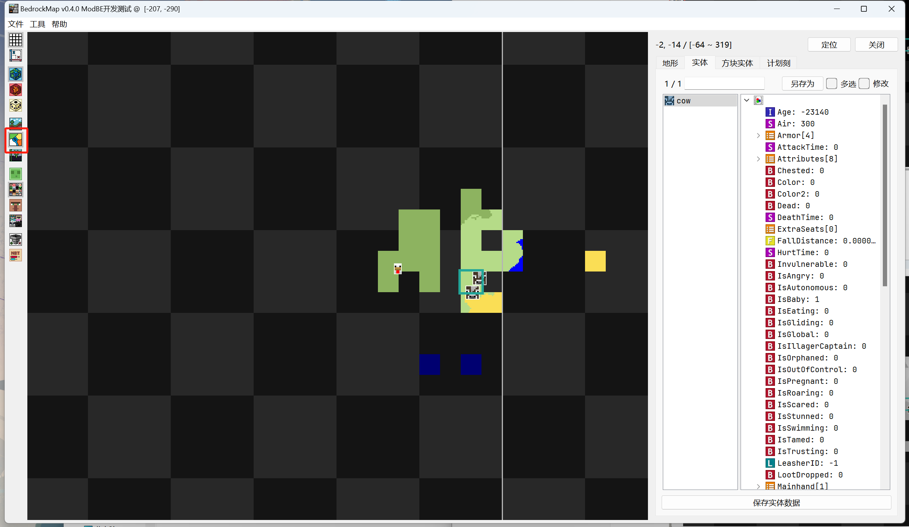
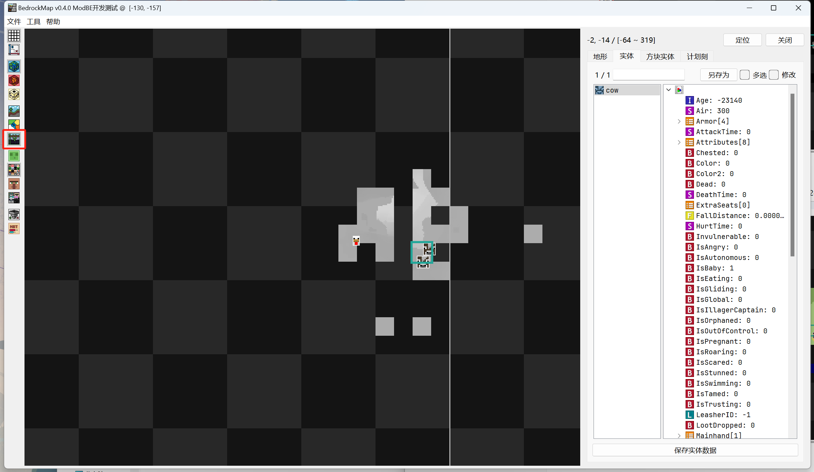
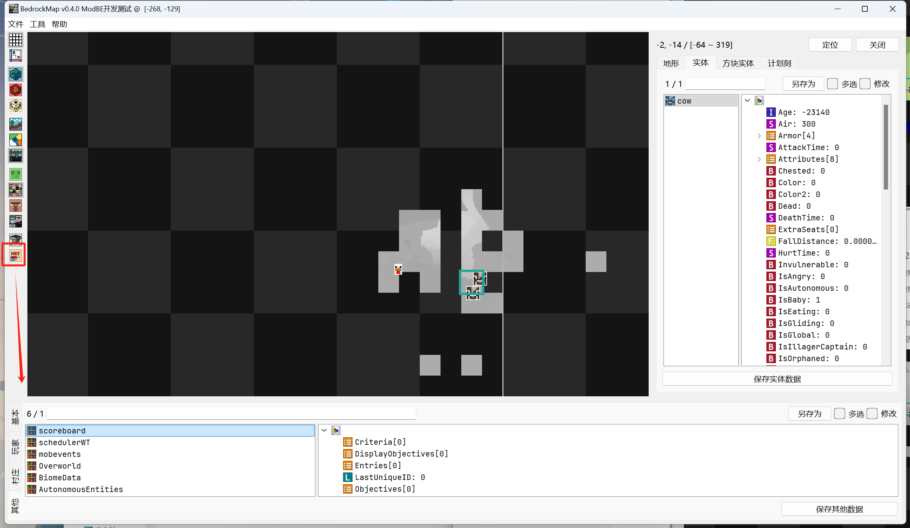

# BedrockMap简介

当你下载好BedrockMap之后，便可以双击`BedrockMap.exe`来使用它了！当然，你也可以右键该可执行程序，发送快捷方式到桌面来方便以后快速打开。

## 基本功能

打开BedrockMap后，我们需要选择一个基岩版存档进行打开，点击中央的“未打开存档”按钮，将弹出文件选择器用于选择你的存档。选择合适的基岩版存档打开。

左侧的竖列是地图中控制显示的选项和工具。从上到下依次是：

- 显示区块和区域网格
- 在区块和区域网格左上角显示坐标
- 显示主世界地图
- 显示下界地图
- 显示末地地图
- 显示地形图
- 显示群系图
- 显示高度图
- 显示史莱姆区块
- 显示实体
- 显示村庄
- 显示硬编码生成区域（HSA）
- 过滤显示的工具
- 编辑该存档内 **除了区块数据之外的NBT** ，点击后会在底部打开选择和编辑窗口

如果要编辑某一区块的相关NBT，你需要定位到该区块，然后右键。然后在右键菜单中选择“ **在区块编辑器中打开** ”。

然后你会在右侧看到区块编辑器，这里是查看和编辑区块NBT数据的窗口。你可以在这里编辑地形、实体、方块实体和计划刻数据。

注意，进行编辑前请务必勾选编辑窗口内的“ **编辑** ”按钮，之后存档才可以编辑。这样做是为了默认保护存档不会在预期之外遭到编辑。

该工具完全开源免费，如果你学有余力，且具有一定的专业水平，也可以参与开发贡献，让我们的开发社区变得更好。

如果你还未明白该工具内的某些功能，请不要着急，你可以多创建一些存档慢慢尝试和实验，相信你很快就能总结出存档编辑的规律！

### 中国版存档

如果你想从国际版编辑存档并移植发布到中国版，那么你在BedrockMap中见到的界面将如同上面所述，没有任何问题。但是如果你的存档是从中国版从零创建的，例如来自于《我的世界》开发工作台，那么你将会遇到下面的问题：

我们现在拥有一个刚从《我的世界》开发工作台创建的存档。在用BedrockMap打开该存档后，你将只能看到如下形状：

换言之，存在地形的位置将错误显示为纯黑，不存在地形的位置将正常显示为透明棋格样式。这是由于BedrockMap的一些不兼容性导致的。不过，除了不能正常绘制地形地图之外，其余的功能将全部正常。包括如下这些功能：

#### 右键显示方块数据

#### 区块编辑器中右键读取方块

虽然所有方块显示为纯黑，但这并不影响读取该方块的信息。

#### 实体地图和区块编辑器中编辑实体

#### 生物群系地图

#### 高度图

#### 其他独立NBT编辑

以及其他所有功能。简而言之，只有地形绘制功能因某些不兼容性问题缺失。这并不影响其它功能的使用。

当然，如果你对地形地图的功能非常依赖，请翻开下一课，我们将介绍另一款可以正常绘制中国版地图的地形图的存档编辑工具！

