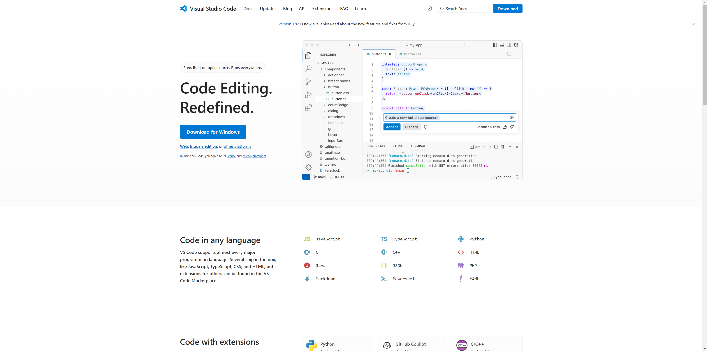
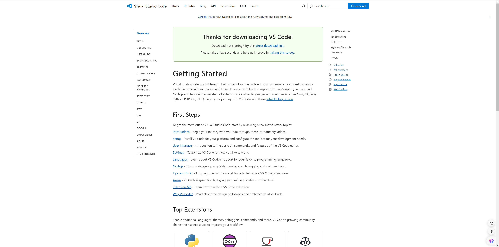
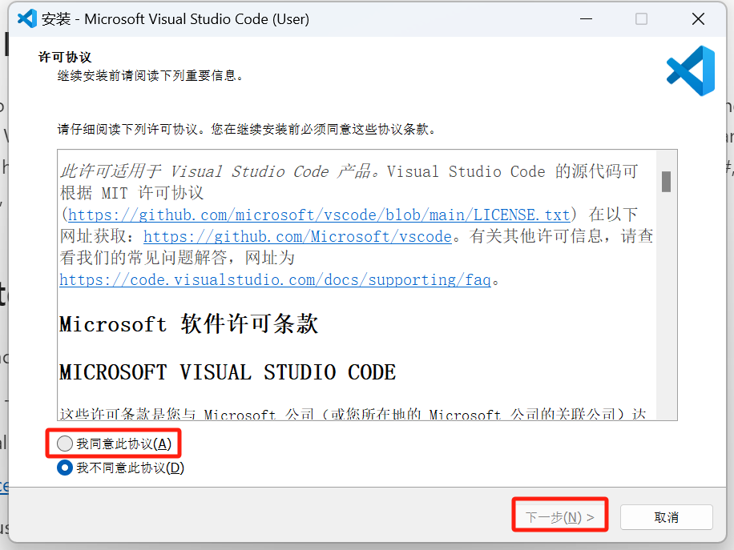
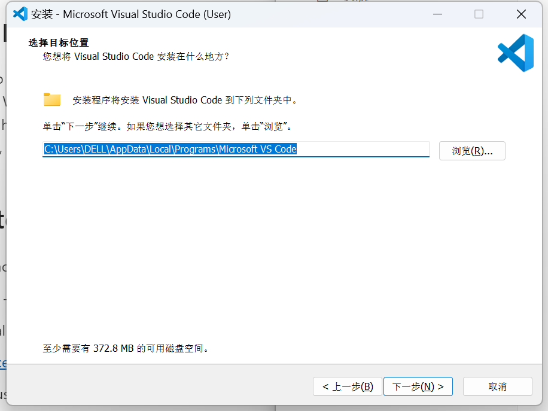
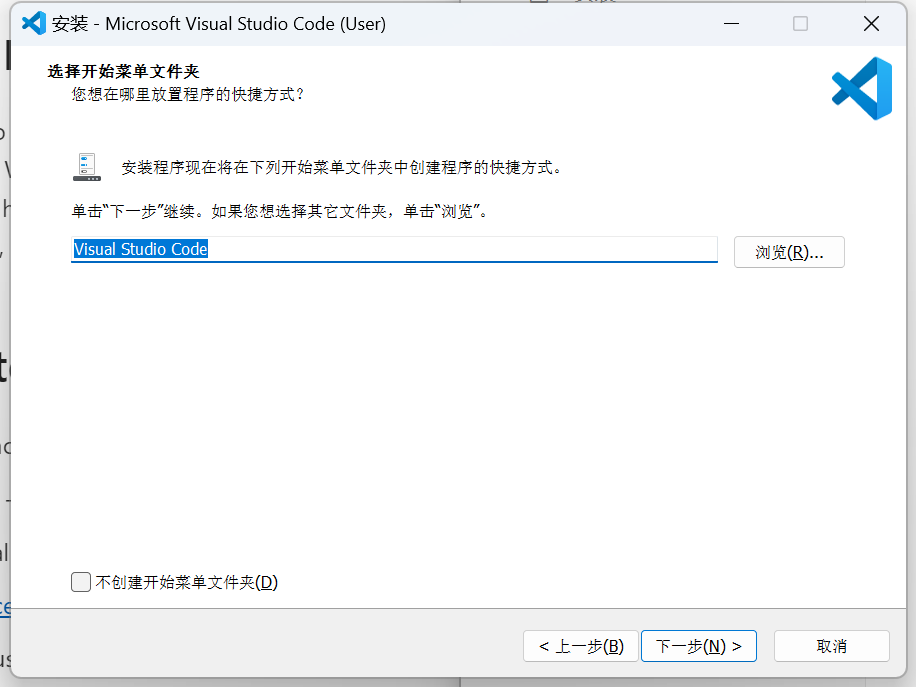
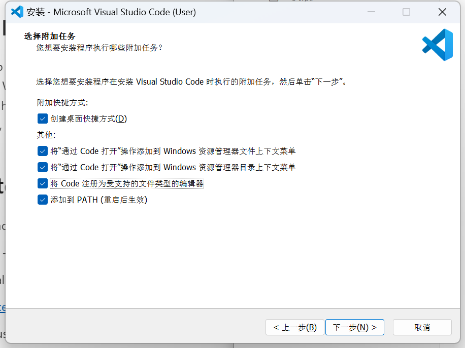
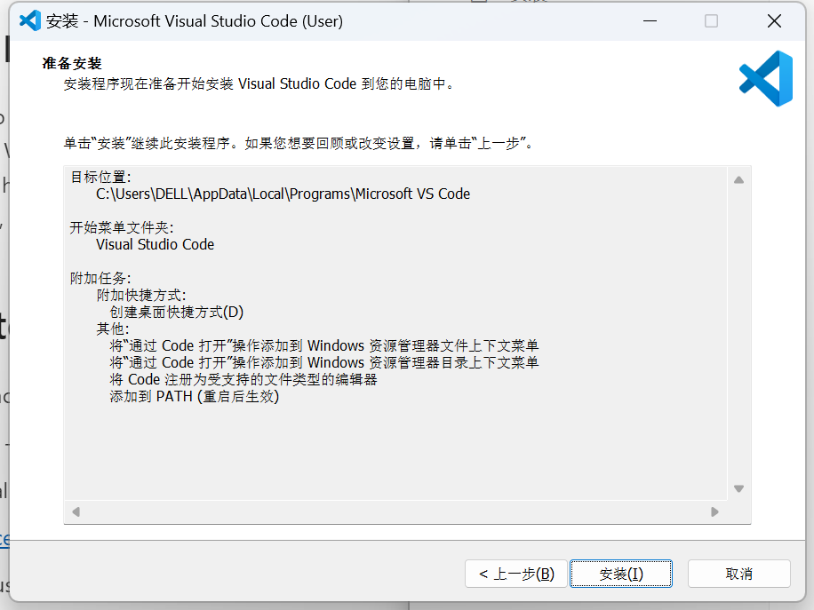

# 安装Visual Studio Code

IDE（集成开发环境）一般指将软件编辑、构建、测试和打包等功能结合到一起的应用，可以一站式完成各类功能。其中最有名的便是微软的Visual Studio Code和JetBrains系列的各IDE。Visual Studio Code（简称VSCode）是微软开发的一款较为轻量的代码编辑器，可以通过扩展添加很多附加功能，同样也可以用来进行《我的世界》开发。VSCode完全免费！

下面，我们就一起下载并安装VSCode。

## 下载

我们可以进入VSCode的官网：https://code.visualstudio.com/ 来下载VSCode。点击官网后，你将看到如下页面：

这里以Windows系统为演示，其他系统情况类似。点击中央左部的“ **Download for Windows（为Windows下载）** ”按钮即可下载适用于Windows系统的安装包。

## 安装

1. 双击安装文件，打开安装。

2. 首先，我们要阅读并同意VSCode的许可协议：

   

3. 然后，我们可以根据喜好选择性更改安装地址：

   

4. 然后我们选择开始菜单中VSCode的文件夹名称（或选中不创建开始菜单）：

   

5. 然后，我们可以选择是否创建桌面快捷方式，是否将VSCode添加到系统的右键菜单中，是否注册VSCode为支持的文件类型的默认编辑器，是否将VSCode添加到环境变量的`PATH`中（用于支持一些命令行功能）。

   

6. 然后，我们准备安装。信息确认无误后，我们点击“安装”按钮开始安装：

   

7. 安装进度完成后，VSCode便安装在我们的计算机上了！

现在，我们已经安装了VSCode，翻开下一课，我们一起来了解VSCode的基本功能。