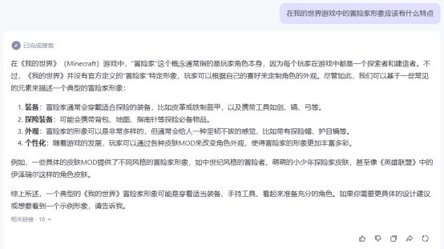
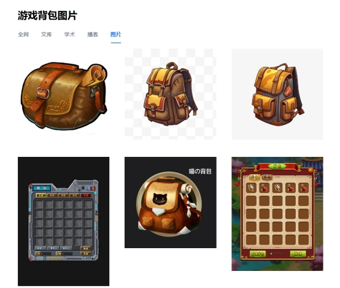

# **寻找灵感**

## **如何去高效的寻找制作的灵感**

一个清晰的灵感能避免你像无头苍蝇一样盲目创作。首先，明确你想要设计的皮肤类型至关重要。例如，假设我们要创作一个冒险者的皮肤，此时我们仅有一个大致的方向。

接下来，我们需要将这个灵感转化为可执行的设计方案。最直接的方法是从网络上搜集相关的素材，将抽象的灵感细化为具体的创意点。

## **使用AI工具帮助拓展思路**

尽管当前的AI工具尚不能直接为您绘制出理想的皮肤，但它们已足够强大到能帮助您整理需求和激发灵感。事实上，创作皮肤最具挑战的部分并非绘制本身，而是如何明确需求并找到合适的创意灵感。

鉴于AI绘画技术尚未被广泛采用，我们可以使用国内的一些免费AI语言引擎作为参考。实际上，任何AI引擎都能胜任这项任务，无需特意选择收费的服务。

 接下来，只需输入一些简单的关键词，例如：“在我的世界游戏中，冒险家形象有哪些特征？”这样就能让AI帮我们总结绘制皮肤时需要考虑的细节

## **利用搜索引擎搜索想要的内容**

综合了AI建议和个人想法后，我们明确了冒险家可能具备的特征。接下来，可以打开任意图片搜索引擎，搜集与这些特征相关的图片。例如，既然提到冒险家通常会携带背包辅助探险，我们就可搜索并收集一些背包的设计图。

请注意以下几点：

- 选择结构简单的图片，避免过于复杂的细节，因为在《我的世界》中玩家皮肤的分辨率有限，复杂的结构难以清晰呈现。

- 选用具有高辨识度的图片作为参考，避免颜色相近、依赖大量线条区分的图片。

- 若使用现实照片作为参考，其适用性可能较弱；可以尝试在搜索关键词中加入“游戏”或“手绘”，以提高参考价值。
