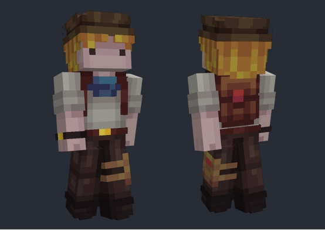

# **课程总结**

绘制皮肤的关键过程如下：

- **大面积中间色铺垫：**首先完成皮肤的基础色调填充，这是构建整体外观的第一步。

- **加入明暗对比：**通过增加阴影和高光来塑造立体感，让皮肤看起来更加真实和生动。

- **细化皮肤质感：**进一步绘制皮肤的纹理细节，使其外观更贴近真实，增添自然感。

- **添加装饰元素：**最后加入个性化装饰品，如衣物、饰品等，使角色的故事背景更加丰富。

记住，每个人的创作风格都是独一无二的，没有绝对的标准。最好的学习方式就是亲自动手实践，不必担心初期的作品不尽人意。只要坚持不懈地练习，你一定能够创作出令人满意的作品。跟随这个教程练习，相信每位参与者都能够创造出一款属于自己的独特皮肤。