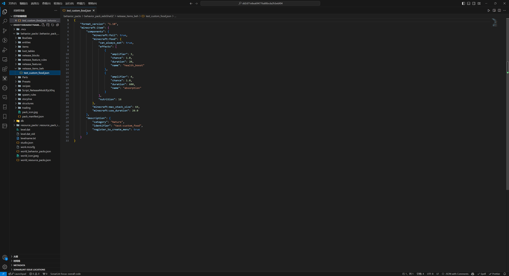
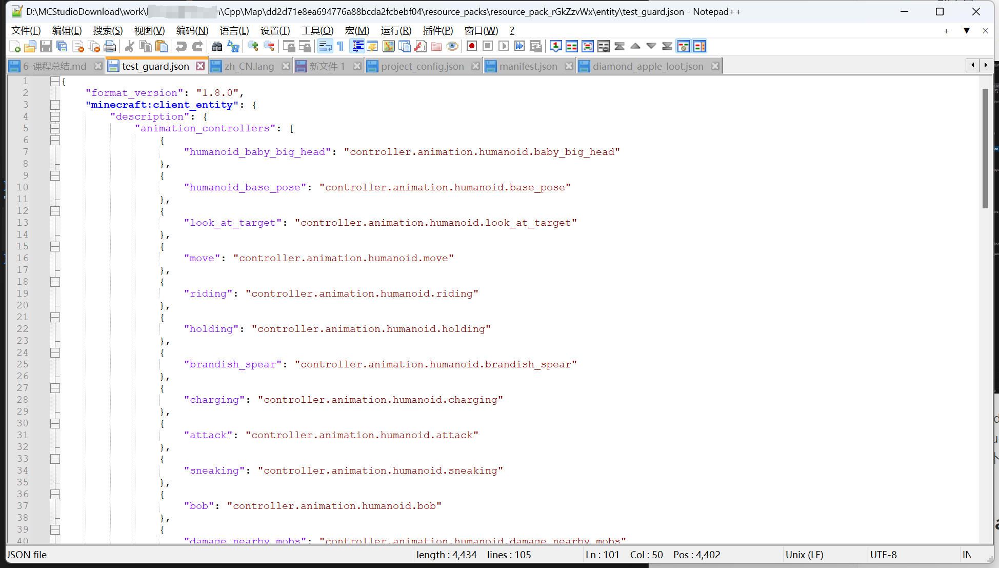

# JSON编辑工具与有效原则

在初步接触了JSON文件之后，大家都会有一个疑问：应该如何查看和编辑JSON文件呢？在本节中，我们一起来了解都有哪些常用的软件支持编辑JSON文件。

## 编辑工具

事实上，作为一种常见的数据存储和交换格式，JSON文件被很多种软件工具所支持。接下来，我们列出几种常见的工具。

### Visual Studio Code

Visual Studio Code是微软开发的一款轻量级通用IDE，可以打开各种主流的文本文件类型，自然包括JSON类型的文件。Visual Studio Code有丰富的代码检查和语法高亮功能；在安装对应扩展之后，还可以具备附加包JSON文件的代码补全和定义跳转等多种智能功能。这非常适合附加包内容的编写。

下载地址：https://code.visualstudio.com/

### Notepad++

Notepad++是一个轻量级的文本编辑软件，支持相当多文本文档格式，具有打开快速、操作简介的特点，同时各类基础功能一应俱全。不过，Notepad++只适合在你充分熟悉接口时使用，因为他并没有任何智能补全和定义跳转等功能。

下载地址：https://notepad-plus-plus.org/

## 有效性

对于JSON数据格式而言，整个文件内容必须满足特定的结构规则，否则文件整体就会失效。失效的文件自然无法再《我的世界》中进行加载。因此，在编写文件时必须时刻注意文件的语法结构没有被破坏。在接下来的两节中，我们将学习JSON的语法结构和常见的故障模式。