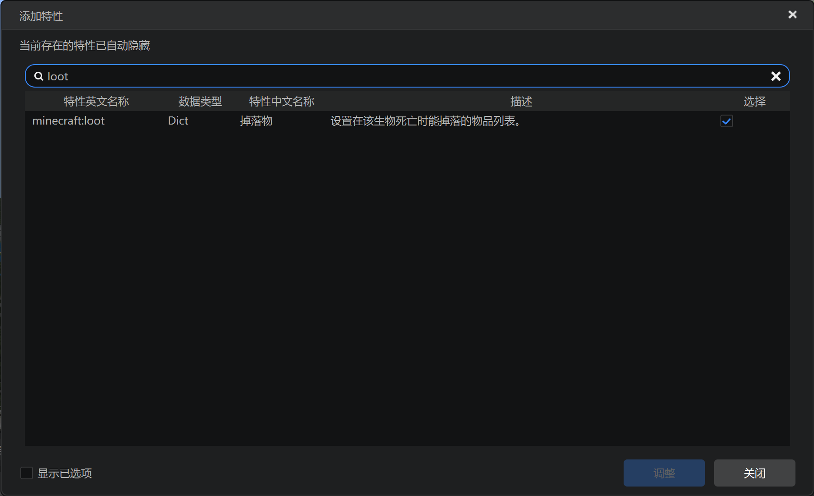
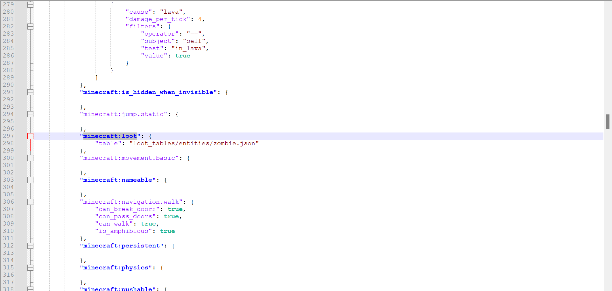

# 掉落

在本节中，我们学习实体的掉落物机制。

# 在编辑器中添加



我们可以在编辑器中添加行为包组件，并找到`minecraft:loot`。在我们的守卫实体中，该组件已经天然添加到行为包组件中了。


可以看到，实体的掉落物也是由一个战利品表控制的。这里使用了原版僵尸的战利品表。

## 实际文件



我们依旧查看行为包的服务端定义文件，这里我们只截取对应组件部分：

```json
{
    "format_version": "1.20.10",
    "minecraft:entity": {
        "component_groups": {
            // ...
        },
        "components": {
            // ...
            "minecraft:loot": {
                "table": "loot_tables/entities/zombie.json"
            },
            // ...
        },
        "description": {
            "identifier": "test:guard",
            "is_experimental": false,
            "is_spawnable": true,
            "is_summonable": true
        },
        "events": {
            // ...
        }
    }
}
```

`minecraft:loot`组件的`table`字段引用了一个战利品表。这和方块掉落物一样，我们可以用相同的格式自定义实体的掉落物，即实体的战利品。例如，我们可以把实体的战利品更改为我们的钻石苹果战利品表：

```json
{
    "format_version": "1.20.10",
    "minecraft:entity": {
        "component_groups": {
            // ...
        },
        "components": {
            // ...
            "minecraft:loot": {
                "table": "loot_tables/diamond_apple_loot.json"
            },
            // ...
        },
        "description": {
            "identifier": "test:guard",
            "is_experimental": false,
            "is_spawnable": true,
            "is_summonable": true
        },
        "events": {
            // ...
        }
    }
}
```

当我们的守卫实体被打败时，将不再掉落腐肉，而是掉落一个钻石苹果。
