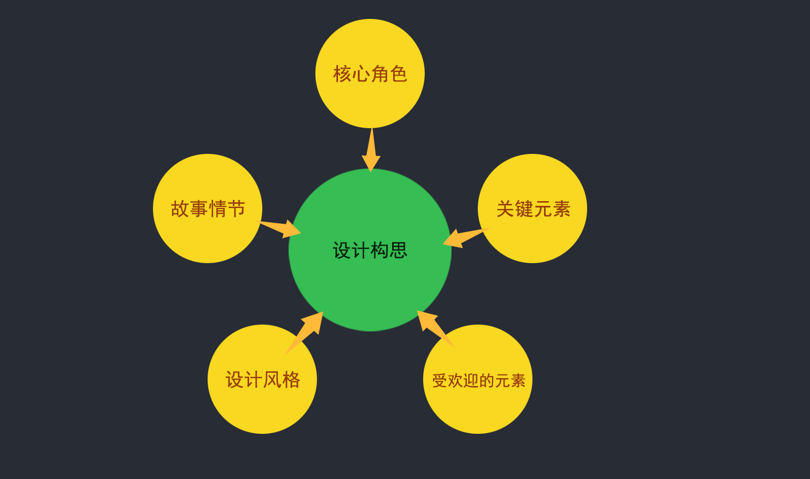
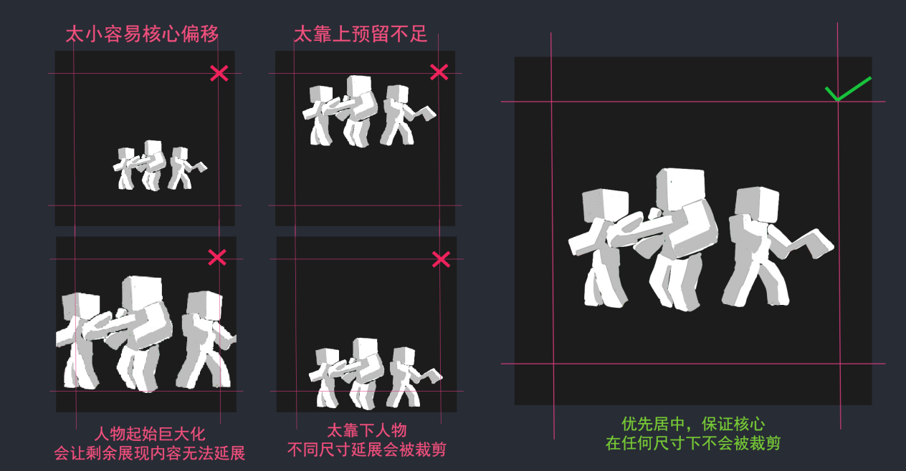
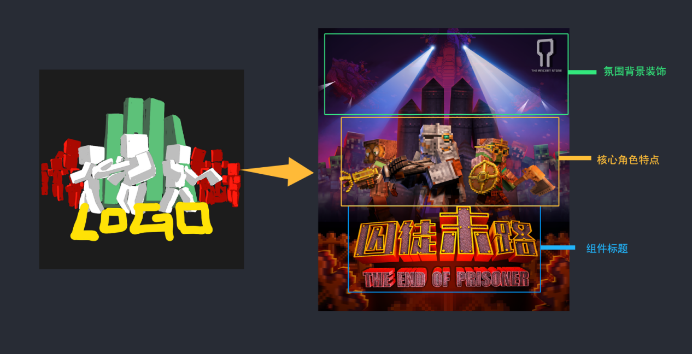
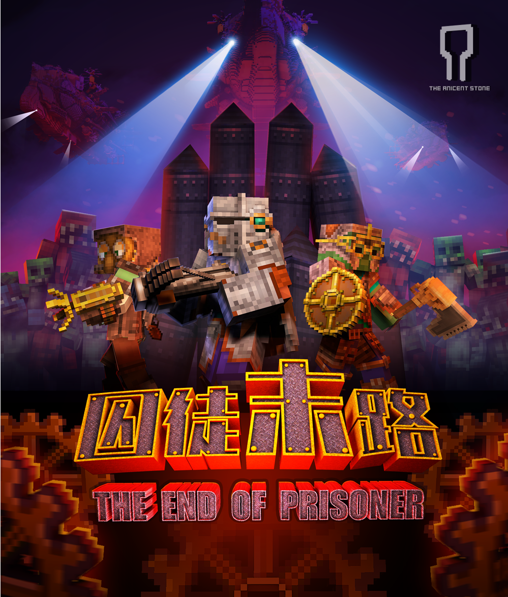
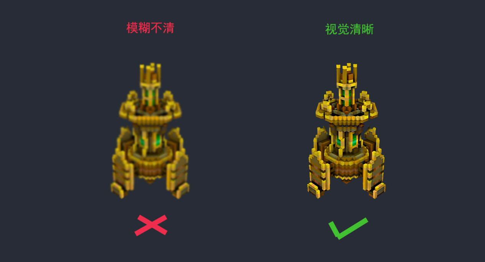
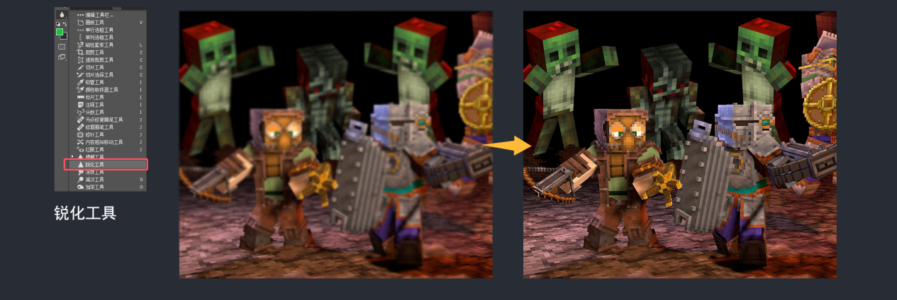
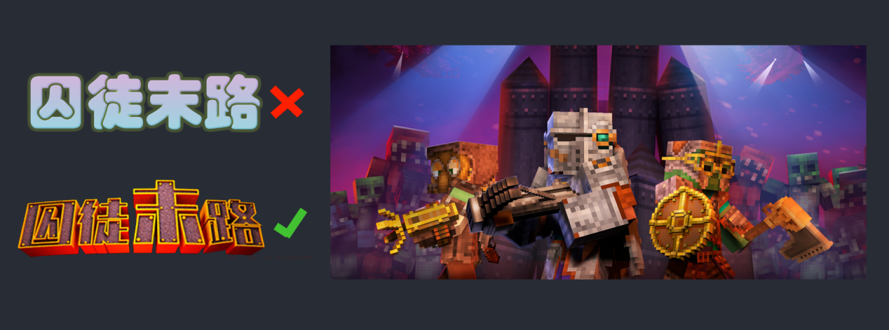

关键艺术作品（Key Art）设计

一张视觉吸引且能够有效传递信息的Key Art设计，需要的不仅仅是技术，更需要创意和构思。本章将教你如何从构思开始，到如何实际设计构图，最终制作出一张能够抓住眼球的Key Art设计。

**Key Art**设计构思：

1、创意构思：通过头脑风暴和市场调研生成设计灵感

假设，你正在为一款末日生存类的组件设计Keyart。为了生成设计灵感，你可以进行头脑风暴，讨论组件中的核心角色、故事情节和关键元素。

同时，通过市场调研，分析同类组件的成功Keyart，了解他们的设计风格和受欢迎的元素。这可能包括玩法组件中的主要**战斗场景、角色的独特能力或组件的主要背景环境**。

结合元素构思画面，你可以得出一个能够吸引玩家的视觉主题，比如在Keyart中突出展示组件中的主角在激烈战斗中的英勇形象，并用独特的背景和特效来增强视觉冲击力。

2、设计草图布局安排：绘制初步草图，规划图像的布局和元素

在生成了设计灵感后，你可以开始绘制初步草图。例如，在设计Keyart时，你可以绘制构思出主要角色的姿势和动作，安排他们在图像中的位置。

*Ps：千万要考虑后期不同尺寸剪裁的通用，不然就要重修主图了。*

规划好核心主角位置后，就可以开始规划：组件标题和想要展示的其他辅助衬托核心的重要元素位置，同时也要确保它们不会遮挡角色的主要动作和关键细节。

这一步骤帮助你将创意构思具体化，为后续的视觉设计实施奠定基础。

Key Art视觉设计实施：

1、完善填充画面：根据草稿细化各部，完善整图，并合理安排图像元素。

按照草稿制作好主要角色放在视觉中心，利用明暗对比和动态姿势来引导观众的视线。将组件标题和标语放置在显眼的位置，如上方或底部，以便玩家一眼就能识别游戏名称。在周围留出适当的空白区域，避免信息过于拥挤，这样可以增强整体的视觉效果。

2、图像选择：使用高质量的图像和图形素材是关键。对于一款动作游戏，你可以选择高分辨率的角色模型图像和背景素材，确保它们具有良好的细节和视觉冲击力。

如果，再原图尺寸稍微有点不足，又遇到需要放大的时候，我们可以使用【工具栏】-【锐化工具】-【选择合适的笔刷】直接在模糊处进行涂抹，来适当补救画质的不足，使其在宣传图中呈现最佳效果。

3、文本处理：设计细化吸引人的标题。在Keyart中，你可以使用大号字体和独特的风格来设计游戏标题，使其引人注目。

但要确保文本与图像元素协调一致，不要使用风格差异过大的字体设计，统一的视觉风格可以使信息传达清晰且有加强视觉吸引力。

通过以上步骤，你可以有效地构思并实施一个视觉吸引的Keyart设计，从创意构思到实际制作，确保你的宣传图能够成功吸引玩家的注意力，并准确传达玩法组件的核心主题。
