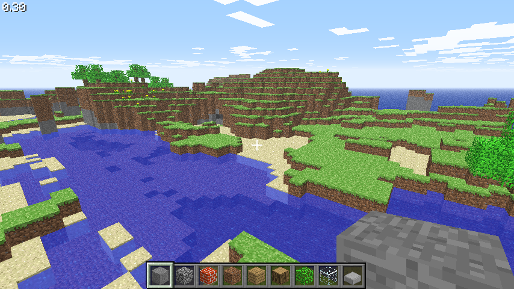
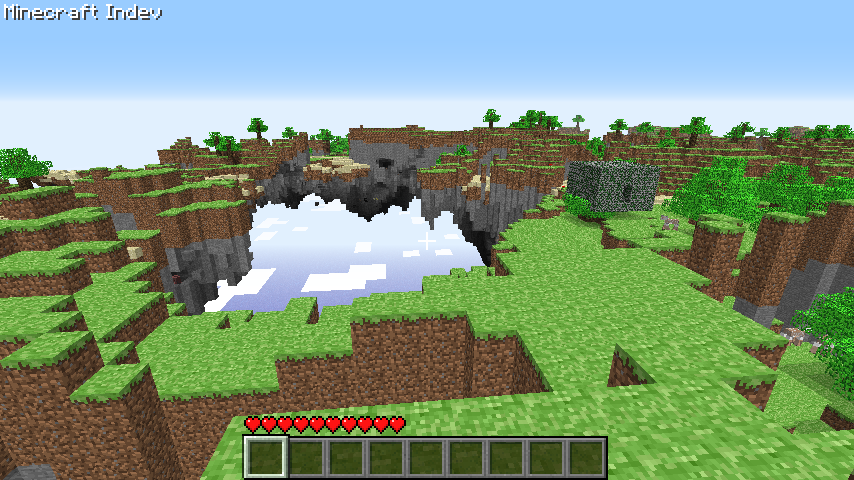
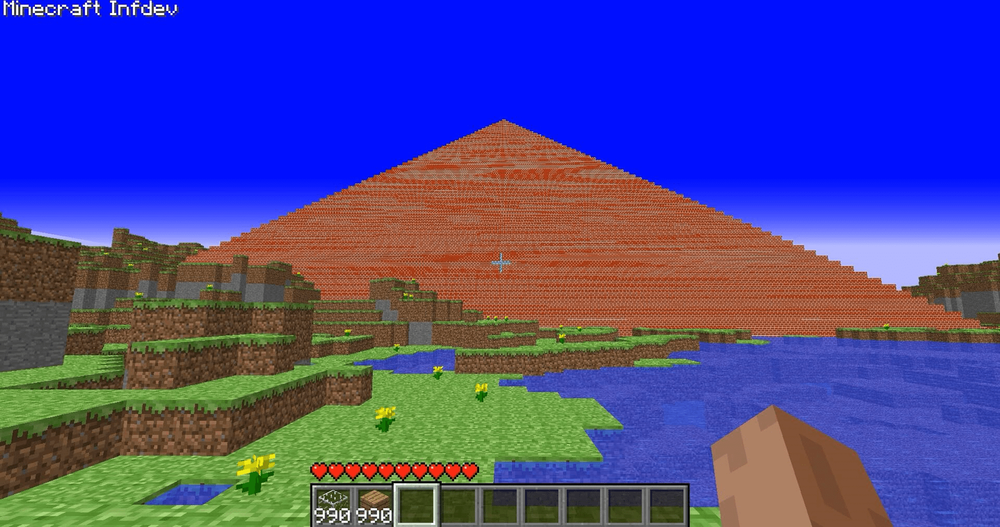
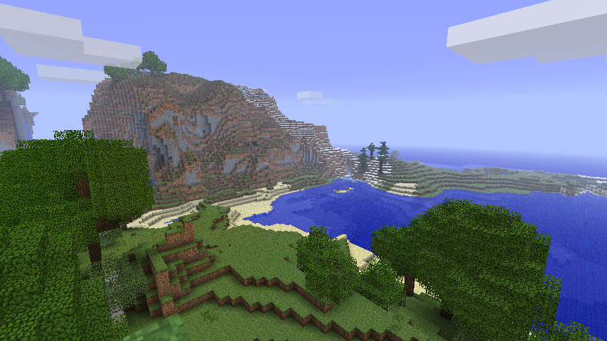
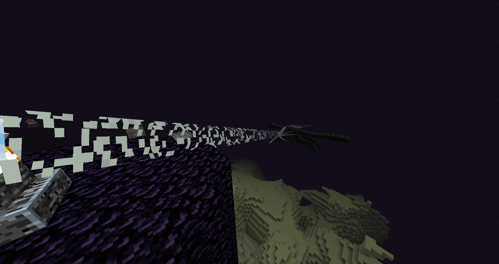
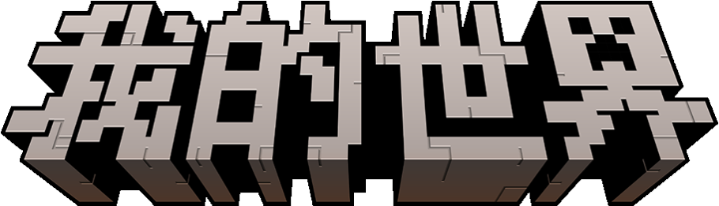

# 《我的世界》的历史

《我的世界》，英文名Minecraft，是一款迄今15年有余的游戏，国际版现由Mojang Studios维护，隶属于微软Xbox游戏工作室，中国版由网易代理并免费发行。

## 初创

受到一款名为《无尽旷工》的游戏的启发，《我的世界》的初创者Notch（本名Markus Persson）在2009年5月开发了《我的世界》的最初版本：Classic版。最初，Classic版《我的世界》只有简单的创造模式，玩家可以通过搭建和破坏少数种类的方块制作自己的建筑，创建自己的小家，制作像素画。在Classic版开发期间，Notch通过一个名为“生存测试”的系列版本引入了生存模式，这形成了当今《我的世界》的雏形。当前，你仍然可以通过国际版的启动器下载并游玩到这些版本。

参考资料：

- [Java版Classic](https://zh.minecraft.wiki/w/Java版Classic)
- [Java版生存测试](https://zh.minecraft.wiki/w/Java版生存测试)

## 开发中！

经过快速的初创阶段，Notch于2009年底更改了开发代号，将其命名为Indev，也就是“正在开发”或者“开发中”的意思。在此阶段的《我的世界》更新变得飞速且频繁，当今《我的世界》的许多功能便来源于此，例如生物群系的前身——地图主题，例如昼夜更替，例如各类工具和装备，以及配方系统——合成和烧炼等。在该版本中，玩家进入世界后会自动生成一个小火柴盒房子（或许是苔石房子），这也是该版本的显著标志。

参考资料：

- [Java版Indev](https://zh.minecraft.wiki/w/Java版Indev)

## 无限地图

2010年2月，Notch将更新代号更改为了Infdev，意思是无限开发。终于，《我的世界》迎来了无限大的世界，这也意味着《我的世界》至此拥有了无限的可能。更多的物品和方块加入了《我的世界》，更多的合成配方也相继添加。这个阶段的标志性建筑是自动以极低概率生成的红砖金字塔和巨型大树。Notch从该阶段开始了被称为“秘密更新”的一系列更新，每次秘密更新都有大量大家目前而言已经熟知的新物品和方块加入到游戏中。

参考资料：

- [Java版Infdev](https://zh.minecraft.wiki/w/Java版Infdev)
- [秘密更新](https://zh.minecraft.wiki/w/%E7%A7%98%E5%AF%86%E6%9B%B4%E6%96%B0)

## 先发测试

2020年6月，Notch将更新代号更改为了Alpha，这意味着游戏进入了正式发行前的测试阶段。同年12月底，更新代号进一步更改为了Beta。一般而言，Alpha意味着游戏的内测，Beta意味着公测，不过在Notch看来这两个阶段好像并无类似区别。Alpha阶段内加入了我们当前熟知的生物群系和下界，Beta阶段进一步加入了村庄、要塞等结构、重构了崭新的创造模式。大家最喜欢用的床也在这一阶段加入游戏。Notch计划加入一种新的维度，被称为天域，但并没有成功实现，这一维度是现在末地的前身。

参考资料：

- [Java版Alpha](https://zh.minecraft.wiki/w/Java版Alpha)
- [Java版Beta](https://zh.minecraft.wiki/w/Java版Beta)
- [Minecon](https://zh.minecraft.wiki/w/Minecraft%E5%B9%B4%E5%BA%A6%E6%B4%BB%E5%8A%A8)

## 正式版

在第二届Minecon上，也就是2011年11月，Notch宣布了《我的世界》正式版的发布，这也就是现在我们所熟知的《我的世界》Java版。目前《我的世界》的终局——末路之地终于加入到了《我的世界》中。在此之后，《我的世界》不断更新迭代版本，加入新的物品、方块和实体，并延续至今。

## 基岩版

在Java版正式发布的同年，2011年8月，第一个携带版《我的世界》发布了。携带版《我的世界》是基岩版《我的世界》的前身，并于2016年正式蜕变为基岩版。与Java版只能在Windows和Mac上运行不同，基岩版可以在全平台各类设备上运行，并支持跨平台联机。同时，基岩版还拥有者官方支持的模组开发接口和市场，这让《我的世界》的受众人群进一步增加。

## 后续

2014年，Notch将《我的世界》连同工作室Mojang Studio出售给了微软。两年之后的2016年5月，微软、Mojang和网易联合宣布，Mojang将Minecraft在中国大陆地区的运营权授予网易旗下子公司，并正式确定游戏的中文译名为《我的世界》。

