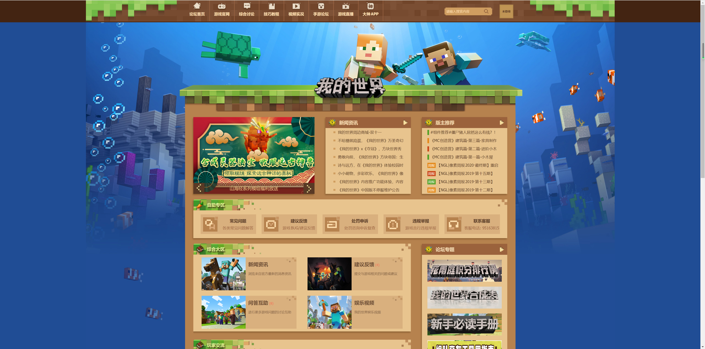
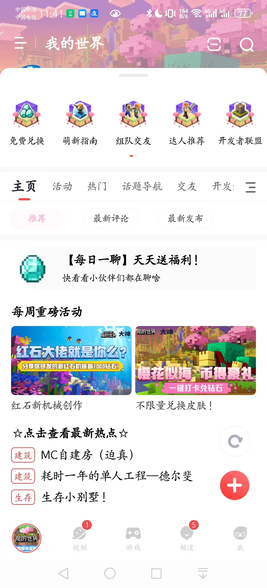
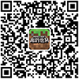
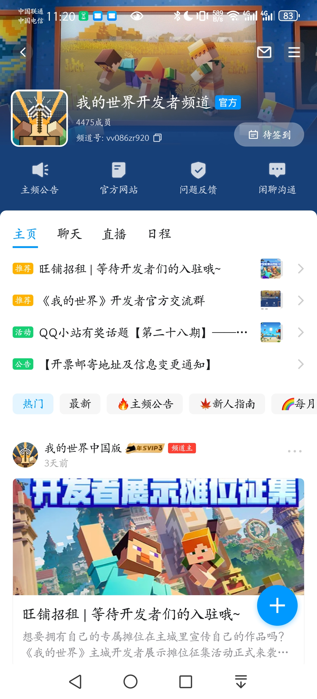

# 游戏背景与社区

《我的世界》拥有庞大的社区，及时了解游戏背景和社区将有助于你更好的与社区互动，开拓技术眼界，从而制作出更受欢迎的作品。

## 官方网站

《我的世界》中国版官方网站是你必须要谨记的网站。以下是官方网站的网址：

- 我的世界官网：https://mc.163.com/
- 我的世界开发者官网：https://mc.163.com/dev/

## 官方论坛

官方论坛是你接触玩家、了解玩家需求的好地方。多逛一逛论坛，你可以看到玩家目前都需要什么。

- 官方论坛：https://mc.netease.com/

## 网易大神

网易大神是网易维护的一个游戏社区，在这里你不仅能接触到各样的游戏玩家，更能和开发者们互相交流，学习知识，是你不可多得的社区圈子。

- 大神广场：https://ds.163.com/square/5bed7f21d545682b8bb8c1c2/

## QQ频道

《我的世界》官方在QQ频道建立了开发者社区，包括帖子和聊天结合一体。在这里你能接触到其他的同行开发者，互相交流经验心得。

- 加入链接：https://pd.qq.com/s/1lwltl494

## 其他社区

微博和微信公众号也开设了官方交流账号，你可以通过下述链接或二维码关注：

- 微博：https://weibo.com/MinecraftChina
  - 微博二维码：

- 微信公众号：