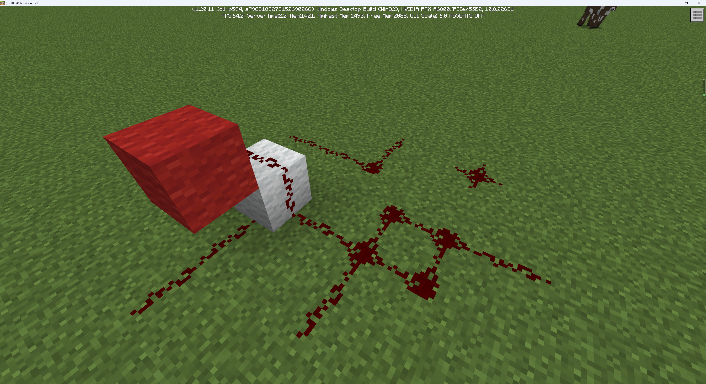
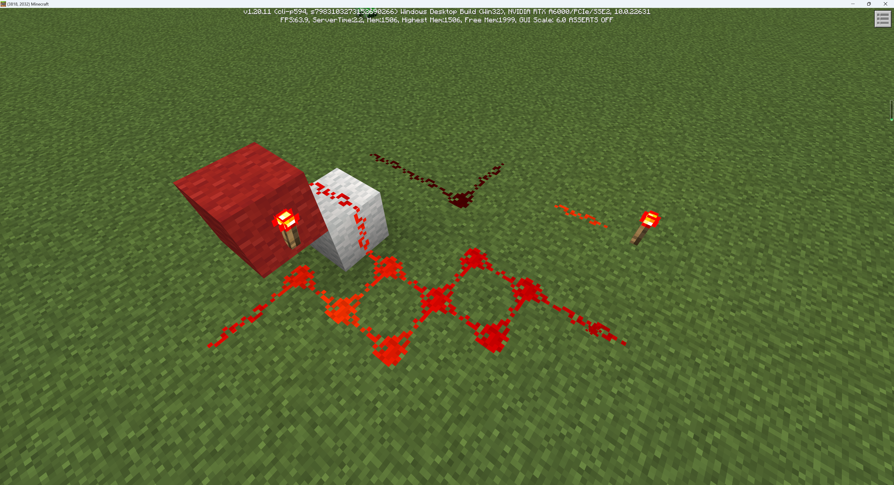
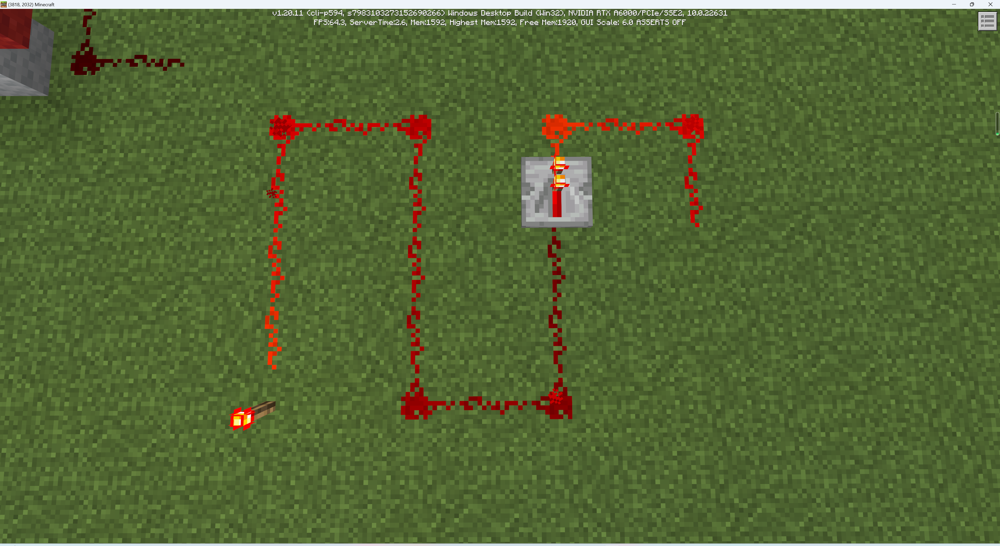
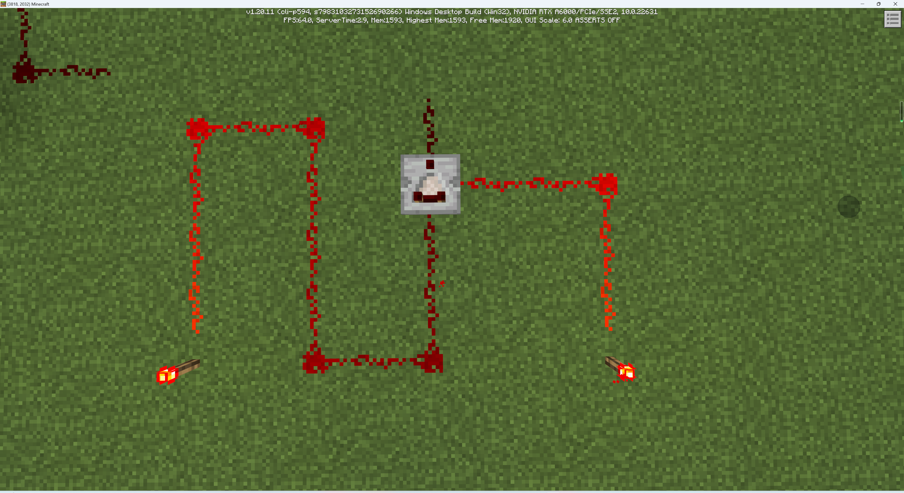
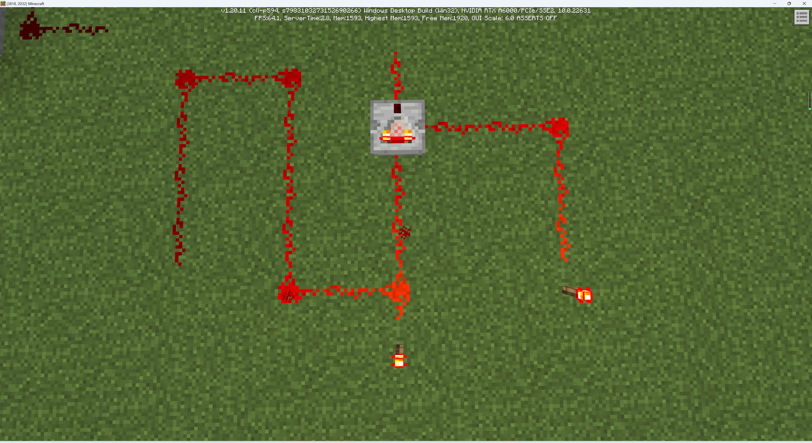
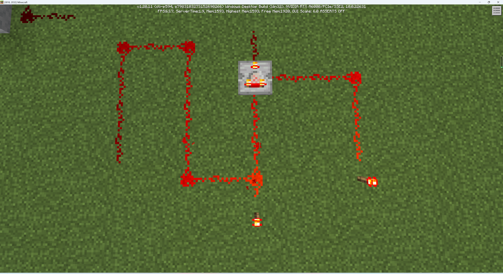

# 一些基本红石元件

《我的世界》中的红石元件多种多样。下面我们了解一些最基本的元件。

### 红石粉/红石线

一般，我们倾向于把拿在手中的红石称为红石粉，放置在地上的称为红石线。红石粉被放置之后，便会在地上产生一个红色的十字，当相邻方块上放置有红石粉后，他们便会连成一条线。红石可以向东南西北四个方向直接连线，在连线时也可以在竖直方向上跨越至多一个方块高。更高的高度会使红石线断开。当可以阻止向下供能的方块被放置在向下传输的路径上时也会使红石线断开，进一步使其不能向下传递信号。

## 红石火把

红石火把是一种产能器，能够产生满级，即15级的能量。能量在通过红石线传递时每向前传递一个方块，能量会递减一级，直至递减成0，进而失去信号；同时，在纹理上红石线将逐渐变暗。

作为产能器中的特殊种类：电容器，红石火把既可以产生能量，也可以在某些条件下接收能量进一步做出反应，使其被激活。激活后的红石火把不再输出能量。红石火把激活的条件是其在所附着的方块的方向上受到供能。此时红石火把的纹理表现为熄灭，其所供能的红石线也不会再具有能量。

至此，你可能对整个红石电路的供能线路产生了一点小小的疑问。为什么上述两张图内的白色羊毛上方的红石线都是具有能量的状态，但是第二张图的红石火把熄灭了，第一张却没有呢？为了更好地描述红石电路的供能线路情况，我们需要理解以下的定义：

- 如果一个红石元件可以在一个方向上接受红石信号，那么称该方向为该元件的**输入端**。如果一个红石元件可以在某个方向上产生并发出红石信号，那么称该方向为该元件的**输出端**。

  以红石火把为例，红石火把所附着的方块对应的方向为输入端，其他五个方向均为输出端。右上附着在草方块的火把的输入端是下方，输出端是东南西北和上方。左侧附着在红色羊毛的火把的输入端是红色羊毛方，输出端是其他三个水平方向和上下两个竖直方向。

  此外，我们把一个方块的全部六个方向上相邻的方块称为它的所有**毗邻**。把一个需要附着在其他方块上的元件所附着的方块称为它的**附着**。

- 当一个元件的输出端与另一个元件的输入端连接时，如果前者具有非0的红石信号强度，那么势必会对后者产生影响，我们称该过程为**供能**。为了方便起见，我们将“被供能”称为**受能**。

- 在供能过程中，如果受能的元件对应的方块产生了某种响应，例如改变方块状态、召唤实体、生成粒子、播放声音、执行命令等，我们将该供能过程称为**激活**。

  上图中，左侧羊毛上的火把就被激活了，红石火把被激活后表现为熄灭。

- 在供能过程之后，如果受能的元件是耗能器或受能方块，且其具有了充当产能器的能力，我们将之前这次供能过程称为**充能**。

  注意，充能和供能（受能）是两个概念。充能表现为受能后仍旧能继续供能，且限定为耗能器或受能方块。因此，虽然红石线在某一方向受能后依旧能够在其他方向上供能，我们并不称呼红石线被充能。不过，至少，我们可以称呼红石线被激活了。

  此外，我们把受能后可以继续充当产能器的能力称为“晋升为产能器”。并不是所有受能的方块（特别是一些耗能器）都具有晋升为产能器的能力。换句话说，并不是所有受能的方块都能被充能。

- 能够被充能的方块称为**红石导体**。如果红石导体被充能后，能够激活毗邻的红石线和其他红石元件，那么称此次充能为**强充能**；如果红石导体被充能后，只能激活其他红石元件，不能激活红石线，那么称此次充能为**弱充能**。

下面，我们来分析上面两图。第一张图中，红色羊毛上的红石火把激活了下方的红石线，下方的红石线具有15级的能量。能量传输至白色羊毛上方的红石线时变为13级（竖直传播不额外减少能量）。红色羊毛属于受能方块元件，但由于红石线并不会自动连接受能方块元件，因此红石线此时在红色羊毛方向上并不具有输出端。红色羊毛的能量等级为0（事实上，此时红色羊毛并不会加入红石系统）。

第二张图中，由于白色羊毛上方的红石线和后下方红石线相连，进一步其输出端对准了红色羊毛。所以该红石线会给红色羊毛供能。该红石线能量为9，红石线对非红石线供能不会损耗能量，因此红色羊毛受能为9。红色羊毛是红石导体，可以被充能。红石线只能提供弱充能。因此红色羊毛被弱充能。即使是弱充能，红色羊毛依旧可以激活附着在其上的红石火把。红石火把被激活，进而熄灭，不再对下方红石线供能。

以上便是第二张图中红石火把熄灭的原因。然后，我们用以上这套语言描述一下红石火把的行为。

未激活时，即点亮状态下：

- 激活自身输出端的红石线、铁轨，供能15级。
- 激活输入端对准自身输出端的红石比较器、红石中继器、耗能器，供能15级。
- 强充能正上方的红石导体，供能15级。其他输出端的红石导体不会受能。

激活时，即熄灭状态下：

- 不供能。

激活条件：

- 输入端方块被充能。

- 或于输入端受能。
- 或附着于活塞且活塞被激活。

此外，为了巩固上述概念，我们补充上面未详细说明的红石线的行为：

激活时，输出端为正下方，和东南西北中根据周围连接情况而定的方向：

- 激活输出端的铁轨、耗能器、产能器（若能），供自身能级。
- 激活相连的红石线，供自身能级减一的能级。
- 弱充能输出端的红石导体。

未激活时：

- 不供能。

激活条件：

- 毗邻方向被非红石线供能，受对应输入能级。注意，被毗邻方向上的强充能方块激活本质上也是被供能，故包含在该条件内，输入能级为该方块的充能能级。弱充能的方块无法未红石线供能。
- 或被连接的红石线供能，受对方能级减一的能级。

## 中继器和比较器

红石中继器是一种可以将红石信号重置为15级的红石元件，也就是信号的**中继**。红石中继器的后方是输入端，前方是输出端，从纹理上可以看出有一个箭头形状代表前后方向。

红石中继器在输入端受能即可被激活，被激活后可以在输出端供15级能，可以像其他产能器一样激活产能器可以激活的元件，并可以强充能输出端的红石导体。

红石比较器是用来进行数学计算的红石元件。红石比较器有左方、右方和后方三个输入端，以及前方一个输出端、红石比较器也可以通过纹理上的箭头图案来判断前后。

红石比较器的前端火把熄灭时位于**比较模式**。位于比较模式的比较器会比较后方输入和侧方输入的信号能级谁更大。如果有一侧的能级大于后方，则比较器输出端不供能，纹理表现为后端两个火把熄灭；如果后方能级最大（或一样大），则比较器输出与后方输入相同的能级，纹理表现为后端两个火把点亮。

你只需要对着比较器按使用键就可以将比较器前端火把点亮。当前端火把点亮时为**作差模式**。实际输出将为，后方输入减去两个侧方输入中的最大值，如果作差之后小于等于0，则不供能；否则供差值能级。如下图所示，输出能级为13-11=2级。

《我的世界》具有非常多的红石元件，你可以参考中文Minecraft Wiki中的[红石元件列表](https://zh.minecraft.wiki/w/%E7%BA%A2%E7%9F%B3%E5%85%83%E4%BB%B6%E5%88%97%E8%A1%A8)页面，来检索你想要查看的红石元件，并点击进入对应的具体页面查看详细的行为表现。