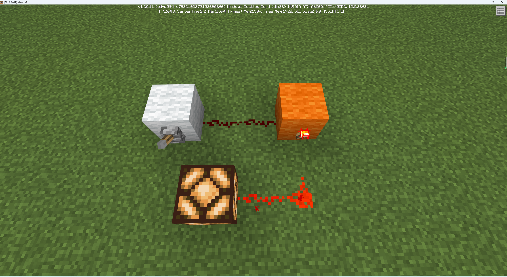
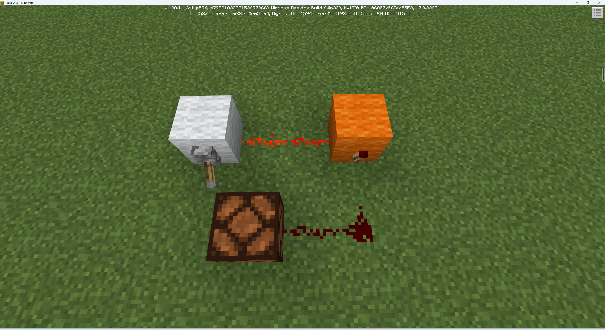
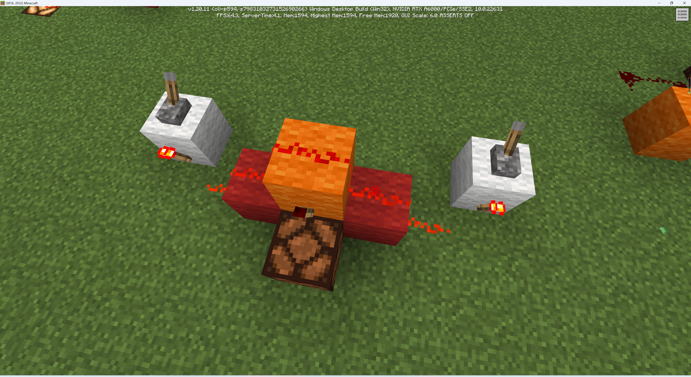
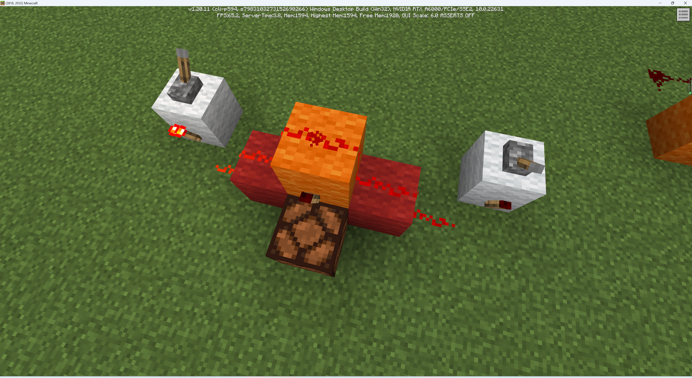
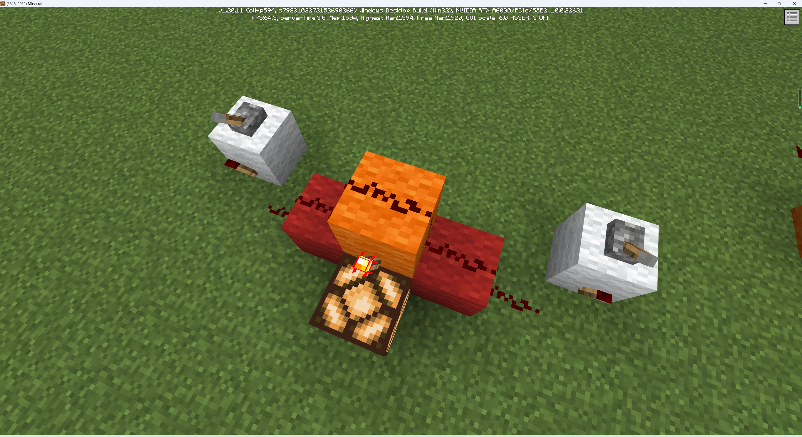
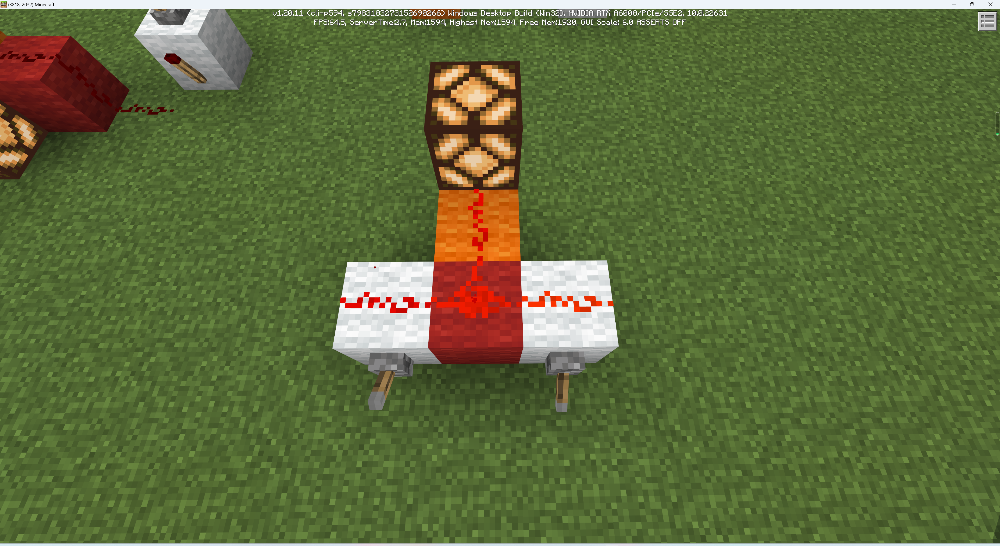
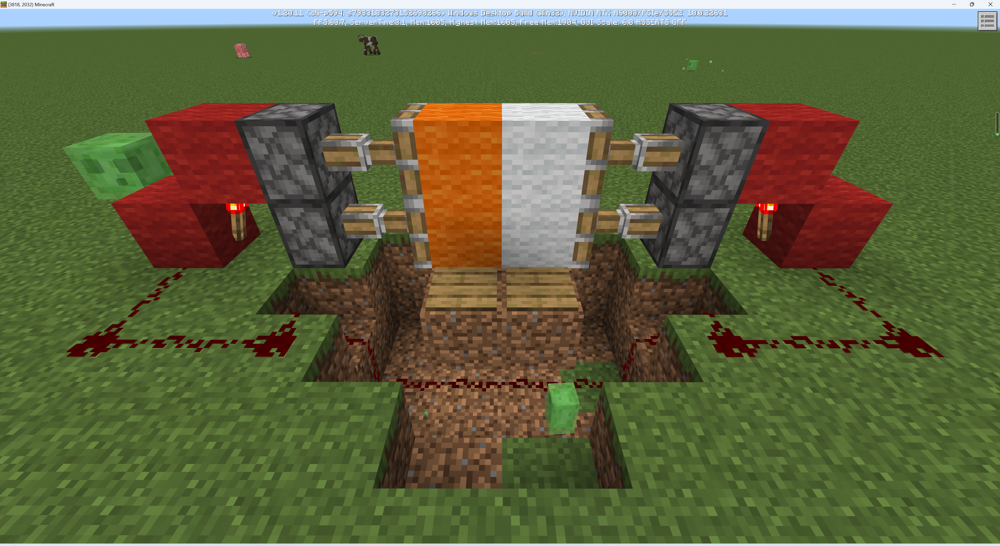
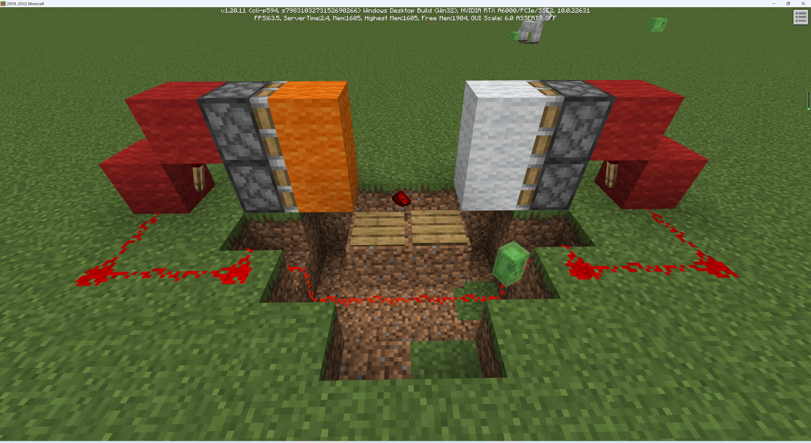
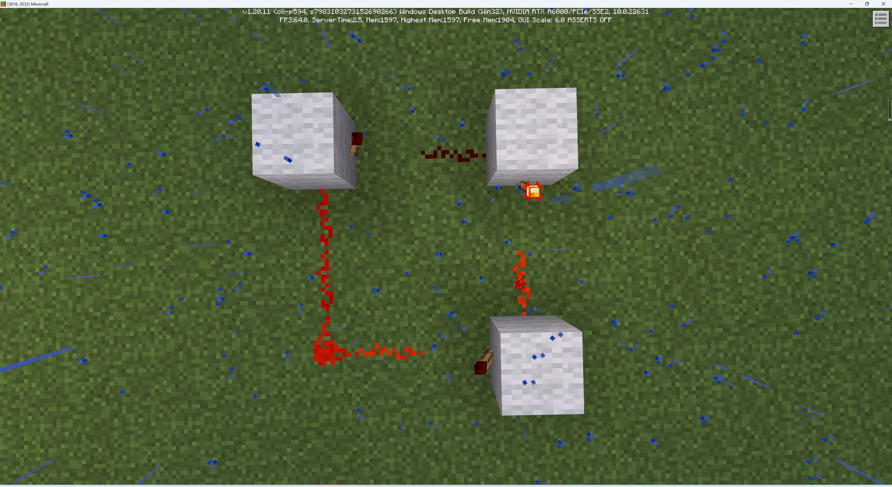
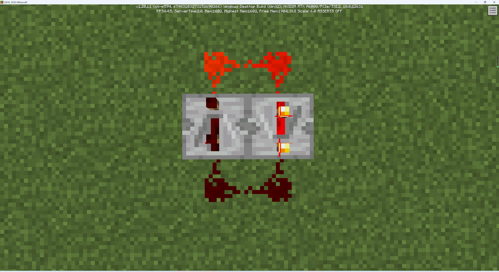

# 构建基本的红石电路

在了解了红石元件之后，我们可以构建基本的红石电路了。在本节中，我们给出几个基本的红石电路的例子，以供大家理解。首先，我们来了解基本的逻辑门。

## 基本逻辑门

逻辑门是一种用于表达数字电路的基本节点。我们在《我的世界》中也可以用红石构造逻辑门。我们把具有红石信号视为1，不具有红石信号视为0，便可以将数字电路移植到红石中。

### 非门

非门是最简单的逻辑门，红石火把就是一个最简单的非门。

如图所示，拉杆作为电源强充能了白色羊毛，激活红石线。进一步会导致附着在橙色羊毛上的火把熄灭，红石灯最终熄灭。第一张图在红石火把的作用下将0转换为1，第二张图在红石火把作用下将1转换为0。这便是一个非门。

### 与门

顾名思义，当所有输入都为1时，与门才会输出1，否则输出0。以下便是一个经典的与门。

当两个拉杆同时供能时，最终红石灯才会点亮。

### 或门

或门意味着只要有一方的输入为1，最终输出就是1。或门的构造相当简单。红石线的交汇默认就是或门。

更复杂的逻辑门都可以由与、或、非三种逻辑门叠加而成。如果你对这些内容感兴趣，可以自行学习逻辑数字电路的相关知识。

## 开关门

我们可以利用活塞制造一个开关门。活塞是一种特殊的耗能器，在受能后可以在特定方向上推开方块。粘性活塞除了推开方块，还可以将方块拉回。我们就选用粘性活塞来完成开关门的构建。

这里用到了简单的非门。此外，用到了一种名为压力板的产能器。压力板可以在其上方有实体时为下方方块供能，以及为下方红石导体强充能。在第二张图中我扔了一个红石粉物品到压力板上，来模拟我走上压力板。在实际应用中，你可以将你的红石电路部分全部隐藏起来，营造一种只有压力板和门的“简洁”状态。

## 红石时钟

我们可以利用红石制作一些每隔一定时间进行一次循环的计时器，这种计时器可以每一定时间激活一次，可以用于处理需要定期激活机械。

### 红石火把时钟

最简单的红石时钟便是红石火把时钟。红石火把时钟要求火把个数为奇数个，这样，游戏进行处理时便不会使火把激活状态达到稳定状态，从而实现反复循环激活。

在分析电路之前，我们需要了解游戏内计时的单位。游戏使用游戏刻来计时，一秒固定为20游戏刻。不过，在红石系统中，游戏单独采取另一套单位来计时，那便是红石刻。值得庆幸的是，红石刻和游戏刻的转换非常简单。2游戏刻等于1红石刻。所以一秒其实就是10红石刻。为了方便，我们约定之后章节中设计的“刻”均指红石刻。

红石火把的激活和反激活是有延时的，延时为1刻。也就是说，从输入端收到红石信号，到红石火把改变自身的激活状态需要1刻的时间。红石线是没有延时的。红石线充能羊毛也是没有延时的。因此，我们分析上图便变得简单了。

以上图截图时的一瞬间为例。右上火把刚刚点亮，信号传播至下方羊毛，此时下方火把纹理也如期显示为熄灭状态。但是实际上此时下方火把的真实状态尚未熄灭，因为转换状态有1刻的延时。一刻之后，火把彻底熄灭。左下红石线熄灭。再等一刻，左上火把点亮。再等一刻，右上火把熄灭，右侧红石线随之熄灭。因此，右侧红石线持续点亮三刻。同理，右侧红石线保持熄灭三刻，之后再次被点亮。因此可以看出来，这是一个三刻红石时钟。

如果你希望延长红石时钟循环时间，你可以成对增加火把数。不过这种方法将随着刻数增加而增加占地面积。

### 中继器时钟

中继器时钟非常好构建，只需要两个方向相反的中继器，只需要注意，他的启动依赖于你迅速放置电源然后再迅速破坏电源。之后能量将在两个中继器之间循环。

中继器默认延时为1刻。但你可以通过对其按下使用键来一刻一刻增加延时，最多可以增加到4刻。如图，这就是一个三刻时钟。

当然，《我的世界》的红石系统非常复杂且多样，你可以通过更多方式构造红石时钟，你也可以通过其他方式构造其他更多的不同种类的红石电路。你的创造力有多高，你的电路就有多多样。你可以通过一些百科类网站或者社交网站搜索红石的更多资料，然后发挥你的创造力，建造属于你的红石逻辑吧！