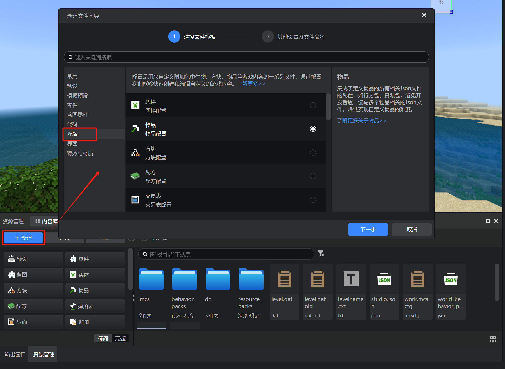
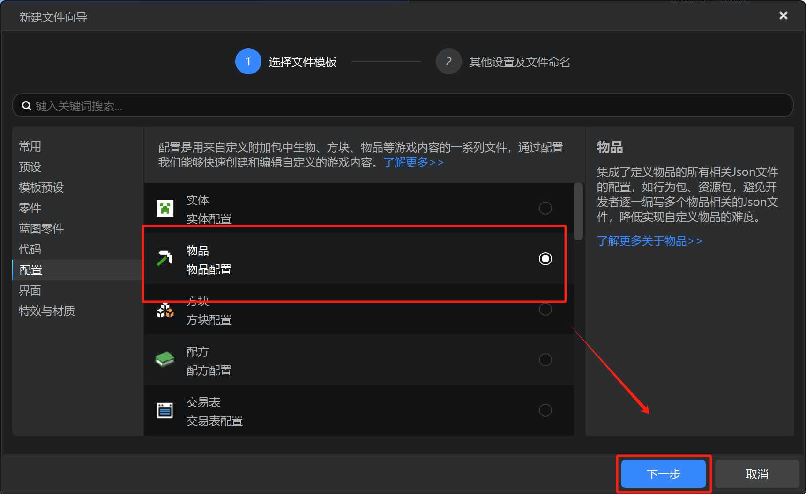
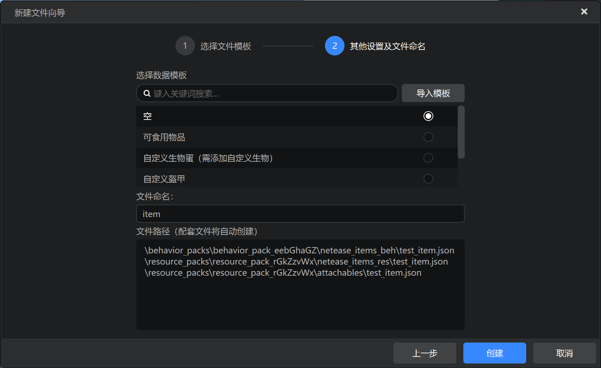
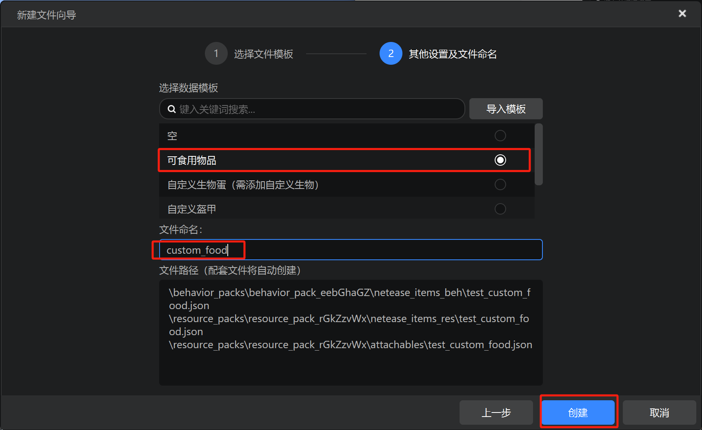
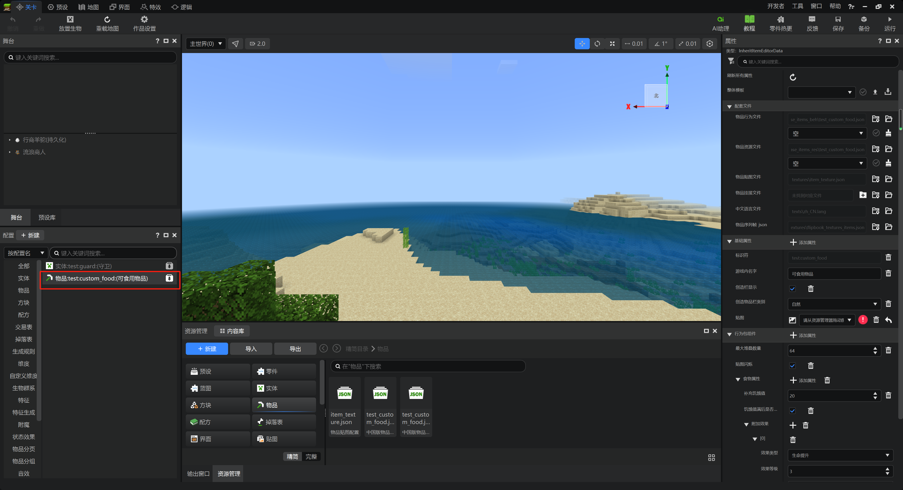
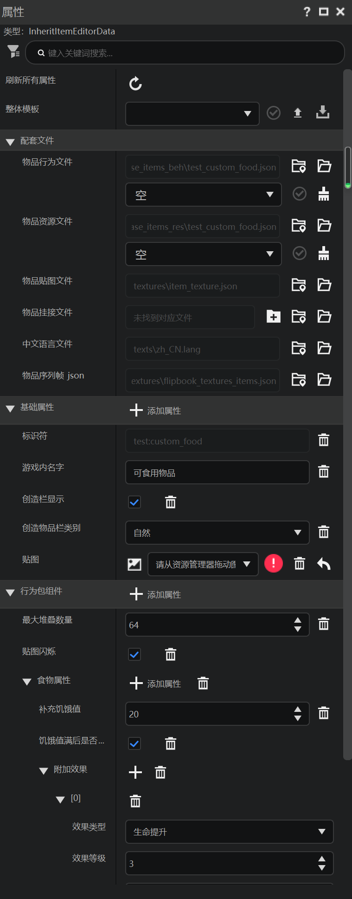
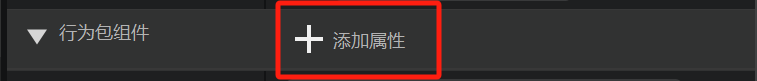
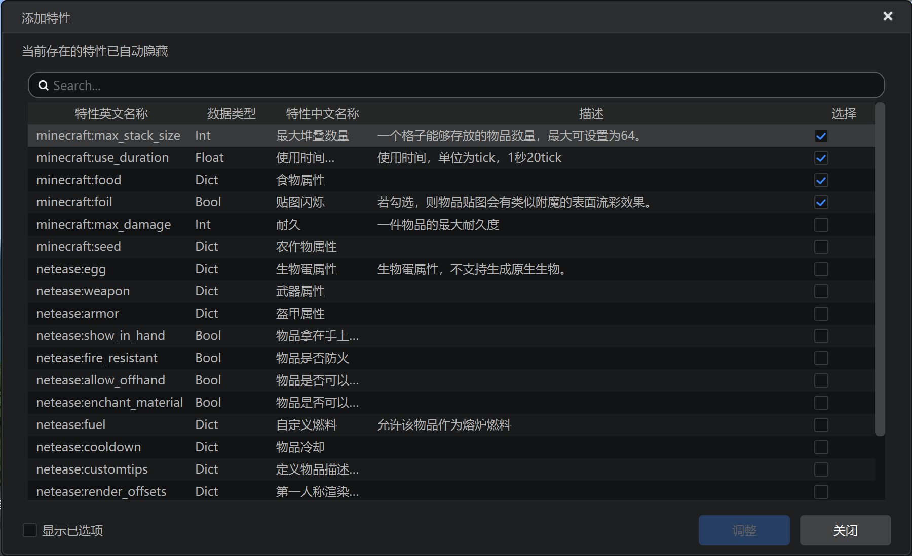
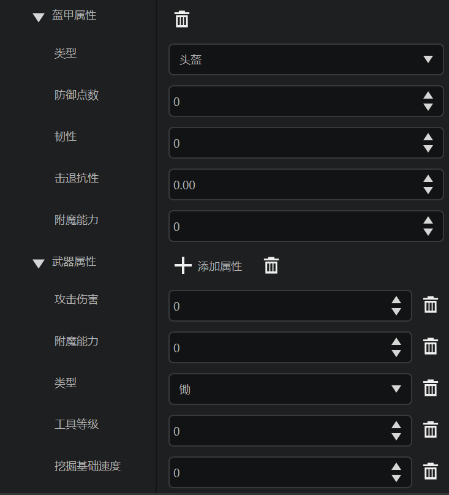

# 创建物品

在本节中，我们将一起学习如何自定义一个新的物品。除了《我的世界》原版中有一系列物品之外，《我的世界》基岩版允许你使用接口自定义新的物品。使用《我的世界》开发工作台中的编辑器，我们可以可视化地、以非常简单的方式自定义我们想要的新物品。

## 新建物品

《我的世界》开发工作台，找到你的项目，并打开“编辑”。这样，便如同之前的教程中反复操作过的那样，我们便打开了编辑器。

点击下方“资源管理”窗格中的“+新建”按钮。我们便可以打开新建文件向导。点击“配置”选项卡。我们打开新建配置的选择界面。

选中“物品”，并点击“下一步”。我们便可以进入新建物品的对话框。

如同自定义实体那样，在这里，我们可以选择一些预设模板，或者以空白物品从零开始创建。

我们以自定义食物为例，我们选择“可食用物品”，并自定义一个物品名，也就是物品标识符。这里我们自定义物品名为`custom_food`。由于我们的示例项目配置的命名空间是`test`，因此新物品的物品标识符将会是`test:custom_food`。点击创建，我们便成功创建了一个新物品。

此时，在左侧配置窗格内便可以看到物品了！

## 更改属性

和之前系列教程中讲述过的自定义实体一样，在右侧的属性窗格中我们可以更改该物品的属性。如图所示，因为我们此次创建的是“可食用物品”，也就是食物，因此已经自动为我们添加了食物属性。我们可以在“补充饥饿值”一栏更改该物品食用后补充的饥饿值，在“附加效果”一栏中更改该物品食用后给予玩家的状态效果。

同样的，点击“添加属性”，我们可以添加、更改和删除该物品的各个属性。

例如，如果我们要让我们的物品是一种武器，我们就需要添加`netease:weapon`；如果我们希望物品是一种盔甲，则需要添加`netease:armor`。

在添加完成相关属性后，我们可以容易更改属性的值来实现我们的自定义效果。