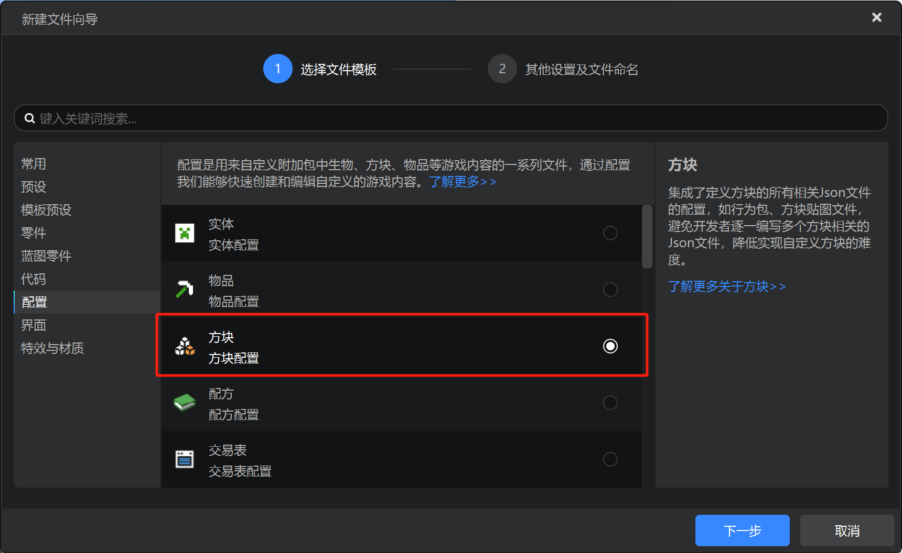
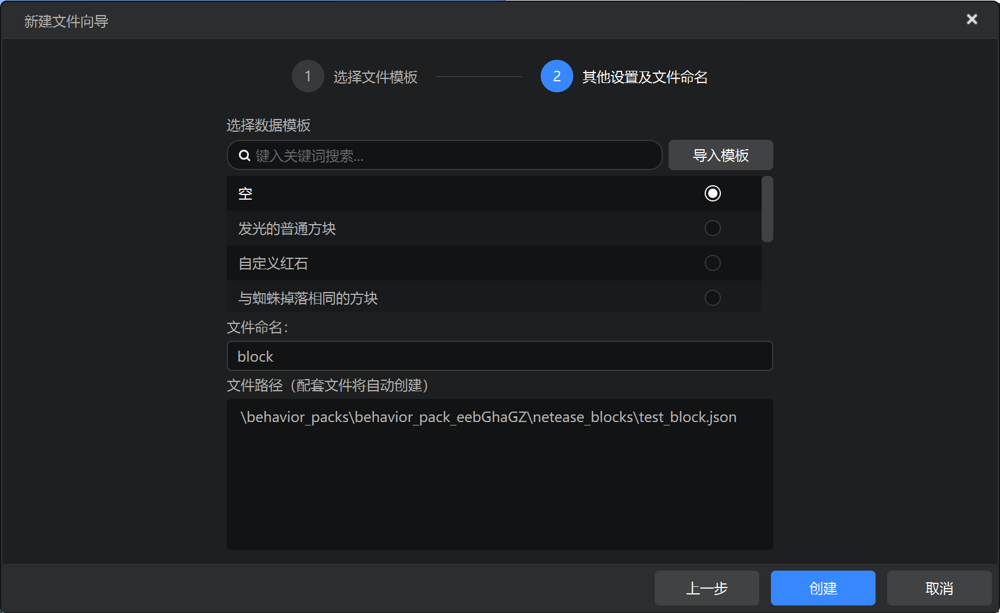
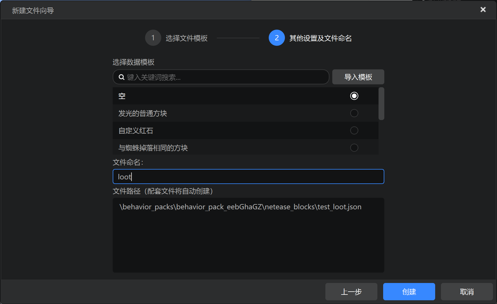
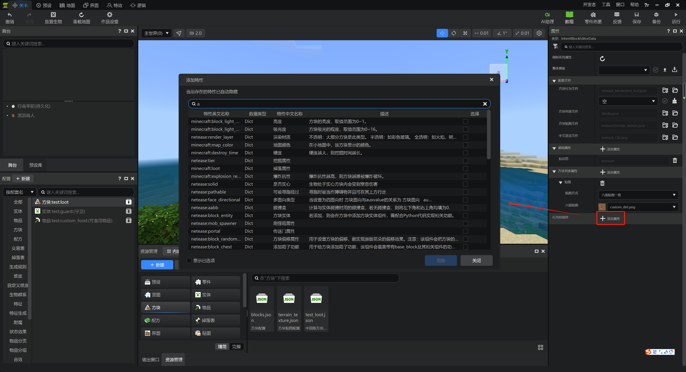
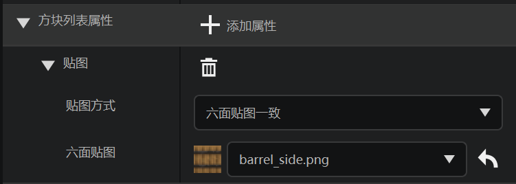

# 自定义方块

为了在遗迹中放置我们的自定义物品，我们需要一个能够产生战利品的“容器”。自定义一个方块来完成这件事便是一个非常好的选择。接下来，我们一起学习如何自定义一个方块。

## 新建方块

回到我们的新建配置界面，我们这次选择方块配置。然后我们点击“下一步”。

在这里，我们可以选择一个模板，并为我们的方块命名。

我们为其命名为`loot`，这样我们方块的标识符便为`test:loot`。

## 修改属性

和实体和物品相同，我们可以点击右侧属性窗格中的“添加属性”按钮添加我们想要的属性。

此外，我们也可以在方块属性列表的“贴图”属性一栏修改我们想要的方块贴图。

例如，我们可以把方块贴图改为原版木桶样式，以符合作为战利品“容器”的需求。