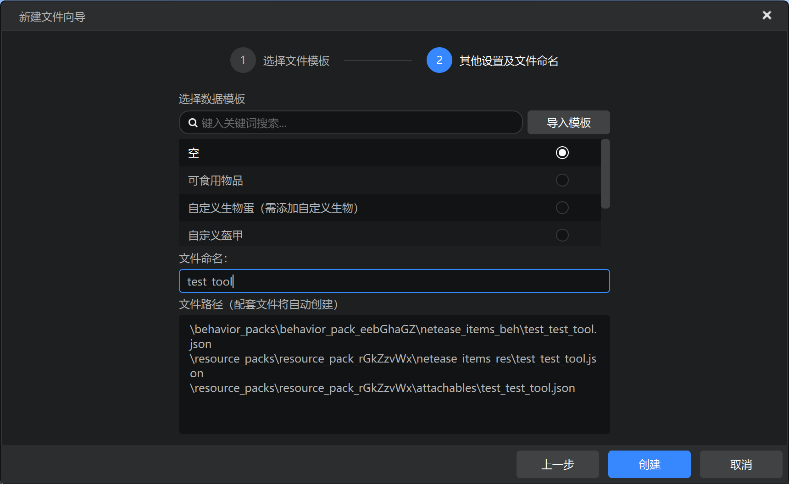
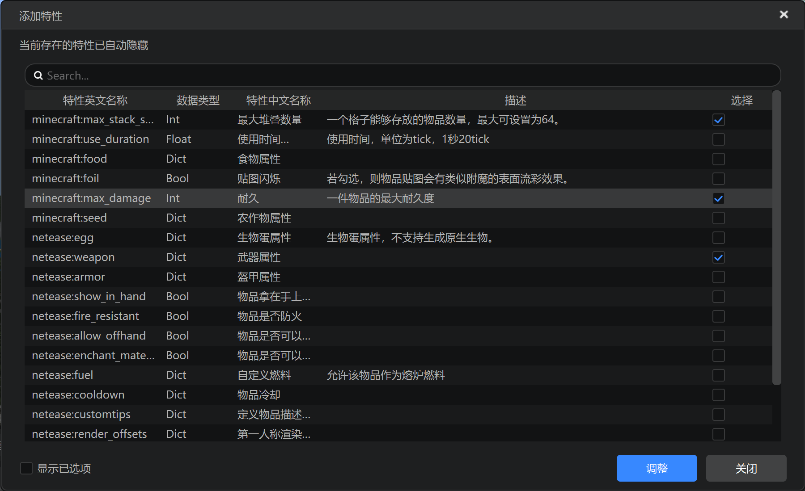
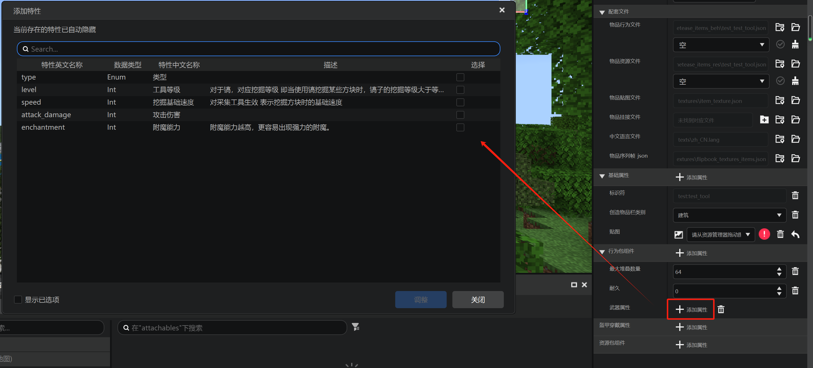
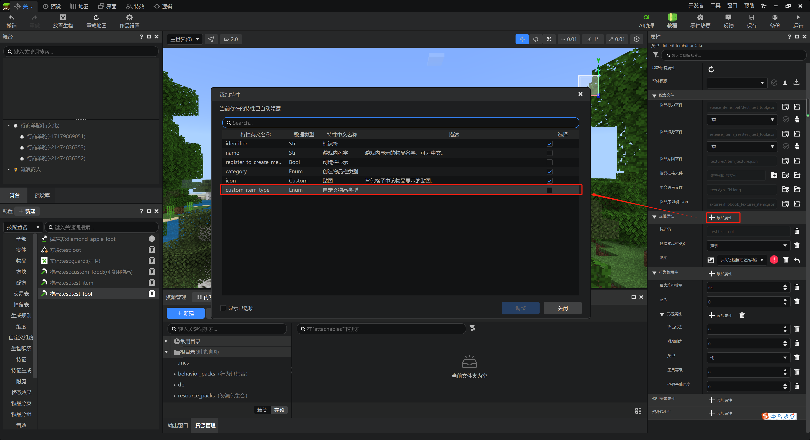
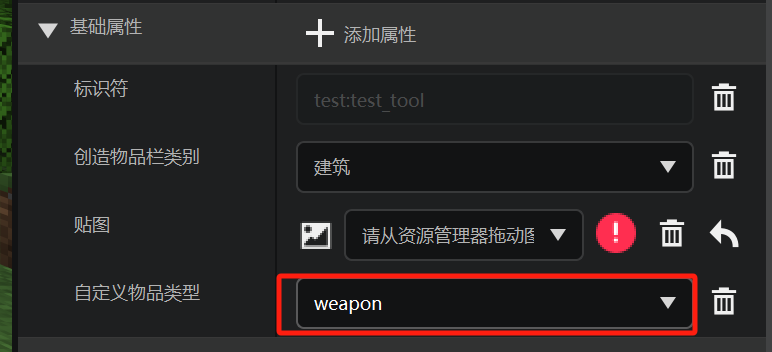

# 工具

在本节中，我们学习工具的自定义物品JSON文件。

## 在编辑器中添加



我们创建一个标识符为`test:test_tool`的物品。



我们为其添加`minecraft:max_stack_size`、`minecraft:max_damage`和`netease:weapon`属性。在后面我们可以看到，这三个属性本质上是三种组件。



然后在武器属性这里我们把所有的子属性都添加上。



接着，我们在基础属性中添加`custom_item_type`。



并确认值为`weapon`。这样，我们便添加了一个自定义工具的基本配置。你可以先在编辑器中进行一些修改，也可以直接打开JSON修改。

## 实际文件

由于以上自定义的属性都位于行为包，这里我们只展示行为包文件的内容：

```json
{
    "format_version": "1.10",
    "minecraft:item": {
        "components": {
            "minecraft:max_damage": 0,
            "minecraft:max_stack_size": 64,
            "netease:weapon": {
                "attack_damage": 0,
                "enchantment": 0,
                "level": 0,
                "speed": 0,
                "type": "hoe"
            }
        },
        "description": {
            "category": "Construction",
            "custom_item_type": "weapon",
            "identifier": "test:test_tool"
        }
    }
}
```

`minecraft:max_damage`组件是一个整数，代表该工具的最大耐久值。我们可以在JSON中手动将其更改到更高的值。

`minecraft:max_stack_size`是该工具的最大堆叠数，这里的默认值64是有问题的，我们必须将其更改到1，因为工具应默认不可堆叠。

`netease:weapon`是网易自己添加的组件，可以用于定义原版的五种工具：剑、镐、斧、锹、锄。具体属性可以至官方文档[自定义武器及工具](https://mc.163.com/dev/mcmanual/mc-dev/mcguide/20-%E7%8E%A9%E6%B3%95%E5%BC%80%E5%8F%91/15-%E8%87%AA%E5%AE%9A%E4%B9%89%E6%B8%B8%E6%88%8F%E5%86%85%E5%AE%B9/1-%E8%87%AA%E5%AE%9A%E4%B9%89%E7%89%A9%E5%93%81/2-%E8%87%AA%E5%AE%9A%E4%B9%89%E6%AD%A6%E5%99%A8%E5%8F%8A%E5%B7%A5%E5%85%B7.html?catalog=1)处查看。

`description`中的`custom_item_type`是用于自定义特殊物品用的，这里值为`weapon`，用于和`netease:weapon`组件相配合。你依旧可以在上面提及的自定义武器及工具页面找到它的相关信息。