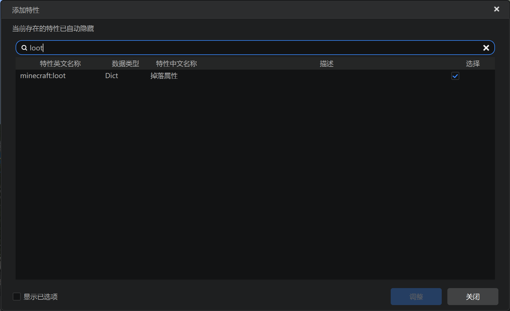
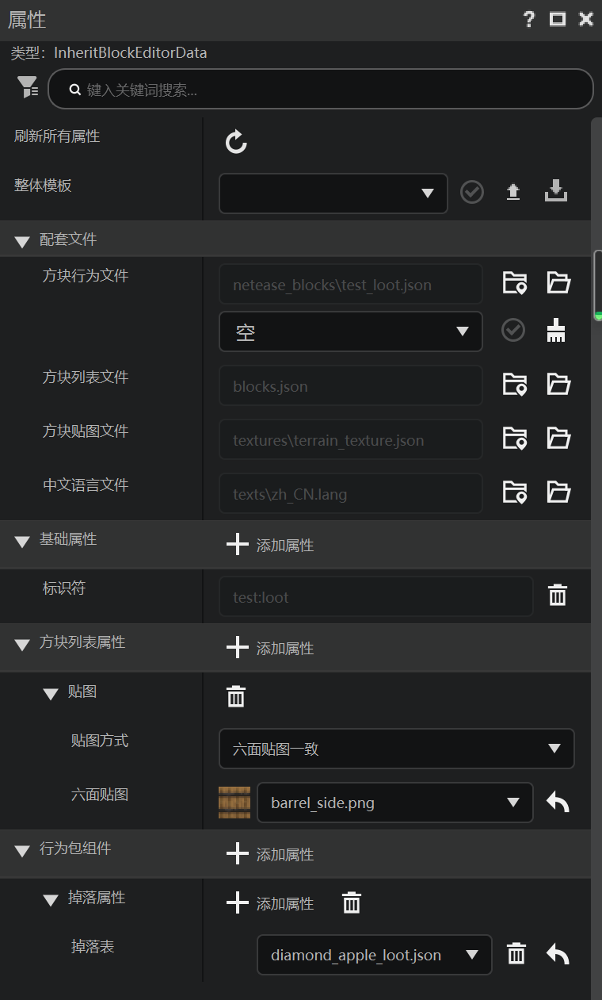

# 掉落

在本节中，我们回顾学习方块的掉落属性。

## 在编辑器中添加



和实体一样，也如之前教程中所教的那样，方块的掉落是由`minecraft:loot`属性控制的。我们可以在行为包属性中找到该属性并添加。



我们之前的木桶战利品方块已经添加过该组件了。

## 实际文件

我们打开并查看木桶战利品方块的服务端定义文件：

```json
{
    "format_version": "1.10.0",
    "minecraft:block": {
        "components": {
            "minecraft:loot": {
                "table": "loot_tables/diamond_apple_loot.json"
            }
        },
        "description": {
            "identifier": "test:loot"
        }
    }
}
```

`minecraft:loot`便是控制方块被挖掘之后掉落物如何生成的组件，其下的`table`接受一个战利品表。如果没有设置该组件，则默认掉落方块自身。

当然，如果你希望方块不掉落任何物品，你可以设置原版的空掉落战利品表：`loot_tables/empty.json`。

