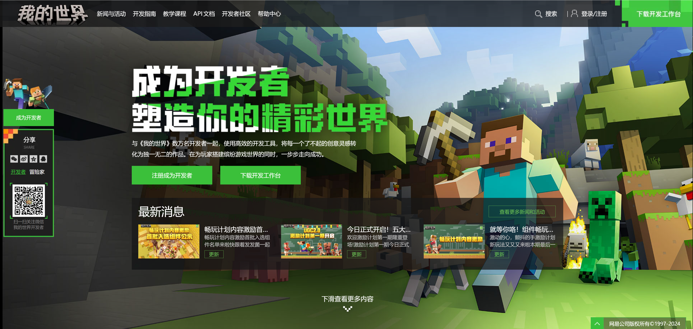
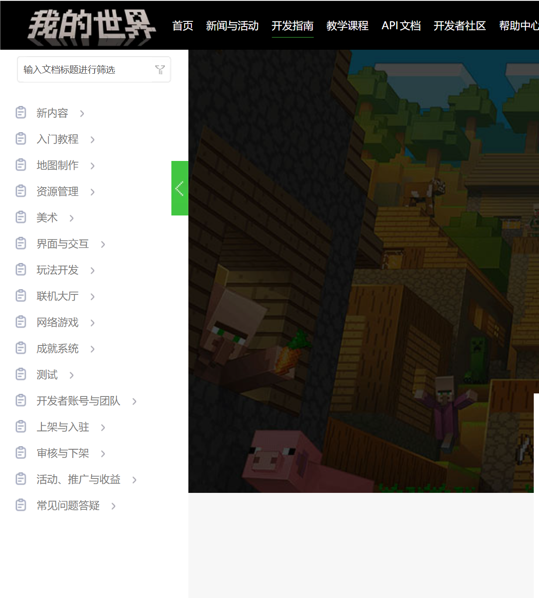
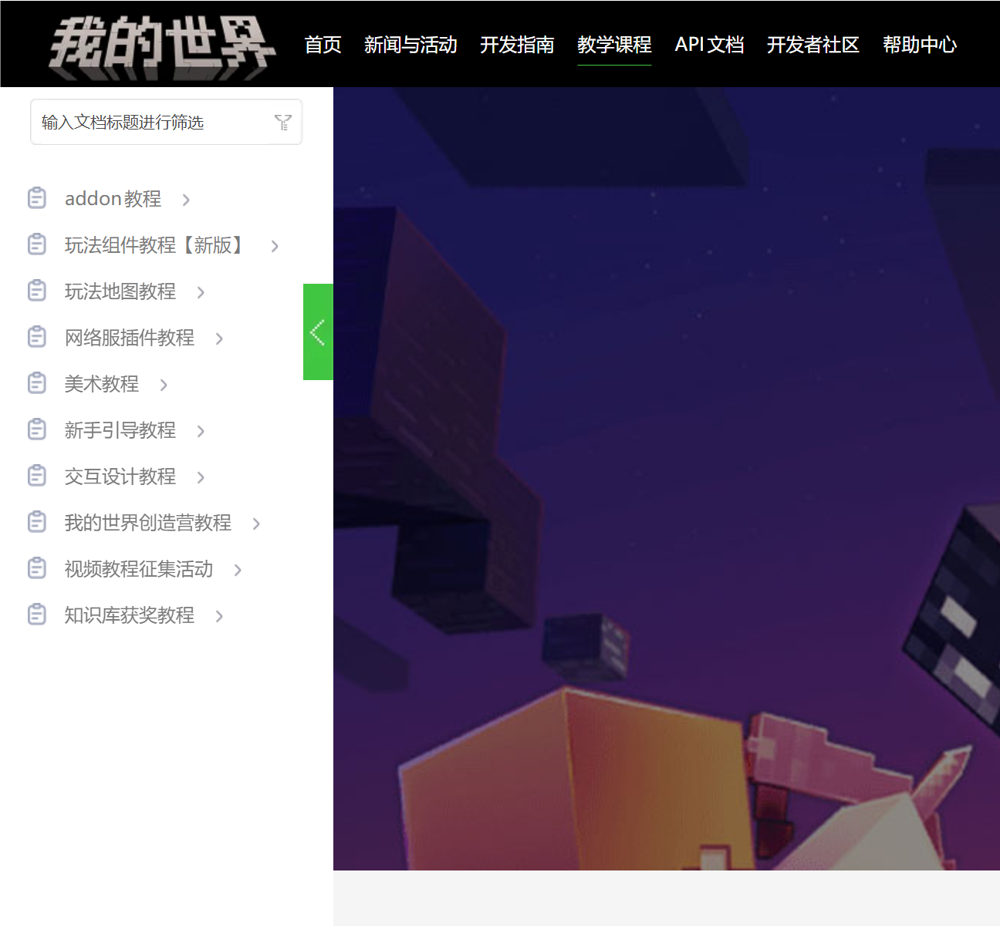
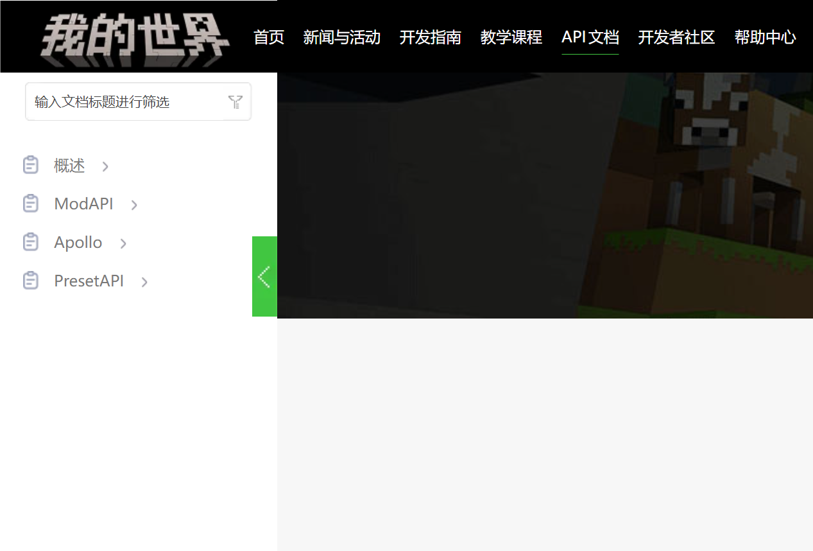

# 利用开发者官网资源

打开我们的中国版《我的世界》开发者官网：https://mc.163.com/dev/index.html 。你会发现顶栏上有“开发指南”、“教学课程”和“API文档”这三个标签。这些内容便是我们开发者官网的各类开发资源。

作为优秀的开发者，我们应当善于利用这些资源来充实自己的开发能力。

## 开发指南

开发指南是关于《我的世界》开发过程中遇到的各类话题的功能文档。其中既有各类介绍性文章，也有一些步骤指南和接口列表，以功能使用说明为主。特别地，“玩法开发”板块下的“自定义游戏内容”的主要内容便是本教程讲述的JSON文件相关接口的开发说明。

## 教学课程

教学课程是各类官方系列教程的存放处。这里从附加包开发到网络服插件教程应有尽有。如果你对某种类型的开发感兴趣，可以直接跟随教程的脚步，逐步构建良好的知识体系。

## API文档

API文档则是中国版独有的Python的模组SDK文档，这里包括模组API（一般附加包接口）、Apollo（服务端插件接口）和预设API（预设与零件接口）的相关参考文档，你可以通过左侧导航栏树状视图浏览，也可以快速搜索找到想要的功能接口。

## 其他资源

除此之外，开发者官网还有开发者社区、开发者内容管理工具、帮助中心等内容，可以在各个方向为你的开发提供帮助、保驾护航！善用开发者官网的资源，将是你成为开发者大师的第一步。