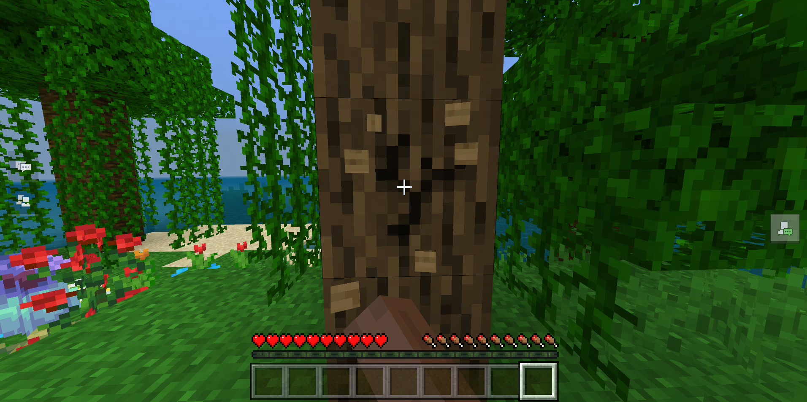
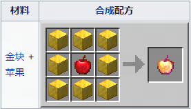

# 寻找与分析失落的配方

在接下来的几节课程中，我们将逐步解锁多种配方。

我们将从配方本身去了解，先熟悉一下，然后找到那些基岩版被移除的配方，并进行简单分析。

在本课中，我们需要：

- 重新温习配方是什么。
- 找到那些基岩版被移除的配方。
- 分析其中几个被移除的配方。

动动手指，我们开始吧。

## 配方

玩家通过不断地挖掘方块来获取各种来自世界中的资源，可以说， **挖** 是我的世界最常用的动作。积累的这些资源需要有一种消耗的途径，使得他们能感受到自己的游戏投入会带来正面价值。

**配方** 解决了这一点。一方面，它引导玩家找到游玩我的世界的方式，提供黄金路线，完成击败 **末影龙** 这一原版目标。另一方面，它解决了原料消耗的问题，并且能时不时提醒玩家记忆不常用的配方，以及化作解锁从未制作过的新东西的工具。

## 基岩版已移除配方

目前基岩版已移除16种配方，在[这里](https://zh.minecraft.wiki/w/%E5%9F%BA%E5%B2%A9%E7%89%88%E5%B7%B2%E7%A7%BB%E9%99%A4%E9%85%8D%E6%96%B9)可以找到我的世界基岩版已移除的配方清单。这代表着：这些配方曾存在于游戏中，但已被移除。有的配方让东西变成不可再生的资源，有的配方移除是为了隐藏已经无法正常从游戏中获取到的方块，而有的则是与我的世界Java版功能同步后的结果。每个变动都或多或少改变玩家的游戏习惯。

## 分析

例如，在基岩版1.2.13以前，附魔金苹果可以使用8个金块加1个苹果合成。它是可以给予更强有益状态效果的特殊食物类物品。虽然没有一种官方的说法去解释它为何被移除。而如今，玩家只能通过寻找宝箱的方式才能获得附魔金苹果，进一步造成了它的稀缺性。这使得玩家必须更加谨慎地使用它们，在关键战斗或紧急情况下才使用。

而下界反应堆配方的取消，则是因为已经被真正的下界维度所替代。玩家无需再通过它来获得下界资源。因而成为了许多老玩家的回忆。

## 结论

现在，我们已经了解了配方的作用，已经一些配方被移除的原因。在下一节中，我们将会学习如何使用编辑器来还原其中几个配方并做适度调整。
