# **进阶技巧**

## **展示教程最终皮肤效果**

这就是我们本次教学的最终皮肤成果。

接下来，我们将根据前面收集的内容，一步步展示如何将其整理并绘制成为皮肤。现在，就让我们一起跟随教程学习绘制过程吧。

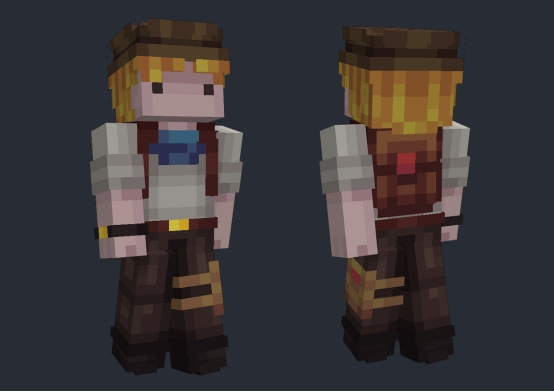

## **开始绘制有基本色调的冒险者皮肤**
让我们先创建一个初始角色,根据下图的步骤进行即可，“文件” > “新建” > “Minecraft皮肤”，纹理图层就是指外层皮肤，如果勾选后就会再生成一层外层皮肤，如果不勾选则不会生成，这个根据自己的需求选择是否生成

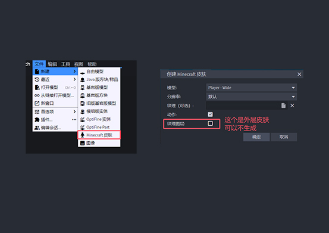

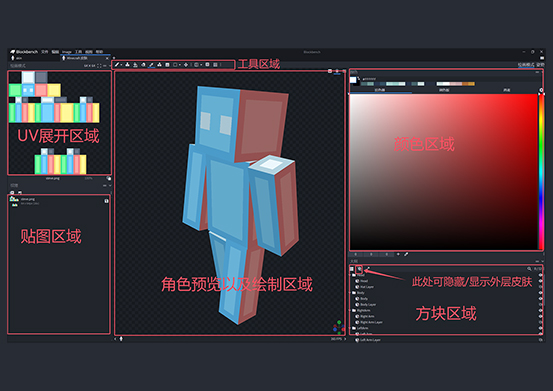

大多数新手在绘制皮肤时，往往会从某个特定部位开始，然后再逐步绘制其他部分。然而这种做法并不理想。建议将皮肤视为一个整体，首先确定大致的外观和服装风格，这样更便于整体观察和调整细节。

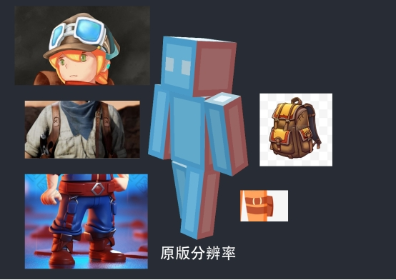

根据我们之前收集的设计灵感，结合自己的色彩搭配偏好，我们可以开始进行纯色上色。

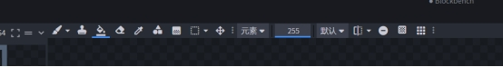

建议使用油漆桶工具，直接对各部位进行大面积的基础颜色填充。

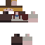

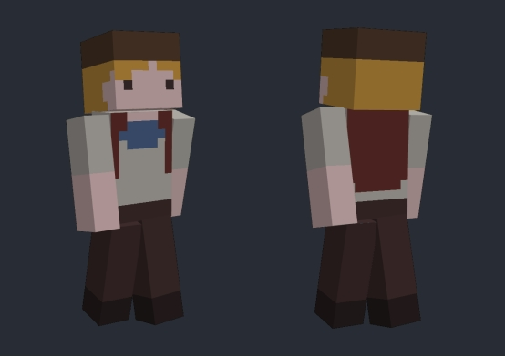

首先确定每个区域的基本颜色和内容布局，这样后期绘制时就能脱离参考图，更加自由地创作了。

## **根据角色结构和基本色调绘制明暗关系**

完成基础颜色绘制后，接下来我们需要定义皮肤的明暗关系，这有助于提升整体的立体感和生动性。在绘制明暗时，请务必遵循整体结构。我们的目标是让皮肤看起来更立体。记得我们在讨论时提到过，调整明暗不仅仅是改变亮度，还需要对颜色本身进行整体调整，比如蓝色围巾的部分。

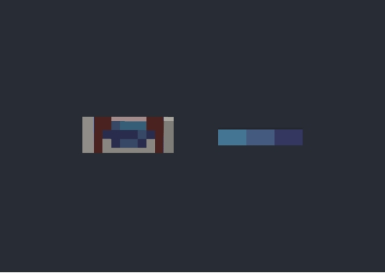

首先确定基础色，也就是中间色，选择时尽量保持在色轮的中间位置，这样颜色既不会过于暗淡也不会过于明亮。

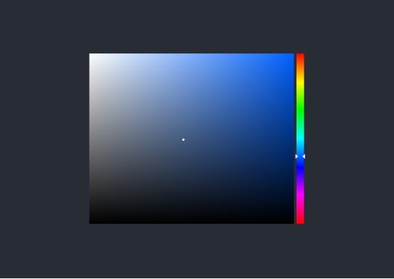

当我们需要调整亮部颜色时，可以在色相上稍微偏向绿色，并同时提高明度。相反地，对于暗部颜色，我们只需做反向操作，即从基础色向下移动，在色相和明度上都做出相应的调整。

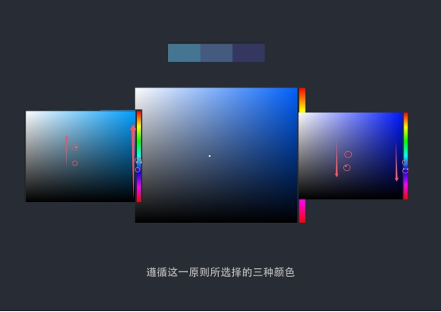

接下来，使用上述方法绘制出所有部分的明暗效果。每个平铺的颜色最好不超过五种渐变色，重点在于精确地表达明暗对比，而非使用大量颜色过渡来绘制明暗。

这样处理后，角色就会呈现出大致的明暗效果。

## **通过明暗关系表现不同的材质质感**

明暗关系是表现材质和色彩的关键手法。例如，可以通过精细的明暗对比来描绘出头发一丝一丝的效果。

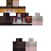

此外，通过局部的小范围明暗对比，还能更有效地突出所要表现物品的材质质感。