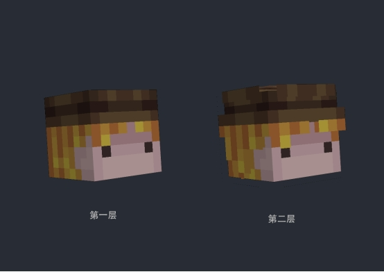
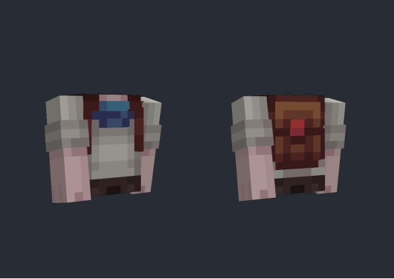
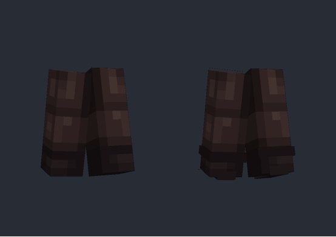
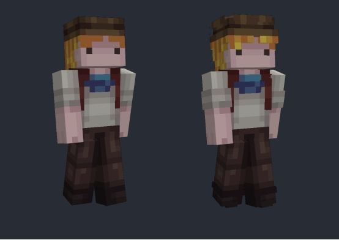
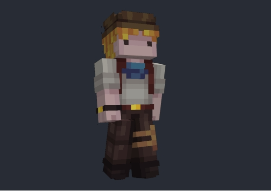
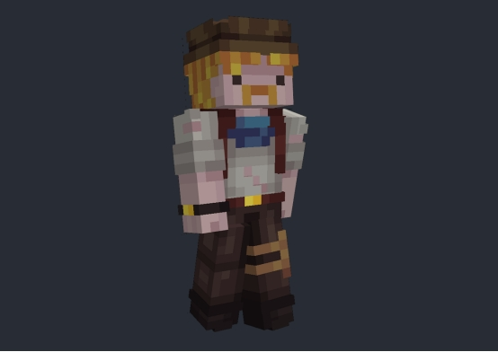

# **独特设计**

## **外层皮肤设计**

添加外层皮肤能让整体外观看起来更加立体，并且提供更多细节展示的机会。

首先对于头部，双层皮肤的设计能够让帽子和头发更加突出。

在上半身部分，可以通过在外层增加一些细节，如袖口的褶皱，来表现衣物扎起的效果；背部的背包也可以在外层稍作勾勒，使其看起来更加立体。

腿部方面，适当在外层加入一些细节，可以使裤子显得更为有趣。

最终效果显示，相比仅添加明暗变化的皮肤，带有外层细节的设计显得更加自然和丰富。

## **为皮肤添加小零件，提高丰富度**

添加小零件的目的是为了让皮肤看起来更加有趣和独特，但要注意不要过多，以免显得杂乱无章，适度添加即可。

在这里，我选择为我的角色添加以下几个小零件：

- 手表：帮助冒险者更好地辨别时间；

- 腰带：使裤子穿得更牢固；

- 小腿包：便于存放一些需要快速取用的小工具。

## **添加足够的故事感**

故事感是指通过角色设计来讲述一个故事。例如，如果你的角色是一位经验丰富但又略显沧桑的老冒险家，你可以给他加上一些与头发同色的胡须，并在其皮肤上绘上一些伤痕来体现他的经历。

当然，每个人都有自己独特的想法，所以在这一环节最重要的是考虑如何加入一些个人化的元素，让角色真正成为你想要讲述的那个故事的一部分。