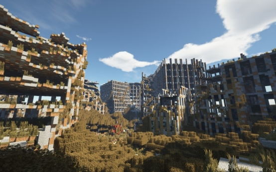

# **练习时间**

## **绘制一个属于自己的冒险者**

相信看完前面的教程后，大家已经迫不及待想要动手尝试了。接下来，让我们一起创作一个属于自己的冒险家形象吧！既然这是一次练习，设定一个简单的题目会很有帮助。那么，我们就来确定一个易于上手的题目吧。

假设你是一位末世中的冒险者，原本是一名热爱户外探险的人，并精通野外生存技巧。当丧尸病毒爆发后，这些技能帮助你在混乱中幸存下来。在最初的几个月里，你独自穿越了废弃的城市与乡村，学会了如何躲避或对抗丧尸。

角色描述如下：

**体型**：健硕而灵活，肌肉线条明显但不臃肿，展现出良好的体能和耐力。

**头发**：短发，略带凌乱，颜色为深棕色，有时会因长时间未打理而显得稍显蓬松。

**眼睛**：双眼深邃，瞳孔呈深褐色，目光锐利而充满警觉性。

**脸型**：方脸，下巴线条分明，脸颊上有几道细小的疤痕，其中一道较为明显的位于左眉上方，是与丧尸搏斗时留下的痕迹。

**肤色**：由于长时间在户外活动，皮肤呈现健康的古铜色，皮肤质地略显粗糙。

**衣着**：通常穿着一件战术夹克，内搭黑色T恤，下身穿紧身战术裤，脚踏耐磨的作战靴。夹克上挂有几个小口袋和工具袋，方便存放小物件和工具。

**装饰**：手腕上佩戴着一条皮质手环，上面刻有几个简单的符号，代表着失去的亲人和朋友的名字；脖子上挂着一条皮制项链，吊坠是一枚小小的指南针，象征着他始终保持着方向感和希望。