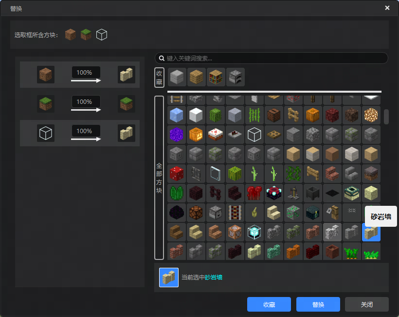
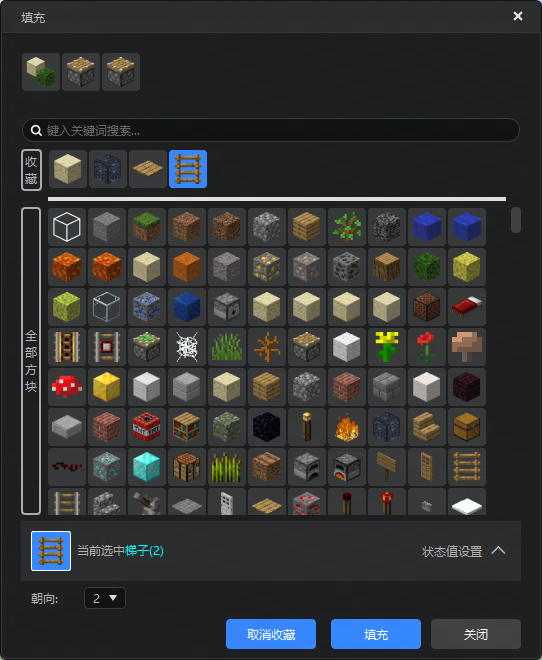

# 2025.7.08 版本1.1.44

## 地图编辑器

替换和填充界面增加方块收藏功能

- 点击所有方块列表中的方块后，会出现收藏按钮，点击按钮即可将方块放入收藏列表

- 点击在收藏方块列表中的方块后，会出现取消收藏按钮，点击按钮即可将方块移出收藏列表

## 配置编辑器

- 对新建文件中"生成规则"描述文字优化为"实体生成规则"，避免和特征规则造成混淆

## 问题修复

- 修复多结构生成规则字段"is multi sub editor"检测会删除文件问题

- 修复原版模型转fbx工具0帧处理问题

- 修复文本输入框控件调整输入文本颜色属性后，再改属性在编辑器内消失问题

- 修复地图编辑器替换、填充弹出界面位置UI会遮挡的问题