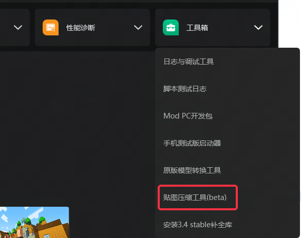
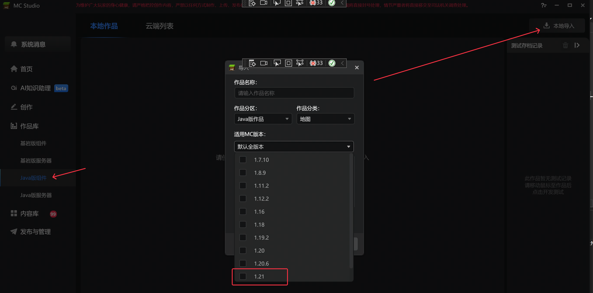
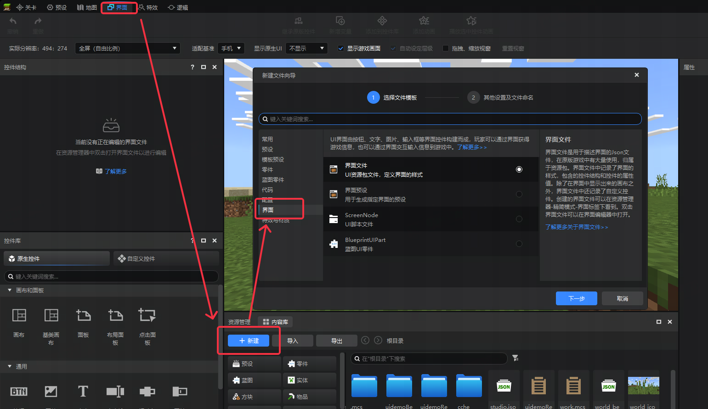

# 2025.6.25 版本1.1.43

## 编辑器

### 编辑器升级3.4

新增支持1.21.0的新物品、方块、实体等

### 贴图压缩工具

工具箱新增资源包贴图压缩工具，可根据JSON配置自动压缩资源包贴图并生成报告，帮助开发者减少包体体积

详细使用链接请前往官方Github仓库[https://github.com/MCNeteaseDevs/Image-AutoCompress](https://github.com/MCNeteaseDevs/Image-AutoCompress)

### Java版组件-本地导入-适用版本，新增支持Java1.21

## 配置编辑器

- 新建页签优化

现在新建配置会根据当前所在页面打开对应的配置选择界面。如在**界面编辑器界面**，新建文件向导会默认**选择界面选项**（见下图）

