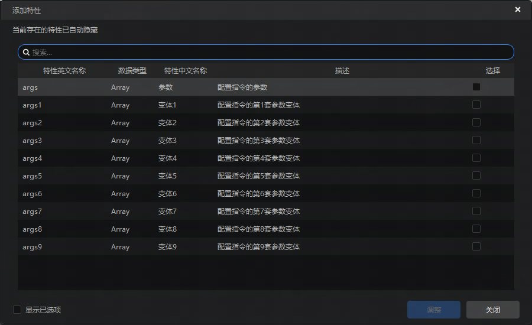

# 2025.4.22 版本1.1.39

## 启动器

- 性能诊断工具优化，优化采集服务的CPU消耗、优化获取进程列表的效率等
- 组件编辑界面优化，编辑界面排布与配置界面一致
- 日志与调试工具，保存窗口位置和大小以及字号大小为配置，下次打开工具使用保存配置

## 编辑器

- 自定义指令支持参数变体配置

- 支持批量导入原版方块模型，点击导入-原版方块模型后打开模型所在文件夹，可以选择多个文件导入

## 问题修复

- 编辑功能对橡木方块进行旋转操作后变为白桦木方块