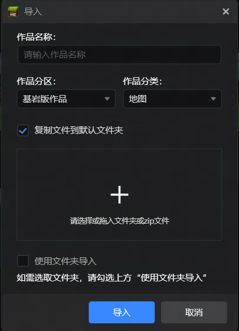
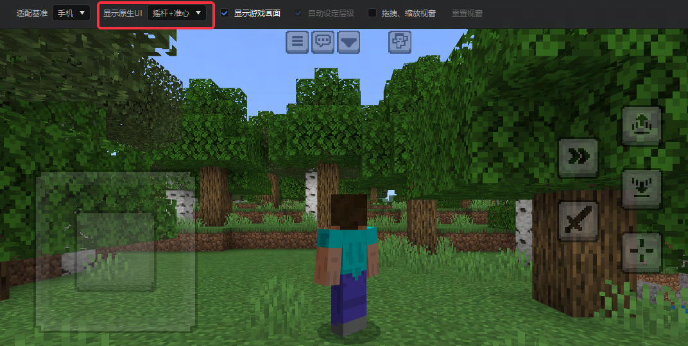

# 2025.2.20 版本1.1.31

## 启动器

组件导入功能优化，支持选择文件类型。

## 界面编辑器

界面编辑器支持预览新触控界面。

界面编辑器补充字段。

- 文本控件：补充锁定颜色、锁定透明度、隐藏连字符、启用本地化
- 图片控件：补充平铺类型、平铺缩放比例、双线性缩放
- 按钮控件：补充按钮声音、声音音量、声音音调

## 配置编辑器

- 自定义配方：支持配方解锁配置
- 自定义盔甲：补充盔甲韧性、击退抗性配置
- 掉落表：支持战利品表配置和空配置

## 问题修复

- 修复打开含雕纹书架的结构体后编辑器崩溃
- 修复netease:weapon、netease:render_layer部分字段与实际配置不符