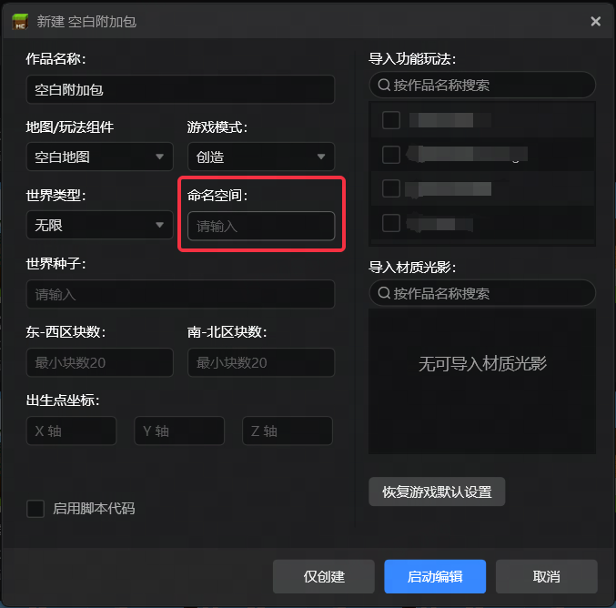
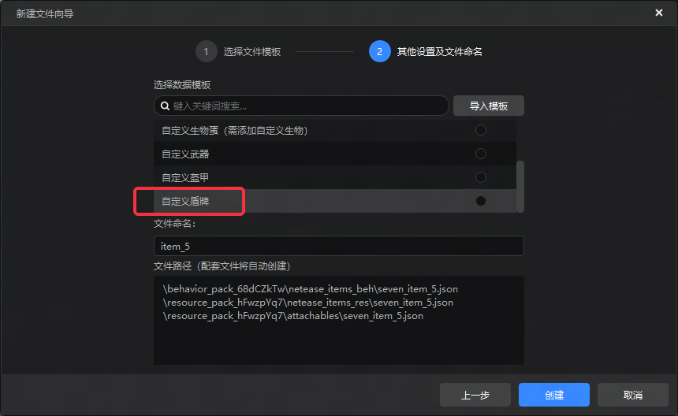
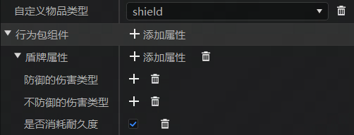

# 2025.1.23 版本1.1.30

## 启动器

新建作品时支持配置命名空间。

## 编辑器

自定义物品新增自定义盾牌模板和相关属性。

编辑器属性面板排版优化，部分控件支持自适应宽度，分割线改为白色，并支持更大范围拖动。

## 其他

- 修复地形功能放置结构池属性点击无反应
- 修复编辑器内的村庄结构无法正常生成
- 修复fbx/obj导入地图编辑器后方块颜色错误
- 修复放置带有箱子的结构体时内嵌游戏崩溃
- 修复配方配置的结果选择自定义物品后属性栏不显示
- 修复物品选择器部分物品贴图错误问题