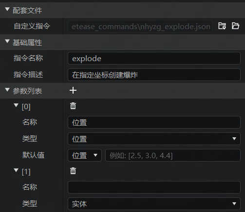
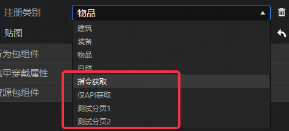
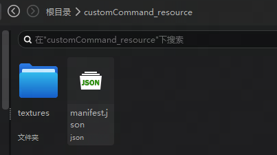
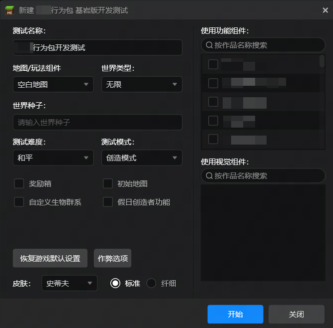

# 2025.1.9 版本1.1.29

## 编辑器

新增自定义指令配置，开发者可以更方便地为作品添加自定义指令。

支持新版物品和方块注册逻辑，不仅支持配置两种新的获取方式，并且能够指定自定义分页。

编辑器目录生成优化，减少了大量不必要的文件夹和文件。

## 启动器

配置界面重新排布，现在右侧搜索框更大更容易操作。

## 其他

- 修复界面编辑器快速切换自定义控件导致Json数据丢失问题
- 修复导出功能会删除二级目录同名非空文件夹的问题
- 云端列表增加对无主包的demo模组标记
- 编辑器升级基岩版1.20.50和Java版1.20.6