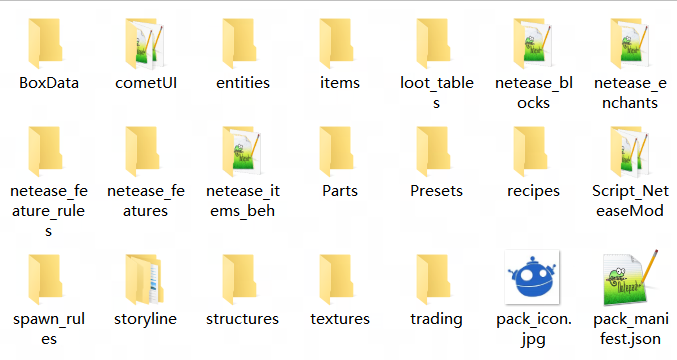
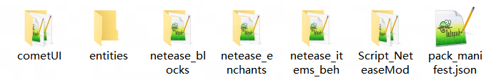
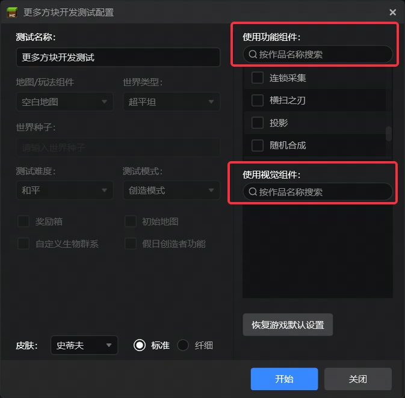
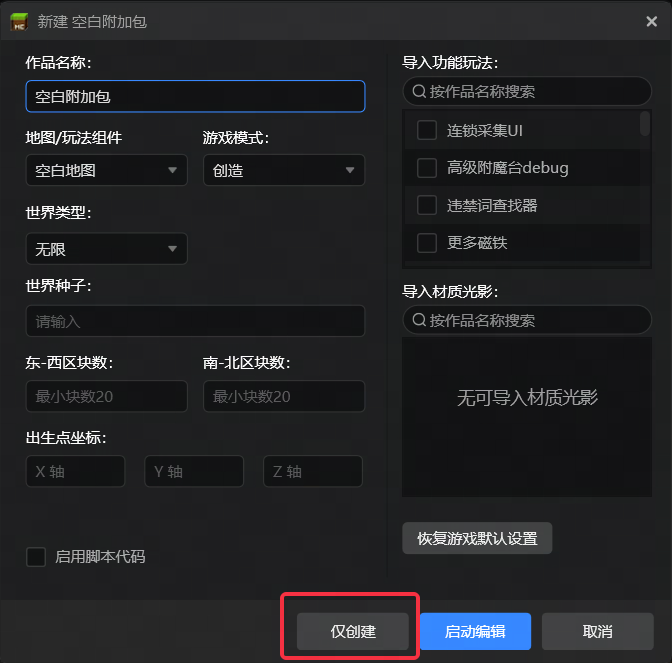

# 2024.12.19 版本1.1.28

## 导出功能

作品导出的zip中会移除无用的空文件夹和文件。

导出前：



导出后：



## 界面编辑器

- 缩进调整为4个空格
- 保留键值对顺序，新键插入末尾
- 移除无用文件和键值对

```json
在生成image控件时，不生成：
"clip_direction": "left",
"clip_ratio": 0.0,
"controls": [],
```
- 不再生成netease_editor_template_namespace.json
- 浮点数生成优化

```json
原本："color": [0.2352941176470588, 0.3176470588235294, 0.9764705882352941],
修改后："color": [0.2353, 0.3176, 0.9765],

原本："offset": [20.0, 0.0],
修改后："offset": [20, 0],

原本："font_scale_factor": 2.000000000000001,
修改后："font_scale_factor": 2,
```

## 测试配置

开发测试的配置界面支持搜索作品，方便测试同时加载多个作品的情况。



## 新建作品

新建空白地图和空白附加包支持仅创建。

