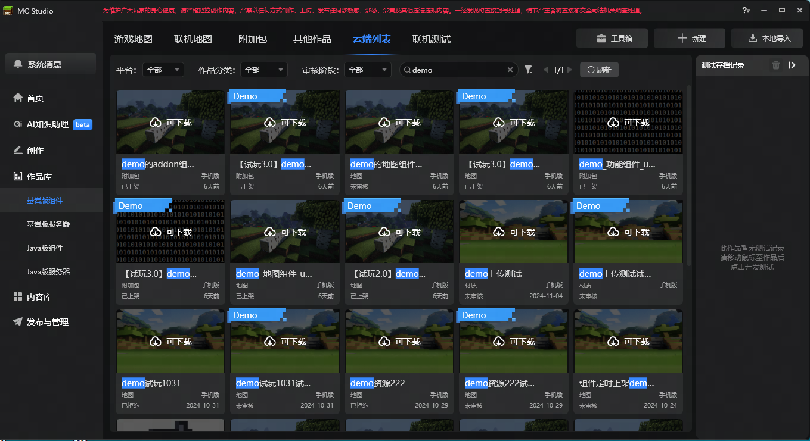
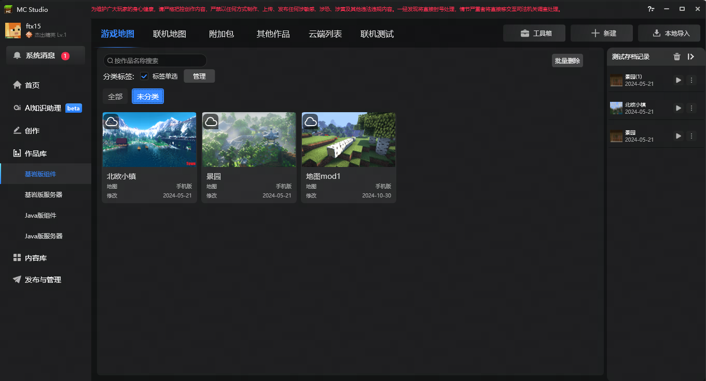
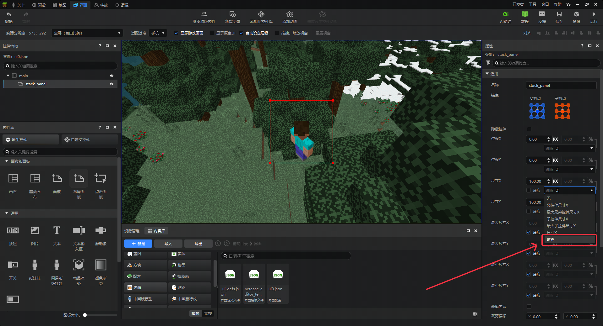
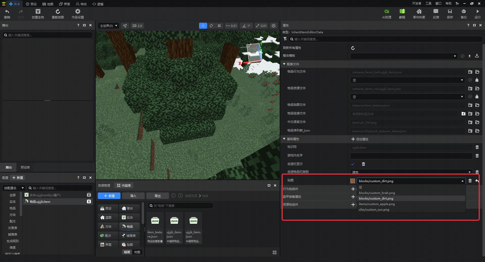
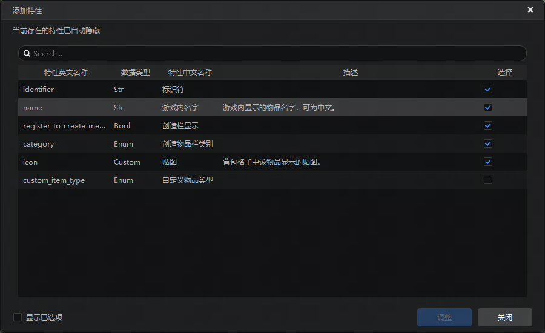

# 2024.11.21 版本1.1.24

## 作品管理

1. 云端列表新增试玩模组角标展示。

2. 新增默认作品标签“未分类”。

## 界面编辑

1. StackPanel支持为其子控件的size设置fill属性。详情可参考[UI说明文档](https://mc.163.com/dev/mcmanual/mc-dev/mcguide/18-界面与交互/30-UI说明文档.html)。

## 属性编辑

1. 物品icon贴图支持选择textures目录下的任意贴图。

2. 新建物品、方块，默认勾选“游戏内名字”、“创造栏显示”特性。

