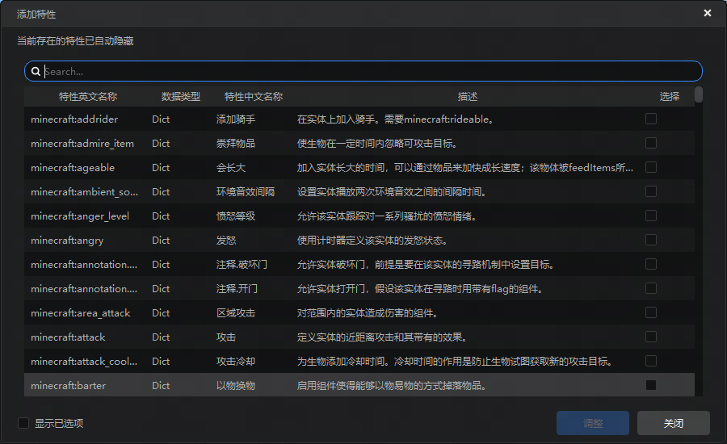
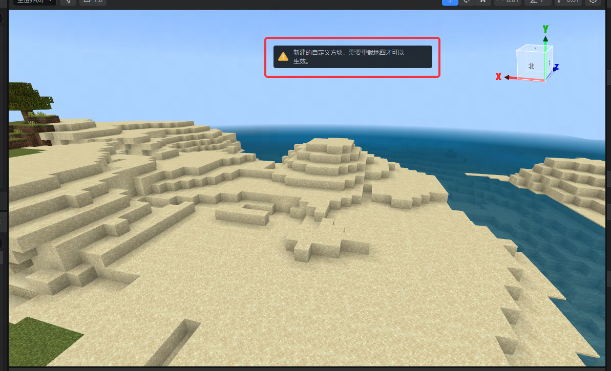
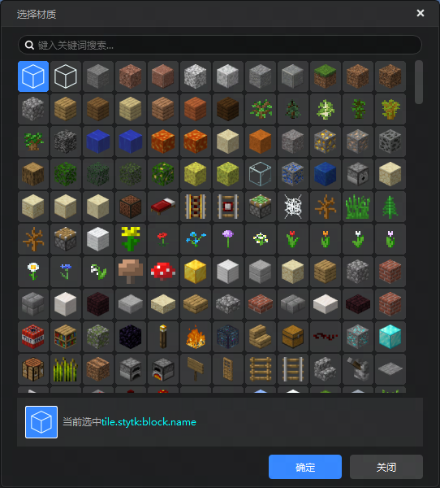
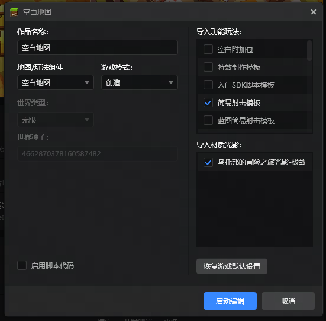

# 2024.10.10 版本1.1.20

## 配置编辑

1. 补充了升级版本后，编辑器中缺失的一些实体配置条目，添加了以下81个新组件。

     - minecraft:admire_item

     - minecraft:anger_level

     - minecraft:area_attack

     - minecraft:attack_cooldown

     - minecraft:barter

     - minecraft:behavior.admire_item

     - minecraft:behavior.avoid_block

     - minecraft:behavior.barter

     - minecraft:behavior.celebrate

     - minecraft:behavior.celebrate_survive

     - minecraft:behavior.croak

     - minecraft:behavior.defend_trusted_target

     - minecraft:behavior.dig

     - minecraft:behavior.drink_milk

     - minecraft:behavior.eat_carried_item

     - minecraft:behavior.eat_mob

     - minecraft:behavior.emerge

     - minecraft:behavior.equip_item

     - minecraft:behavior.fertilize_farm_block

     - minecraft:behavior.find_cover

     - minecraft:behavior.go_and_give_items_to_noteblock

     - minecraft:behavior.go_and_give_items_to_owner

     - minecraft:behavior.hold_ground

     - minecraft:behavior.investigate_suspicious_location

     - minecraft:behavior.jump_to_block

     - minecraft:behavior.move_outdoors

     - minecraft:behavior.move_to_block

     - minecraft:behavior.move_to_lava

     - minecraft:behavior.move_to_liquid

     - minecraft:behavior.move_towards_dwelling_restriction

     - minecraft:behavior.move_towards_home_restriction

     - minecraft:behavior.nap

     - minecraft:behavior.nearest_prioritized_attackable_target

     - minecraft:behavior.play_dead

     - minecraft:behavior.ram_attack

     - minecraft:behavior.random_hover

     - minecraft:behavior.random_look_around_and_sit

     - minecraft:behavior.rise_to_liquid_level

     - minecraft:behavior.roar

     - minecraft:behavior.sniff

     - minecraft:behavior.sonic_boom

     - minecraft:behavior.stalk_and_pounce_on_target

     - minecraft:behavior.stay_near_noteblock

     - minecraft:behavior.stroll_towards_village

     - minecraft:behavior.swim_idle

     - minecraft:behavior.swim_with_entity

     - minecraft:behavior.work_composter

     - minecraft:block_climber

     - minecraft:block_sensor

     - minecraft:boss

     - minecraft:buoyant

     - minecraft:celebrate_hunt

     - minecraft:combat_regeneration

     - minecraft:conditional_bandwidth_optimization

     - minecraft:custom_hit_test

     - minecraft:drying_out_timer

     - minecraft:entity_sensor

     - minecraft:equip_item

     - minecraft:exhaustion_values

     - minecraft:experience_reward

     - minecraft:flocking

     - minecraft:game_event_movement_tracking

     - minecraft:group_size

     - minecraft:grows_crop

     - minecraft:heartbeat

     - minecraft:home

     - minecraft:hurt_on_condition

     - minecraft:inside_block_notifier

     - minecraft:instant_despawn

     - minecraft:is_pregnant

     - minecraft:mob_effect

     - minecraft:movement.hover

     - minecraft:movement_sound_distance_offset

     - minecraft:navigation.hover

     - minecraft:out_of_control

     - minecraft:physics

     - minecraft:pushable

     - minecraft:suspect_tracking

     - minecraft:trail

     - minecraft:variable_max_auto_step

     - minecraft:vibration_damper

       

2. 现在在关卡编辑器中对方块配置进行修改之后，重载地图之后就可以实时生效（在地图编辑器中的材质选择界面中出现），无需再重启编辑器了。

## 启动器工程组件记录

1. 开发者启动器的编辑地图界面中，会记录当前地图使用的附加包和材质光影信息，每次打开此界面时，启用的内容将会自动被勾选。

## 其他

1. 逻辑编辑器中，补充了3.0SDK的相关节点内容。
2. 修复了3.0PC包中，使用联机地图创建多人房间后关闭游戏时的崩溃问题。
