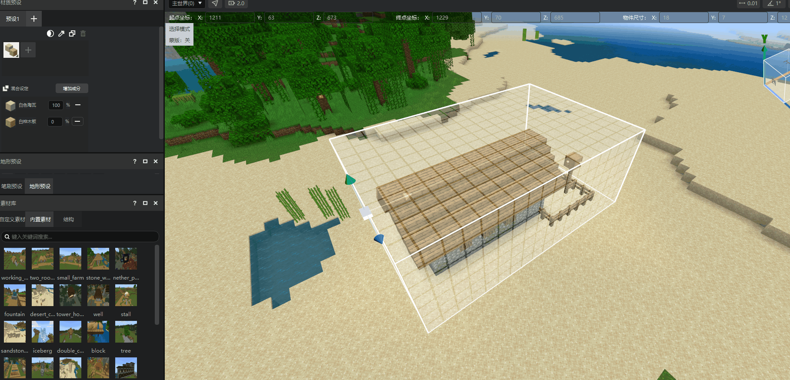
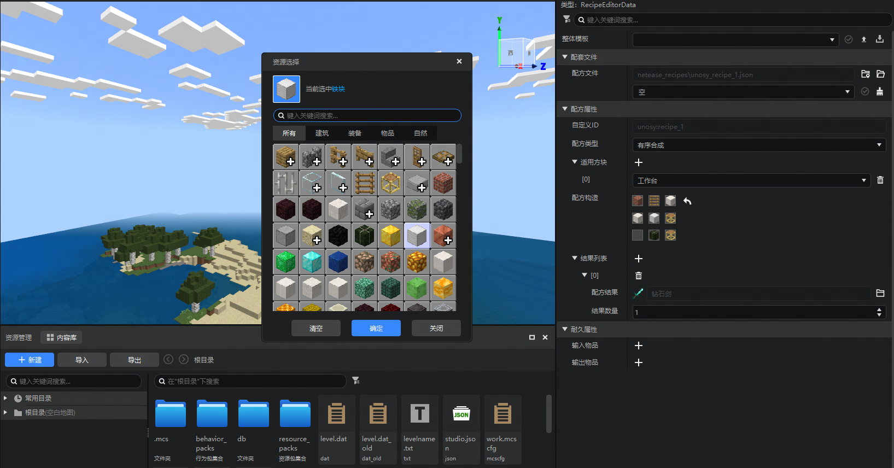

#  2024.9.5 版本1.1.19

## 地图编辑器

1. 地图编辑器基础操作优化，新增智能识别物体功能，快速框选建筑结构，生成指定包围盒。

   

2. 保存结构时，现在可以记住上次的配置。例如：勾选 **去除空气** 并记住该配置后，下次保存结构时无需重复选择同类选项。减少重复操作，提升开发效率。

   

## 配方配置功能更新

1. 配方保存逻辑优化，去除了应用按钮，调整配方时，点击清空/确定后自动保存配方内容。

   

## 其他

1. 修复设备名称出现中文或特殊字符时，新版调试工具无法连接的问题。
1. 编辑器内嵌游戏、ModPC升级到64位包体。
1. 修复自定义方块配置中，方块实体组件的tips描述错误的问题。
1. 修复游戏模式下部分快捷键会触发编辑器对应功能的问题。
