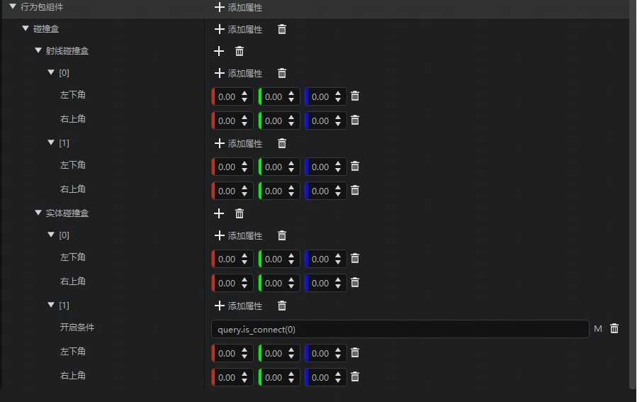
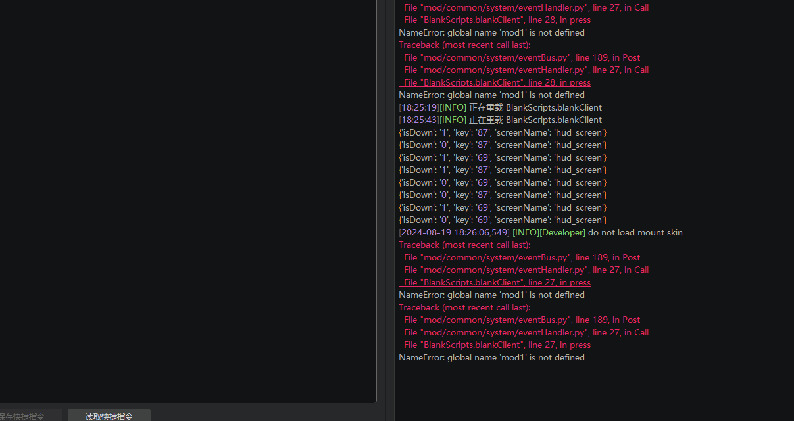

#  2024.8.22 版本1.1.17

## 关卡编辑器

1. 自定义方块碰撞盒支持以数组为形式的实体碰撞盒与射线碰撞盒

## 调试工具

1. 在调试输出界面中增加报错信息跳转机制，点击报错信息直接打开对应的代码文件。

   ::: danger 注意

   需要开发测试或编辑器内启动ModPC开发包，直接启动ModPC开发包或在开发测试过程切换存档会导致跳转失败。

   :::

## 其他

1. 修复关卡编辑器编辑硬度属性导致游戏报错的问题。
1. 修复修复自定义方块贴图写入错误的问题。
1. 修复测试存档数据丢失的问题。
