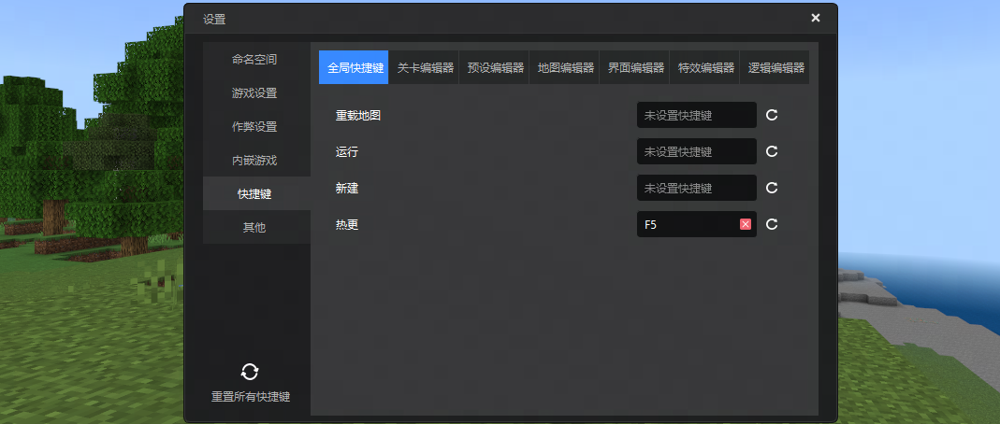
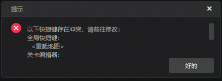

#  2024.8.8 版本1.1.16

## 自定义编辑器快捷键

1. 作品设置新增快捷键分页，包含7组快捷键：全局、关卡、预设、地图、界面、特效、逻辑。
2. 支持修改、清除、重置快捷键，并及时反馈到编辑器内对应的功能入口。
3. 保存与加载：快捷键设置在同一台电脑上共享。
4. 冲突检测：全局快捷键会检测所有快捷键，其余各编辑器内仅检测全局和当前编辑器的快捷键。
5. 启动检测：编辑器启动时检测所有快捷键是否存在冲突，有冲突时将弹窗提示，关闭弹窗后将自动打开 **作品设置** 并跳转至 **快捷键** 分页。

## 地图编辑器

1. 地形植被工具添加新版本的植树特征，含樱花树、红树及其变种等。

## 其他

1. 修复MC Studio无法自测认证的问题
2. 补充逻辑编辑器新版接口翻译。
3. 修复地图编辑器无法撤回已放置的杜鹃花叶、盛开的杜鹃花叶、樱花树叶与红树树叶等问题。
4. 修复地图编辑器复制方块可能随机丢失选取方块的问题。
