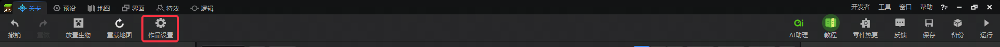
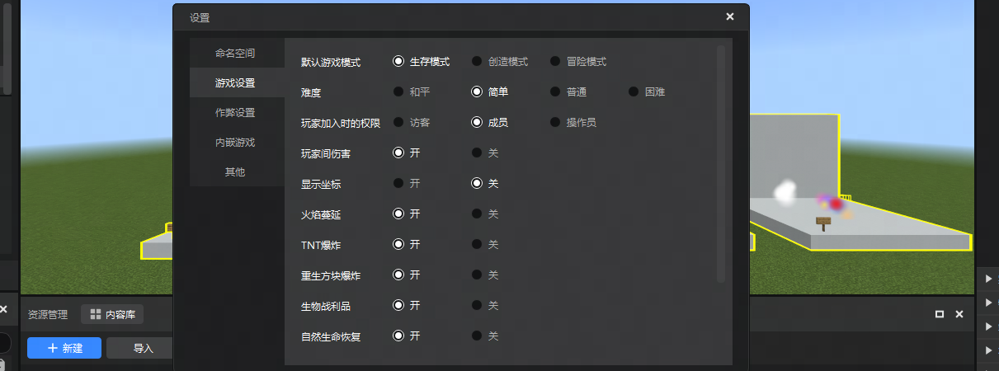
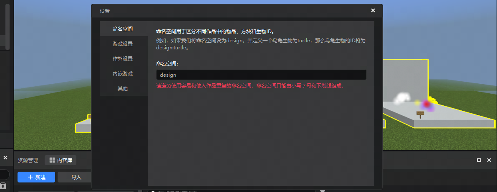
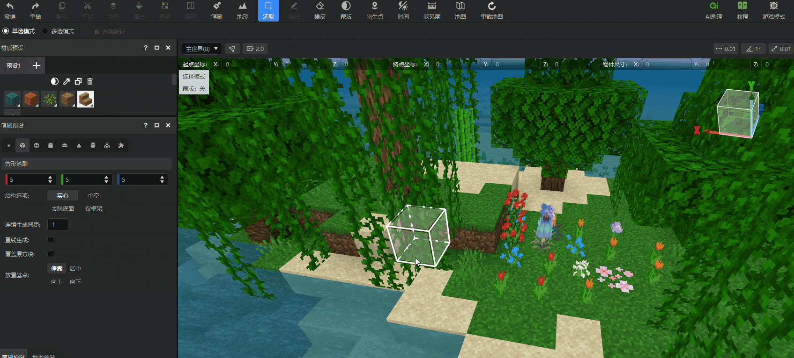
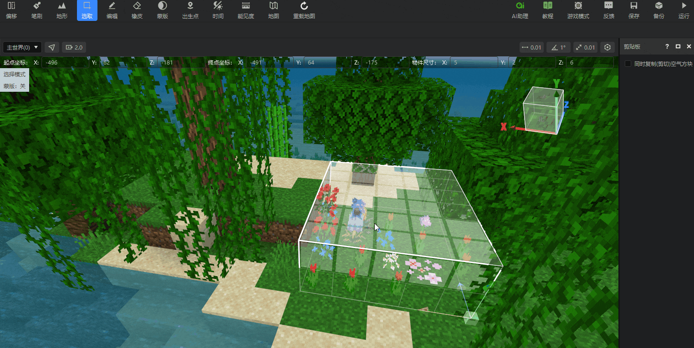
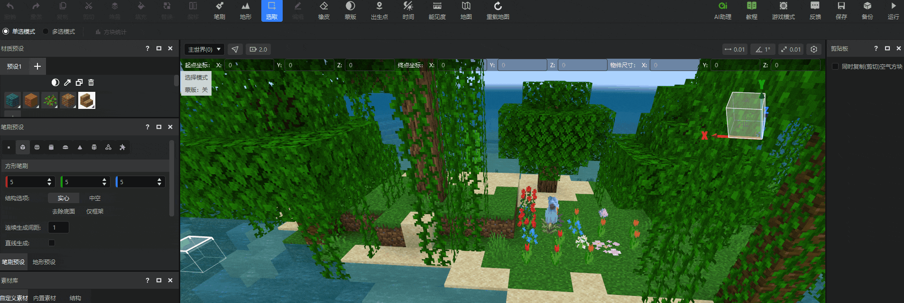

#  2024.7.25 版本1.1.13

## 关卡编辑器

1.  **布局优化** ： **作品** 入口与下拉选单功能现已合并至 **关卡编辑器** 二级工具栏的 **作品设置** 中。也可以在 **关卡编辑器** 、 **预设编辑器** 与 **地图编辑器** 的预览窗右上方点击 **设置** 进入。

- **旧** ：

- **新** ：

  

2.  **作品设置** ：

    1. 现在可以一键修改并同步 **内嵌游戏** 、 **编辑器内运行游戏** 与 **实际作品** 的作弊模式选项与游戏设置选项。不包括开发测试。

       部分设置与模式在编辑器内嵌游戏中不会生效，但会在游戏自测、作品导出或上传至开发者平台生效。

       ::: danger 注意

       作弊模式选项与游戏设置选项页签目前仅在地图的作品设置面板中显示。

       :::

       

    2. **命名空间** 修改后，无需再次进行确认。如果新导入的作品已经有了命名空间，系统会自动读取已存在的命名空间。如果作品有多个附加包，系统会随机选取其中一个附加包的命名空间作为作品的命名空间。

       

    3. **内嵌游戏** 、**其他** 功能保留不变。

## 地图编辑器

1. **基础操作优化** ：

   1. **选取模式** 支持框选单个区域后直接框选下个区域。另外，点击空气区域现在即可取消上次选区的包围盒。减少步骤操作，提升操作体验。

   

   2. **选取模式** 下右键包围盒即可快速保存结构或素材。取消原先保存结构和素材的冗余操作。

   

   3. **编辑模式** 下，现在放置的素材与结构可以直接应用旋转、缩放与镜像操作。

   

   4. **编辑模式** 的包围盒显示为黄色，提升视觉反馈。
   5. 生成后保留编辑过的选取包围盒，方便进行二次编辑。
   6. **编辑模式** 快捷键由`Crtl+K`更换至`Q`。

## 其他

1. 修复了在地图编辑器中保存结构时，勾选【去除空气选项】无效的问题。
