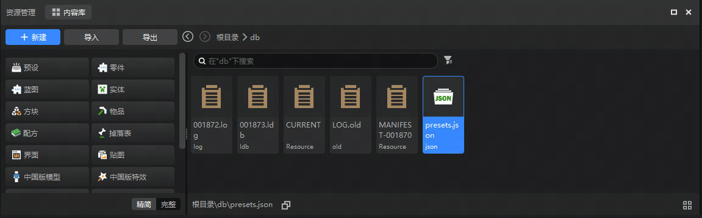
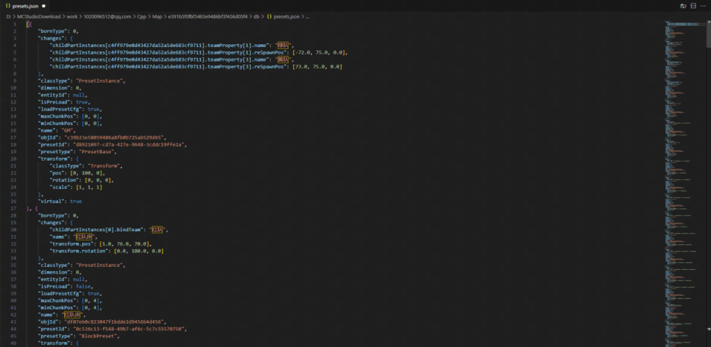
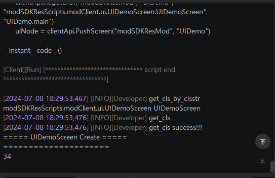

#  2024.7.10 版本1.1.12

## 关卡编辑器

1.  **预设配置文件** ：优化关卡编辑器`preset.json`的数据结构，由一行格式转换为多行格式，提高可读性的同时，避免了多人协作过程中提交冲突的情况，提升多人协作效率。

## 特效编辑器

1. **时间轴：** timeline最大时长扩展至50秒，同时切换动作时将根据动作的播放时长自适应调整时间轴，提高动作制作上限，优化用户体验。

## ModPC开发包

1. **BUG修复：** 修复UI界面update函数每秒执行次数不足30次的问题。

## 其他

1. **1.20.1Java版客户端外放** ：现在可以自测并提审47.3.0（Forge版本）及以上的Java作品。
